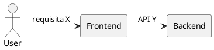

---
---
id: speckit.arquiteto.specify
title: Agente Arquiteto — Specify
description: "Executar o Agente Arquiteto para estruturar a base arquitetural antes da especificação formal. Produz briefing arquitetural e artefatos de handoff para `speckit.specify` e `speckit.developer.implement`."
version: 1.1.0
handoffs:
  - to: speckit.specify
    artifact: architectural-brief.json
    send: true
  - to: speckit.developer.implement
    artifact: spec-recommendations.json
    send: false
inputs:
  - name: user_request
    type: text
    required: true
  - name: repository_context
    type: object
    required: false
outputs:
  - name: architectural_brief_md
    type: markdown
    required: true
  - name: architectural_brief_json
    type: json
    required: true
expected_artifacts:
  - spec.md
  - spec.json
  - plan-recommendations.md
---

# Agente Arquiteto

## Objetivo (expandido)

Fornecer um briefing arquitetural completo e estruturado que sirva como base para a geração formal da especificação (`/speckit.specify`) e para orientar o Developer na decomposição inicial do trabalho. O briefing deve ser suficiente para:

- Definir fronteiras do sistema e componentes principais.
- Enumerar requisitos de alto nível com critérios de aceitação.
- Produzir recomendações de decomposição em tarefas (3–8 itens) com estimativas iniciais.
- Gerar artefatos estruturados (JSON) para automação e handoffs.

## Entrada

- `$ARGUMENTS` (conforme invocação do Spec Kit): descrição da feature, constraints, prioridades.
- `repository_context` (opcional): arquivos relevantes do repositório, exemplos, diagramas, issues relacionadas.

## Saídas/Artefatos esperados

1. `architectural_brief.md` — documento humano-legível contendo:
   - Contexto e objetivo resumidos
   - Atores e personas
   - Componentes e fronteiras
   - Requisitos de alto nível (REQ-XXX)
   - Decisões arquiteturais iniciais com justificativa
   - Perguntas em aberto / riscos
   - Recomendações de decomposição (lista de 3–8 tarefas com estimativa e critério de aceitação)

2. `architectural_brief.json` — versão estruturada com campos explícitos para automação:
   - id, source, timestamp, actors[], components[], requirements[], recommendations[]

3. `spec-recommendations.json` (opcional) — mapa para `speckit.specify` com campos: scope, priority, suggested_sections

4. Links/IDs para rastreabilidade: cada requisito deve ter `REQ-` id único.

## Diretrizes detalhadas

1. Interpretar o `$ARGUMENTS` priorizando clareza e completude; quando algo estiver ambíguo, gerar 1–2 hipóteses explicitas.
2. Identificar e nomear atores e personas com papel e responsabilidades.
3. Definir componentes e fronteiras em nível arquitetural (não implementar detalhes).
4. Para cada requisito, incluir:
   - ID (REQ-XXX), descrição curta, critério de aceitação mensurável, prioridade (alta/média/baixa).
5. Produzir recomendações de decomposição em tarefas orientadas a implementação (ex.: API design, UI, integração, testes), cada tarefa com título, descrição curta e estimativa (Pequena/Média/Grande).
6. Incluir notas sobre observabilidade, performance e restrições operacionais quando aplicáveis.
7. Se houver diagramas (PlantUML), incluir bloco com código PlantUML e referenciar arquivo `diagram.puml` quando for o caso.

## Formatos e exemplos (modelos)

Exemplo mínimo de `architectural_brief.json`:

```json
{
  "id": "arch-2026-0001",
  "source": "speckit.arquiteto.specify",
  "timestamp": "2026-06-03T12:00:00Z",
  "context": "Resumo do problema...",
  "actors": [{"id":"ACT-001","name":"Usuário final","role":"consome X"}],
  "components": [{"id":"C-UI","name":"Frontend UI","description":"Componente responsavel por..."}],
  "requirements": [{"id":"REQ-001","text":"O sistema deve...","acceptance":"Teste X","priority":"high"}],
  "recommendations": [{"id":"R-001","title":"Criar endpoint /foo","estimate":"Média","description":"..."}]
}
```

Exemplo de bloco PlantUML a incluir quando pertinente:



## Regras de execução (processo e políticas)

- Sempre emitir artefato JSON principal (`architectural_brief.json`) além do MD.
- IDs: use prefixos `REQ-`, `ACT-`, `C-`, `R-` para rastreabilidade.
- Hipóteses: registre como `ASSUME-001` com breve justificativa.
- Sensibilidade: não incluir segredos; referenciar segredos via `secret:KEY` quando necessário.
- Versão do comando: incremente `minor` ao adicionar campos não incompatíveis; `major` para quebra de schema.

## Handoffs e integração com Spec Kit

- Handoff primário para `/speckit.specify`: incluir `architectural_brief.json` e `spec-recommendations.json`.
- Handoff secundário para `/speckit.developer.implement`: enviar `spec-recommendations.json` com `send: false` (revisão humana opcional).
- Marcar no frontmatter os `expected_artifacts` para CI e validação.

## Checklist de validação automática (para CI)

1. Frontmatter YAML parseável.
2. `architectural_brief.md` contém os blocos obrigatórios (Objetivo, Requisitos, Recomendações).
3. `architectural_brief.json` é JSON válido e contém `id`, `timestamp`, `requirements`.
4. Cada `REQ-` referenciado tem critério de aceitação.
5. Se `diagram.puml` for referido, o arquivo existe e passa `plantuml -tpng` (se disponível).

Script de validação rápido (exemplo):

```bash
python3 - <<'PY'
import sys, json, yaml
from pathlib import Path
f = Path('.specify/extensions/arquiteto/commands/speckit.arquiteto.specify.md')
text = f.read_text()
fm = text.split('---',2)[1]
yaml.safe_load(fm)
print('frontmatter OK')
PY
```

## Prompt engineering — instruções sugeridas para o agente

Prompt-base (Arquiteto):
"Você é um Arquiteto de Software. A partir do texto de entrada e do contexto do repositório, gere um `architectural_brief.md` e `architectural_brief.json`. Inclua Objetivo, Atores, Componentes, Requisitos (REQ-), Decisões, Riscos e Recomendação de decomposição em tarefas. Quando ambiguidade existir, liste hipóteses numeradas. Produza também um bloco PlantUML se apropriado. Seja conciso, orientado a ação e gere IDs únicos."

Prompt de exemplo curta (para uso humano):
"Leia o pedido: <TEXTO>. Gere briefing arquitetural com 5 requisitos prioritários e 4 recomendações de alto nível (cada uma com estimativa)." 

## Modelo de decomposição de tarefas (saída esperada)

- Tarefa 1 — Título: Projeto do endpoint /foo
  - Descrição: Definir contrato, payload, validações
  - Critério de aceitação: OpenAPI + testes unitários
  - Estimativa: Média

- Tarefa 2 — Título: Implementar componente UI X
  - ...

## Exemplo completo (fluxo de trabalho)

1. Usuário solicita feature via `/speckit.arquiteto.specify` com `$ARGUMENTS` preenchido.
2. Agente Arquiteto gera `architectural_brief.md` + `architectural_brief.json` e instrui `/speckit.specify` (send: true).
3. Pipeline valida frontmatter e artifacts; `speckit.specify` gera `spec.md`.
4. `speckit.developer.implement` consome `spec.md`/`spec.json` e propõe `tasks.md`.

## Observações finais e governança

- Documente mudanças em `version` do comando e atualize `.specify/extensions/.registry` com novo `manifest_hash` quando o `extension.yml` for alterado.
- Mantenha exemplos em `relatorios/spec-kit/examples/` para testes de integração.

---
Atualizado para versão 1.1.0: extensão detalhada do Agente Arquiteto alinhada ao Spec Kit, protocolo de pesquisa e fluxo de trabalho local.
