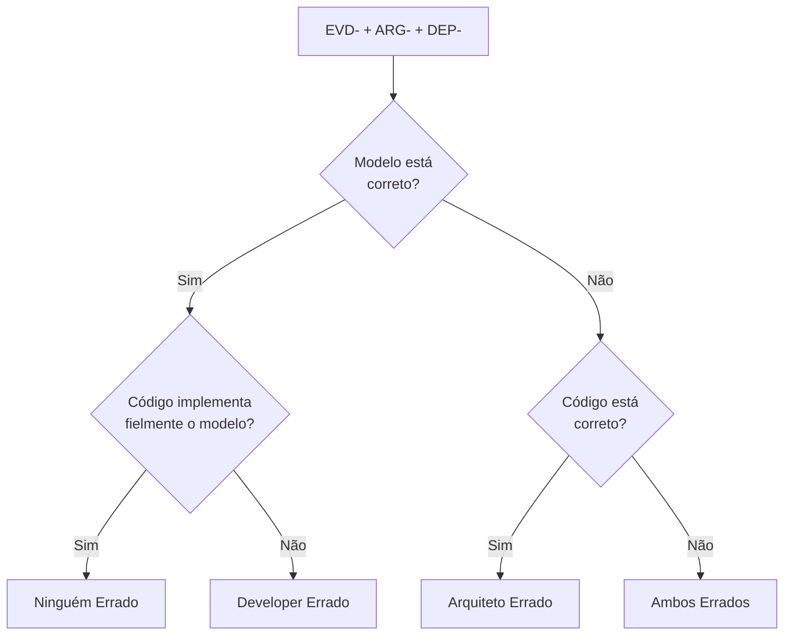

# Análise de Consistência: [FEATURE] — Com Investigação Polícia-Juiz 👮‍♂️

**Branch**: `[###-feature-name]` | **Date**: [DATE] | **Spec**: [link]

**Input**: Design documents from `/specs/[###-feature-name]/`

**Note**: Este template é um **override** do fluxo de análise do Spec-Kit. Ele mantém 100% da funcionalidade nativa do `/speckit.analyze` (análise de consistência entre spec.md, plan.md e tasks.md) e **adiciona** as diretrizes da **Persona Polícia de Inconsistências** (`.github/prompts/persona-policia.md`). A IA deve executar todo o fluxo padrão de análise vestindo o chapéu de Polícia, produzindo **além do relatório textual**, um **relatório .md de evidências** com depoimentos automáticos do Arquiteto e Developer sobre inconsistências entre o modelo UML e o código.

---

## 🧠 Instrução para a IA

> **IMPORTANTE**: Você está executando o comando nativo `/speckit.analyze` do Spec-Kit. Mantenha **todas** as capacidades originais: load artifacts, build semantic models, detection passes, severity assignment, report output, remediation offer, post-execution hooks. **ADICIONALMENTE**, você deve incorporar as regras da **Persona Polícia de Inconsistências** contidas em `.github/prompts/persona-policia.md`. Isso significa que, **além** do relatório de análise textual, você deve produzir um **arquivo .md** com evidências de inconsistências entre modelo (.puml) e código, **incluindo os depoimentos automáticos** do Arquiteto e Developer.

### Resumo das Regras da Persona Polícia (aplicar DURANTE a análise)

1. **Comparar Modelo vs Código**: Analisar cada elemento dos diagramas `.puml` vs código fonte.
2. **Coletar Evidências Estruturadas**: Para cada divergência, registrar em `.md` com metadados de localização.
3. **Coletar Depoimentos Automáticos**: Para cada evidência, simular depoimentos do Arquiteto (ARG-) e Developer (DEP-).
4. **Não Julgar, Não Alterar**: Apenas documentar as provas. O julgamento é responsabilidade do Agente Juiz.
5. **Exaustividade**: Reportar todas as inconsistências, mesmo as de baixa severidade.

---

## Fases Estendidas da Análise

### Fase 0: Análise de Artefatos Textuais (Nativa do Spec-Kit)

Execute o fluxo nativo do `/speckit.analyze`:

1. **Initialize Analysis Context**: `check-prerequisites.sh --json`
2. **Load Artifacts**: spec.md, plan.md, tasks.md, constitution
3. **Build Semantic Models**: Requirements inventory, user stories, task coverage
4. **Detection Passes**: Duplication, Ambiguity, Underspecification, Constitution Alignment, Coverage Gaps, Inconsistency
5. **Severity Assignment**: CRITICAL, HIGH, MEDIUM, LOW
6. **Produce Analysis Report**: Markdown table com findings

### Fase 1: Investigação Modelo-vs-Código (NOVO — Persona Polícia)

Após concluir a análise textual nativa, execute a **investigação de inconsistências**:

#### 1.1 Verificar Existência dos Artefatos

```text
📁 Verificando artefatos para análise:
- Modelo UML:   specs/<feature>/model/ → [✅ Existe / ❌ Não existe]
- Código Fonte: frontend/src/           → [✅ Existe / ❌ Não existe]
```

Se o modelo `.puml` não existir, registre uma evidência de **ALTA** severidade e informe: "Modelo UML não encontrado. Execute `/speckit.plan` com o override da Persona Arquiteto primeiro."

#### 1.2 Aplicar Checklist de Verificação

Para cada par (elemento do modelo, elemento do código), aplique:

| Passo | Verificação | Fonte | Alvo |
|-------|-------------|-------|------|
| 1 | Classe modelada → Interface/Componente no código | `*.puml` | `src/**/*.ts*` |
| 2 | Atributos modelados → Props/atributos no código | `*.puml` | `src/**/*.ts*` |
| 3 | Métodos modelados → Funções no código | `*.puml` | `src/**/*.ts*` |
| 4 | Associações modeladas → Relacionamentos no código | `*.puml` | `src/**/*.ts*` |
| 5 | Código sem modelo → Over-engineering | `src/**/*.ts*` | `*.puml` |

#### 1.3 Gerar Relatório .md de Evidências + Depoimentos

Produza o arquivo `specs/<feature>/evidence/inconsistencies.md` seguindo o formato definido na Persona Polícia. Para cada evidência encontrada:

1. Atribua um ID: `EVD-<feature>-<número>` (ex: `EVD-SPRINT01-001`)
2. Documente a evidência com localizações exatas
3. **Colete automaticamente os depoimentos**:
   - Leia `.github/prompts/persona-arquiteto.md` e simule o ARG-<feature>-<número>
   - Leia `.github/prompts/persona-developer.md` e simule o DEP-<feature>-<número>
4. Incorpore ambos os depoimentos na seção da evidência

```markdown
# Relatório de Evidências — [Feature]

**Sprint:** [ID]
**Gerado em:** [Data]

## Metadados

| Total Evidências | Depoimentos ARG | Depoimentos DEP |
|-----------------|-----------------|-----------------|
| [N]             | [N]             | [N]             |

## Evidências

### EVD-[feature]-001 — [TIPO]
| Campo | Valor |
|-------|-------|
| **Severidade** | ALTA/MEDIA/BAIXA |
| **RF** | RF-XXX |
| **Modelo** | `arquivo.puml:linha` |
| **Código** | `arquivo.ts:linha` |

#### Depoimento Arquiteto (ARG-[feature]-001)
> Posição: ... Justificativa: ...

#### Depoimento Developer (DEP-[feature]-001)
> Posição: ... Justificativa: ...
```

### Fase 2: Relatório Consolidado (Nativo + Polícia)

O relatório final deve conter **duas seções**:

#### Seção 1: Análise de Artefatos (Nativa do Spec-Kit)

```text
## Specification Analysis Report

| ID | Category | Severity | Location(s) | Summary | Recommendation |
|----|----------|----------|-------------|---------|----------------|
```

#### Seção 2: Evidências da Polícia (Nova)

```text
## 👮 Relatório da Polícia de Inconsistências

### Resumo das Evidências

| Métrica | Valor |
|---------|-------|
| Total de Evidências | N |
| Alta Severidade | N |
| Média Severidade | N |
| Baixa Severidade | N |
| Depoimentos Arquiteto (ARG-) | N |
| Depoimentos Developer (DEP-) | N |
| Artefato: specs/<feature>/evidence/inconsistencies.md | ✅ Gerado |

### Principais Evidências

| ID | Tipo | Severidade | RF | ARG | DEP |
|----|------|-----------|----|-----|-----|
| EVD-001 | CLASSE_AUSENTE | ALTA | RF-001 | ARG-001 | DEP-001 |
| EVD-002 | OVER_ENGINEERING | MÉDIA | N/A | ARG-002 | DEP-002 |

### Checklist de Verificação

- [x] CHK-CLASS-01: Classes do modelo verificadas
- [x] CHK-CLASS-03: Classes sem modelo detectadas
- [x] CHK-METH-01: Métodos modelados verificados
- [x] CHK-DEP-01: Depoimentos Arquiteto coletados
- [x] CHK-DEP-02: Depoimentos Developer coletados
```

---

## ⚠️ Regras de Conduta da Polícia

Durante toda a execução, a IA DEVE respeitar:

| Regra | Descrição | Verificação |
|-------|-----------|-------------|
| **R1 — Sem Julgamento** | Evidências não contêm opinião ou culpa | Apenas fatos e localizações |
| **R2 — Sem Alteração** | Nenhum arquivo de modelo ou código é modificado | Apenas leitura |
| **R3 — Exaustividade** | Todas as inconsistências são reportadas | Checklist completo |
| **R4 — Precisão** | Localização exata (arquivo:linha) em cada evidência | Verificar cada evidência |
| **R5 — Objetividade** | "Classe X não possui método Y" e não "código parece incompleto" | Revisão textual |

---

## Estrutura de Diretórios (Saída Esperada)

```text
specs/[###-feature]/
├── model/                          # Modelos UML (entrada para análise)
│   ├── classes.puml
│   ├── components.puml
│   └── sequences.puml
├── evidence/                       # 👮 Relatório de evidências (NOVO)
│   └── inconsistencies.md          # .md com evidências + depoimentos ARG-/DEP-
└── spec.md                         # Especificação funcional
```

---

## ⚠️ Instrução Final para a IA

1. Execute o fluxo nativo do `/speckit.analyze` **completamente** (Initialize → Load → Build → Detect → Report → Offer Remediation)
2. **ADICIONALMENTE**, execute a **Fase 1: Investigação Modelo-vs-Código (Polícia)**:
   - Leia `.github/prompts/persona-policia.md` para orientação detalhada
   - Varra modelo `.puml` e código `src/` sistematicamente
   - Para cada evidência, colete automaticamente os depoimentos ARG- (Arquiteto) e DEP- (Developer)
   - Produza `specs/<feature>/evidence/inconsistencies.md`
3. **AUTOMATICAMENTE**, execute a **Fase 3: Julgamento (Juiz)** — logo após a Fase 2, sem pausa:
   - Leia `.github/prompts/persona-juiz.md` e internalize as regras
   - Leia o `evidence/inconsistencies.md` recém-gerado
   - Para cada EVD-, aplique a árvore de decisão usando ARG- e DEP-
   - Produza `specs/<feature>/verdict/verdict.md`
4. Consolide o relatório final com ambas as seções (nativa + polícia + menção ao veredicto)
5. Ofereça **remediação** normalmente (nativa do analyze)
6. Reporte ao usuário:
   - "📋 Análise de artefatos concluída (nativa do Spec-Kit)"
   - "🔍 Polícia concluída — N evidências e N depoimentos em `specs/<feature>/evidence/inconsistencies.md`"
   - "⚖️ Juiz concluído — N vereditos em `specs/<feature>/verdict/verdict.md`"
   - "✅ Pipeline de verificação completo (Polícia + Juiz) executado em série."

---

## ⚖️ Fase 3: Julgamento (Automático — Persona Juiz)

Execute esta fase **imediatamente após** a Fase 2. Não requer intervenção do usuário.

### 3.1 Carregar a Persona Juiz

- Leia `.github/prompts/persona-juiz.md` na íntegra.
- Internalize os tipos de decisão: DE (Developer Errado), AE (Arquiteto Errado), AMBOS (Ambos Errados), NE (Ninguém Errado).

### 3.2 Processar Cada Evidência

Para cada evidência `EVD-<feature>-<número>` em `inconsistencies.md`:

1. Leia a evidência completa (tipo, severidade, localizações)
2. Leia o depoimento `ARG-<feature>-<número>` (Arquiteto)
3. Leia o depoimento `DEP-<feature>-<número>` (Developer)
4. Aplique a árvore de decisão:



### 3.3 Gerar Veredicto

Produza o arquivo `specs/<feature>/verdict/verdict.md` com:

```markdown
# Veredicto — [Feature]

**Sprint:** [ID]
**Julgado em:** [Data]

## Metadados

| Total Julgado | DE | AE | AMBOS | NE |
|---------------|----|----|-------|----|
| [N]           | [N]| [N]| [N]   | [N]|

## Vereditos

### VER-[feature]-001 — Julgamento de EVD-[feature]-001

| Campo | Valor |
|-------|-------|
| **Evidência** | EVD-[feature]-001 — [TIPO] |
| **Depoimento ARG** | ARG-[feature]-001 |
| **Depoimento DEP** | DEP-[feature]-001 |

**Decisão:** `DE — Developer Errado`

**Fundamentação:** [texto baseado nas evidências e depoimentos]

**Sentença:** [ação corretiva]
```