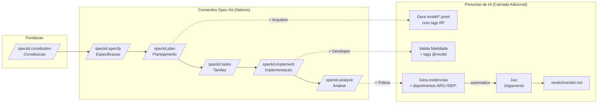
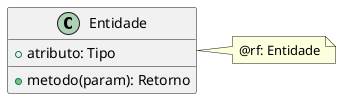
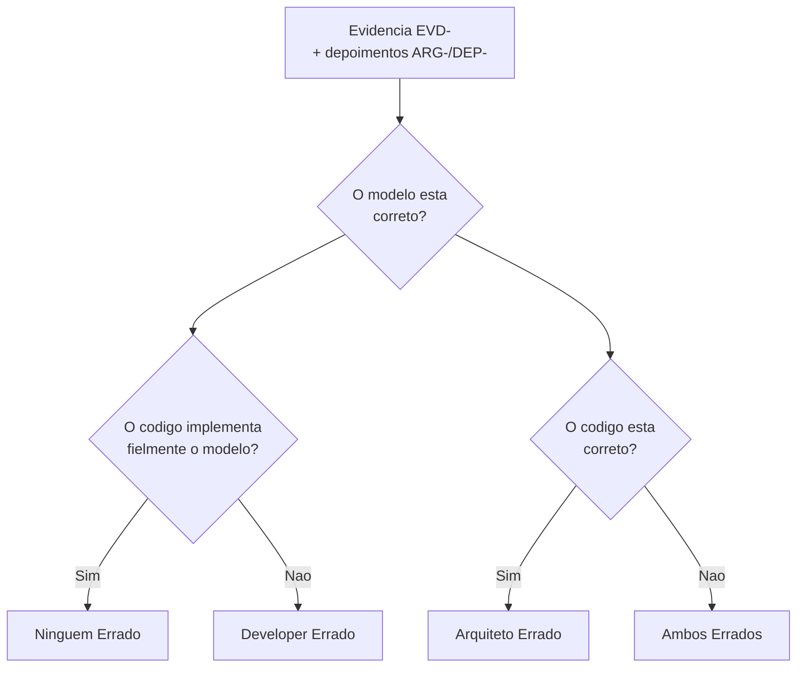
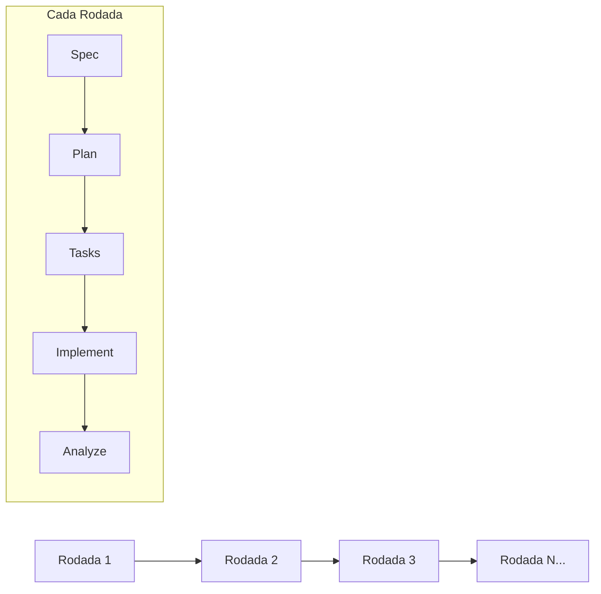
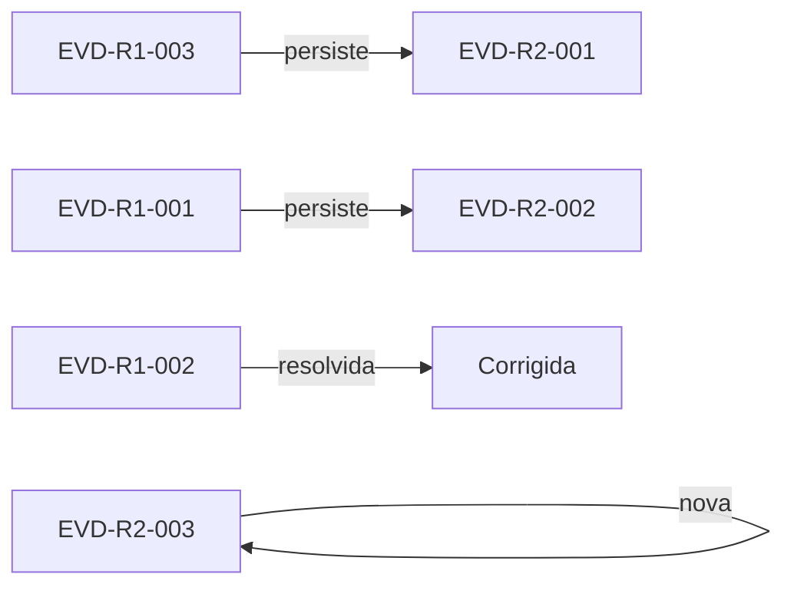

# Pipeline Spec-Kit com Quatro Personas de IA: Guia de Referencia

**Proposito:** Documentar de forma completa e generalizada o funcionamento do pipeline
de desenvolvimento que integra os comandos nativos do Spec-Kit com quatro personas
de IA (Arquiteto, Developer, Policia, Juiz), criando um fluxo sistematico de especificacao,
modelagem, implementacao e verificacao em multiplas rodadas iterativas.

---

## Sumario

- [1. Visao Geral do Pipeline](#1-visao-geral-do-pipeline)
  - [1.1 Principio Fundamental](#11-principio-fundamental)
- [2. Sistema de Rastreabilidade](#2-sistema-de-rastreabilidade)
  - [2.1 Tabela de Identificadores](#21-tabela-de-identificadores)
  - [2.2 Estrutura dos Identificadores por Rodada](#22-estrutura-dos-identificadores-por-rodada)
- [3. As Quatro Personas de IA](#3-as-quatro-personas-de-ia)
  - [3.1 Arquiteto (Modelagem UML)](#31-arquiteto-modelagem-uml)
  - [3.2 Developer (Implementacao Fiel)](#32-developer-implementacao-fiel)
  - [3.3 Policia (Investigacao de Inconsistencias)](#33-policia-investigacao-de-inconsistencias)
  - [3.4 Juiz (Decisao Fundamentada)](#34-juiz-decisao-fundamentada)
- [4. Sistema de Rodadas Iterativas](#4-sistema-de-rodadas-iterativas)
  - [4.1 Funcionamento das Rodadas](#41-funcionamento-das-rodadas)
  - [4.2 Regras do Sistema de Rodadas](#42-regras-do-sistema-de-rodadas)
  - [4.3 Exemplo de Arvore de Evidencias entre Rodadas](#43-exemplo-de-arvore-de-evidencias-entre-rodadas)
- [5. Fluxo Completo do Pipeline](#5-fluxo-completo-do-pipeline)
  - [5.0 Constituicao (Passo Unico)](#50-constituicao-passo-unico)
  - [5.1 Especificacao](#51-especificacao)
  - [5.2 Planejamento com Arquiteto](#52-planejamento-com-arquiteto)
  - [5.3 Geracao de Tarefas](#53-geracao-de-tarefas)
  - [5.4 Implementacao com Developer](#54-implementacao-com-developer)
  - [5.5 Analise com Policia e Juiz](#55-analise-com-policia-e-juiz)
- [6. Mapa de Ativacao das Personas](#6-mapa-de-ativacao-das-personas)
- [7. Estrutura Completa de Artefatos](#7-estrutura-completa-de-artefatos)
- [8. Exemplo de Aplicacao em Multiplas Rodadas](#8-exemplo-de-aplicacao-em-multiplas-rodadas)
- [9. Resumo das Regras de Ouro](#9-resumo-das-regras-de-ouro)

---

## 1. Visao Geral do Pipeline

O pipeline e composto por duas camadas que operam de forma integrada:

1. **Camada nativa (Spec-Kit):** Comandos fundamentais que executam as etapas de
   constituicao, especificacao, planejamento, geracao de tarefas, implementacao e analise.
2. **Camada de personas (IA):** Quatro agentes especializados que se sobrepoem aos
   comandos nativos, adicionando rigor de modelagem, controle de over-engineering e
   verificacao de consistencia entre modelo e codigo.



### 1.1 Principio Fundamental

As personas **nunca substituem** os comandos nativos do Spec-Kit. Elas constituem
uma **camada adicional de comportamento** que se sobrepoe ao fluxo padrao,
adicionando:
- Rigor de modelagem UML (Arquiteto);
- Contencao de over-engineering (Developer);
- Coleta sistematica de evidencias (Policia);
- Decisao fundamentada sobre inconsistencias (Juiz).

---

## 2. Sistema de Rastreabilidade

Todo o pipeline e governado por um sistema de identificadores unicos que permitem
rastrear cada artefato desde o principio constituicional ate o veredito final.

### 2.1 Tabela de Identificadores

| Prefixo | Artefato de Origem | Exemplo | Descricao |
|---------|---------------------|---------|-----------|
| `CONST-` | `constitution.md` | CONST-R1 | Principio ou norma da constituicao do projeto |
| `RF-` | `spec.md` | RF-001 | Requisito funcional |
| `EVD-` | `evidence/inconsistencies.md` | EVD-FEATURE-R1-001 | Evidencia de inconsistencia entre modelo e codigo |
| `ARG-` | `evidence/inconsistencies.md` | ARG-FEATURE-R1-001 | Depoimento simulado do Arquiteto sobre a evidencia |
| `DEP-` | `evidence/inconsistencies.md` | DEP-FEATURE-R1-001 | Depoimento simulado do Developer sobre a evidencia |
| `VER-` | `verdict/verdict.md` | VER-FEATURE-R1-001 | Veredito do Juiz sobre a evidencia julgada |
| `CHK-` | `evidence/inconsistencies.md` | CHK-CLASS-01 | Item do checklist de verificacao |
| `// @model:` | Codigo fonte | `// @model: classes.puml` | Marcador de rastreabilidade no codigo ao diagrama de origem |

### 2.2 Estrutura dos Identificadores por Rodada

```
EVD-<feature>-R<round>-<seq>
VER-<feature>-R<round>-<seq>
ARG-<feature>-R<round>-<seq>
DEP-<feature>-R<round>-<seq>
```

Onde:
- `<feature>`: identificador da funcionalidade (ex: 001, login-component);
- `<round>`: numero da rodada (R1, R2, R3...);
- `<seq>`: numero sequencial dentro da rodada (001, 002...).

---

## 3. As Quatro Personas de IA

### 3.1 Arquiteto (Modelagem UML)

**Ativado por:** `/speckit.plan`

**Responsabilidade:** Traduzir requisitos funcionais em modelos UML precisos
utilizando PlantUML, garantindo que cada elemento modelado seja rastreavel
a um requisito funcional por meio da tag `@rf:`.

**Escopo de modelagem:**
- **Frontend:** componentes React, camadas arquiteturais (views, viewmodels,
  models), estados de interface, servicos HTTP;
- **Backend:** endpoints, controladores, servicos, entidades de dominio,
  serializadores.

**Artefatos gerados:**
```
specs/<feature>/model/
  classes.puml       # Diagrama de classes
  components.puml    # Diagrama de componentes
  sequences.puml     # Diagramas de sequencia
```

**Regras:**
1. Fidelidade a especificacao -- o modelo deve refletir exatamente o que foi
   especificado, nada alem, nada aquem.
2. Rastreabilidade obrigatoria -- todo elemento deve conter `@rf:<ID>`.
3. Consistencia -- nomenclatura uniforme entre diagramas e com o codigo.
4. Simplicidade -- modelar apenas o necessario para satisfazer o requisito.

**Exemplo de codigo PlantUML:**


### 3.2 Developer (Implementacao Fiel)

**Ativado por:** `/speckit.implement`

**Responsabilidade:** Traduzir os modelos UML em codigo funcional, seguindo
rigidamente o que foi modelado. O principio fundamental e **zero over-engineering**:
nada e implementado sem contraparte no modelo.

**Mapeamento modelo-codigo:**

| Elemento UML | Frontend (React/TypeScript) | Backend (Python/FastAPI) |
|--------------|-----------------------------|--------------------------|
| Classe | `models/Entidade.ts` (interface) | `models/entities/Entidade.py` (dataclass) |
| Atributo `+ nome: string` | Propriedade `nome: string` | Atributo `nome: str` |
| Metodo `+ login(): bool` | Funcao em servico/store | Metodo em controller/servico |
| Associacao `-->` | Propriedade de referencia | Relacao entre entidades |
| Componente | `pages/MinhaPagina.tsx` | Rota `@router.post("/rota")` |

**Regras:**
1. Fidelidade ao modelo -- o codigo deve ser um reflexo direto do diagrama.
2. Zero over-engineering -- nao implementar nada que nao esteja modelado.
3. Rastreabilidade reversa -- todo arquivo deve conter `// @model:` ou `# @model:`
   referenciando o diagrama de origem.
4. Separacao de responsabilidades -- UI, logica de negocios e servicos separados
   conforme o modelo de componentes.

### 3.3 Policia (Investigacao de Inconsistencias)

**Ativado por:** `/speckit.analyze` (executado automaticamente em serie)

**Responsabilidade:** Analisar o modelo UML e o codigo implementado, comparando-os
meticulosamente para coletar evidencias estruturadas de possiveis inconsistencias.
A Policia **nao julga, nao decide, nao altera** nenhum artefato -- apenas documenta
as provas para o Juiz.

**Tipos de evidencia coletados:**

| Tipo | Descricao | Severidade |
|------|-----------|------------|
| `CLASSE_AUSENTE` | Classe modelada nao existe no codigo | ALTA |
| `CLASSE_NAO_MODELADA` | Classe no codigo sem modelo correspondente | MEDIA |
| `METODO_AUSENTE` | Metodo modelado nao implementado | ALTA |
| `METODO_EXTRAS` | Metodo no codigo sem modelo correspondente | MEDIA |
| `ATRIBUTO_AUSENTE` | Atributo modelado sem contraparte no codigo | ALTA |
| `ATRIBUTO_EXTRAS` | Atributo no codigo sem modelo | MEDIA |
| `TIPO_INCOMPATIVEL` | Tipo do atributo/retorno difere entre modelo e codigo | MEDIA |
| `RELACIONAMENTO_AUSENTE` | Associacao modelada nao refletida no codigo | ALTA |
| `COMPORTAMENTO_DIVERGENTE` | Fluxo modelado diferente do implementado | ALTA |
| `OVER_ENGINEERING` | Funcionalidade no codigo sem cobertura no modelo | MEDIA |

**Depoimentos automaticos:** Para cada evidencia, a Policia simula automaticamente:
- **Depoimento do Arquiteto (ARG-):** defesa do modelo com base nos artefatos
  de modelagem;
- **Depoimento do Developer (DEP-):** justificativa da implementacao com base
  no codigo e nas tarefas.

**Artefato gerado:** `specs/<feature>/evidence/inconsistencies.md`

### 3.4 Juiz (Decisao Fundamentada)

**Ativado por:** `/speckit.analyze` (executado automaticamente apos a Policia)

**Responsabilidade:** Ler o relatorio completo gerado pela Policia e proferir
uma decisao fundamentada para cada evidencia, utilizando a arvore de decisao
e os depoimentos ARG-/DEP- ja coletados.

**Tipos de decisao:**

| Decisao | Codigo | Descricao | Sentenca |
|---------|--------|-----------|----------|
| Developer Errado | `DE` | O modelo esta correto; o codigo nao implementa fielmente o que foi modelado. | Developer deve corrigir o codigo para alinhar ao modelo. |
| Arquiteto Errado | `AE` | O codigo implementa corretamente a funcionalidade, mas o modelo nao reflete a realidade. | Arquiteto deve atualizar o modelo para refletir o codigo. |
| Ambos Errados | `AMBOS` | Tanto o modelo quanto o codigo apresentam problemas. | Ambos devem corrigir seus artefatos. |
| Ninguem Errado | `NE` | Nao ha inconsistencia real; a divergencia e justificada por decisao consciente de projeto. | Nenhuma acao necessaria. |

**Arvore de decisao:**



**Regras do julgamento:**
1. Fundamentacao obrigatoria -- toda decisao deve ser justificada com base
   nas evidencias e deposimentos.
2. Imparcialidade -- julgar com base nos fatos, nao em preferencias.
3. Referencia explicita -- a decisao deve referenciar os IDs EVD-, ARG- e DEP-.
4. Sem audiencia manual -- os depoimentos ja estao no relatorio da Policia.
5. Finalidade -- a decisao do Juiz e final no ambito do pipeline.

**Artefato gerado:** `specs/<feature>/verdict/verdict.md`

---

## 4. Sistema de Rodadas Iterativas

Um dos aspectos centrais deste pipeline e sua capacidade de operar em **multiplas
rodadas**. Cada execucao completa do ciclo (especificacao -> implementacao -> analise)
constitui uma rodada, e o historico de rodadas anteriores e sempre preservado.

### 4.1 Funcionamento das Rodadas



### 4.2 Regras do Sistema de Rodadas

**Para evidencias (Policia):**

| Regra | Descricao |
|-------|-----------|
| R-R1 -- Preservar Historico | Nunca remover ou alterar secoes de rodadas anteriores. Apenas adicionar. |
| R-R2 -- Verificacao de Persistencia | Para cada evidencia da rodada anterior, verificar se foi corrigida. Se sim, registrar como RESOLVIDA. Se nao, criar nova evidencia filha. |
| R-R3 -- ID Unico por Rodada | Cada evidencia recebe ID unico da rodada atual. Evidencias que persistem tem link `parent:` para a original. |
| R-R4 -- Arvore de Evidencias | O topo do arquivo contem uma arvore que mapeia pais e filhos entre rodadas. |

**Para vereditos (Juiz):**

| Regra | Descricao |
|-------|-----------|
| VR-R1 -- Preservar Historico | Nunca remover vereditos de rodadas anteriores. Apenas adicionar. |
| VR-R2 -- Julgar Rodada Atual | Julgar apenas as evidencias da rodada atual. As anteriores ja foram julgadas. |
| VR-R3 -- Vereditos Pai-Filho | Se uma evidencia persiste, o novo veredito tem `parent:` apontando para o anterior. Se resolvida, criar veredito com `status: RESOLVIDA`. |
| VR-R4 -- Arvore no Sumario | O topo contem sumario da rodada atual e arvore de vereditos. |

### 4.3 Exemplo de Arvore de Evidencias entre Rodadas



Formato tabular equivalente:

| Rodada Anterior | Status | Rodada Atual |
|-----------------|--------|--------------|
| EVD-R1-001 | PERSISTE | EVD-R2-001 |
| EVD-R1-002 | RESOLVIDA | --- |
| EVD-R1-003 | PERSISTE | EVD-R2-002 |
| --- | NOVA | EVD-R2-003 |

---

## 5. Fluxo Completo do Pipeline

### 5.0 Constituicao (Passo Unico)

**Comando:** `/speckit.constitution`

**Descricao:** Define os principios, regras e gates que governam todo o projeto.
Este e o primeiro passo, executado antes de qualquer especificacao ou modelagem.
O arquivo gerado e lido automaticamente pelos comandos subsequentes para
validacao de conformidade.

**Artefato gerado:** `.specify/memory/constitution.md`

**Exemplo de principios constituicionais:**

| ID | Principio | Descricao |
|----|-----------|-----------|
| CONST-R1 | Modelagem Orientada a Especificacao | Modelagem cobre todas as camadas do sistema |
| CONST-R2 | Zero Over-Engineering | Codigo implementado apenas se modelado |
| CONST-R3 | Rastreabilidade Obrigatoria | Toda implementacao deve ter `@rf:` e `@model:` |
| CONST-R4 | Arquitetura Definida | Camadas separadas e bem definidas |
| CONST-R5 | Pipeline de Verificacao | Policia e Juiz executados automaticamente |

### 5.1 Especificacao

**Comando:** `/speckit.specify`

**Descricao:** Gera o documento de especificacao contendo os requisitos funcionais
da funcionalidade a ser implementada.

**Persona envolvida:** Nenhuma (apenas Spec-Kit nativo).

**Artefato gerado:** `specs/<feature>/spec.md`

**Identificadores gerados:** `RF-001`, `RF-002`, etc.

### 5.2 Planejamento com Arquiteto

**Comando:** `/speckit.plan`

**Duas camadas de execucao:**

| Nivel | Acao | Artefatos |
|-------|------|-----------|
| Spec-Kit nativo | Setup, verificacao constituicional, fases de planejamento | `plan.md`, `research.md`, `data-model.md` |
| Persona Arquiteto | Leitura da especificacao, modelagem UML com tags `@rf:` | `model/classes.puml`, `model/components.puml`, `model/sequences.puml` |

**Artefatos gerados:**
```
specs/<feature>/
  plan.md
  model/
    classes.puml
    components.puml
    sequences.puml
```

### 5.3 Geracao de Tarefas

**Comando:** `/speckit.tasks`

**Descricao:** Gera o documento de tarefas estruturadas por fase, derivadas
do planejamento e dos diagramas.

**Persona envolvida:** Nenhuma (apenas Spec-Kit nativo).

**Artefato gerado:** `specs/<feature>/tasks.md`

### 5.4 Implementacao com Developer

**Comando:** `/speckit.implement`

**Duas camadas de execucao:**

| Nivel | Acao | Artefatos |
|-------|------|-----------|
| Spec-Kit nativo | Verificacao de pre-requisitos, carga de tarefas, execucao por fase | Codigo implementado |
| Persona Developer | Leitura dos diagramas, validacao de cobertura, insercao de tags `@model:`, varredura de over-engineering | Codigo com rastreabilidade |

**Marcadores de rastreabilidade inseridos:**
```typescript
// @model: specs/<feature>/model/classes.puml
```
```python
# @model: specs/<feature>/model/classes.puml
```

### 5.5 Analise com Policia e Juiz

**Comando:** `/speckit.analyze`

**Descricao:** Pipeline completo de verificacao executado em serie por meio de
um unico comando. Nenhuma acao manual e necessaria entre as etapas.

| Etapa | Agente | Acao | Artefato |
|-------|--------|------|----------|
| 1 | Spec-Kit nativo | Carga de artefatos, modelos semanticos, passes de deteccao | Relatorio textual de analise |
| 2 | Policia | Varredura sistemaica de modelo vs. codigo, coleta de evidencias, simulacao de deposimentos ARG- e DEP- | `evidence/inconsistencies.md` |
| 3 | Juiz | Leitura do relatorio de evidencias, aplicacao da arvore de decisao, proferimento de vereditos | `verdict/verdict.md` |

**Artefatos gerados:**
```
specs/<feature>/
  evidence/
    inconsistencies.md    # EVD-, ARG-, DEP-
  verdict/
    verdict.md            # VER-
```

---

## 6. Mapa de Ativacao das Personas

| Comando Spec-Kit | Persona Ativada | Arquivo de Instrucoes | Gatilho | Artefatos Gerados |
|------------------|-----------------|----------------------|---------|-------------------|
| `/speckit.constitution` | Nenhuma | --- | Unico (inicio do projeto) | `.specify/memory/constitution.md` (CONST-R*) |
| `/speckit.plan` | Arquiteto | `persona-arquiteto.md` | Automatico | `model/*.puml` com `@rf:` |
| `/speckit.implement` | Developer | `persona-developer.md` | Automatico | Codigo com `// @model:` / `# @model:` |
| `/speckit.analyze` | Policia + Juiz | `persona-policia.md` + `persona-juiz.md` | Automatico (em serie) | `evidence/inconsistencies.md` (EVD-/ARG-/DEP-) + `verdict/verdict.md` (VER-) |

---

## 7. Estrutura Completa de Artefatos

Cada ciclo do pipeline produz a seguinte estrutura de diretorios e arquivos:

```text
.specify/
  memory/
    constitution.md              # CONST-R1, CONST-R2...

specs/<feature>/
  spec.md                        # RF-001, RF-002...
  plan.md                        # Plano de implementacao
  tasks.md                       # Tarefas estruturadas por fase
  model/                         # Gerado pelo Arquiteto
    classes.puml                 #   @rf: RF-001
    components.puml              #   @rf: RF-002
    sequences.puml               #   @rf: RF-003
  evidence/                      # Gerado pela Policia
    inconsistencies.md           #   EVD-, ARG-, DEP- (cumulativo por rodada)
  verdict/                       # Gerado pelo Juiz
    verdict.md                   #   VER- (cumulativo por rodada)
```

---

## 8. Exemplo de Aplicacao em Multiplas Rodadas

Para ilustrar o funcionamento do sistema de rodadas, considere um cenario
hipotetico de tres rodadas para uma mesma funcionalidade:

**Rodada 1 (R1):**
- Evidencias encontradas: 5 (3 NOVAS, 2 NOVAS)
- Vereditos: 2 DE, 1 AE, 1 AMBOS, 1 NE
- Acoes corretivas: Developer corrige 2 metodos; Arquiteto atualiza 1 diagrama

**Rodada 2 (R2):**
- Verificacao de R1: 2 evidencias RESOLVIDAS, 3 PERSISTEM
- Evidencias novas: 1 NOVA (decorrente das alteracoes de R2)
- Arvore de evidencias:
  - EVD-R1-001 -> EVD-R2-001 (PERSISTE)
  - EVD-R1-002 -> RESOLVIDA
  - EVD-R1-003 -> EVD-R2-002 (PERSISTE)
  - EVD-R2-003 -> NOVA

**Rodada 3 (R3):**
- Todas as evidencias resolvidas
- Nenhuma evidencia nova
- Pipeline concluido para a funcionalidade

---

## 9. Resumo das Regras de Ouro

1. **Constituicao primeiro:** Antes de qualquer especificacao ou modelagem,
   execute `/speckit.constitution` para definir os principios do projeto.

2. **Personas sao camada adicional:** As personas nunca substituem os comandos
   nativos do Spec-Kit. Elas se somam ao fluxo padrao.

3. **Rastreabilidade obrigatoria:** Todo elemento do modelo deve ter `@rf:`.
   Todo arquivo de codigo deve ter `@model:`.

4. **Zero over-engineering:** Nao implementar nada que nao esteja modelado.
   Se o modelo nao tem, o codigo nao tem.

5. **Historico preservado:** Evidencias e vereditos sao cumulativos por rodada.
   Nunca remover registros de rodadas anteriores.

6. **Automacao do pipeline de verificacao:** O comando `/speckit.analyze` executa
   em serie: analise nativa, investigacao da Policia e julgamento do Juiz.
   Nenhuma acao manual e necessaria entre estas etapas.

7. **Sem audiencia manual:** Os depoimentos do Arquiteto e do Developer sao
   simulados automaticamente pela Policia com base nas respectivas personas.
   O Juiz decide com base nestes deposimentos, sem necessidade de entrevistas.