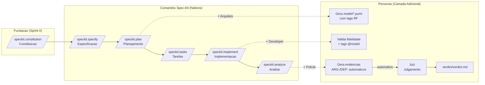
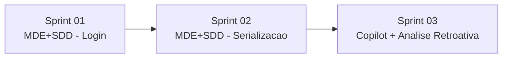

# Plano de Sprints -- Keyphrase Curation (KPC)

**Projeto:** Frontend MVVM de curadoria de keyphrases com backend FastAPI
**Total de Sprints:** 3 sprints

---

## Sumario

- [Natureza dos Experimentos](#natureza-dos-experimentos)
- [Convencoes do Pipeline (Sprints 01 e 02)](#convencoes-do-pipeline-sprints-01-e-02)
- [Sprint 01 -- Autenticacao e Tela de Login (MDE+SDD com Spec-Kit)](#sprint-01----autenticacao-e-tela-de-login-mdesdd-com-spec-kit)
  - [Requisitos Funcionais (RFs)](#requisitos-funcionais-rfs)
  - [Tarefas](#tarefas)
  - [Arquivos impactados (frontend)](#arquivos-impactados-frontend)
- [Sprint 02 -- Correcao de Serializacao: Pairwise + Centroid Similarity (MDE+SDD com Spec-Kit)](#sprint-02----correcao-de-serializacao-pairwise--centroid-similarity-mdesdd-com-spec-kit)
  - [Requisitos Funcionais (RFs)](#requisitos-funcionais-rfs-1)
  - [Tarefas](#tarefas-1)
  - [Arquivos impactados (backend)](#arquivos-impactados-backend)
- [Sprint 03 -- Correcao de Ordenacao de Clusters (Copilot + Analise Retroativa)](#sprint-03----correcao-de-ordenacao-de-clusters-copilot--analise-retroativa)
  - [Requisitos Funcionais (RFs)](#requisitos-funcionais-rfs-2)
  - [Tarefas](#tarefas-2)
  - [Status Geral da Sprint](#status-geral-da-sprint)
  - [Arquivos impactados (frontend + backend)](#arquivos-impactados-frontend--backend)
- [Mapa de Dependencias entre Sprints](#mapa-de-dependencias-entre-sprints)
- [Resumo de Esforco por Sprint](#resumo-de-esforco-por-sprint)

---

## Natureza dos Experimentos

| Sprint | Abordagem | Descricao | Status |
|--------|-----------|-----------|--------|
| **Sprint 01** | MDE+SDD (Spec-Kit + 4 Personas) | Experimento controlado utilizando o pipeline Spec-Kit com as quatro personas (Arquiteto, Developer, Policia, Juiz) para refinar e modelar o componente de Login existente, seguindo a abordagem MDE combinada com SDD (Spec-Driven Development). | Concluida |
| **Sprint 02** | MDE+SDD (Spec-Kit + 4 Personas) | Experimento controlado utilizando o pipeline Spec-Kit com as quatro personas para corrigir um bug de serializacao numpy no backend, seguindo a mesma abordagem MDE+SDD da Sprint 01. | Concluida |
| **Sprint 03** | Copilot (sem metodologia) + Analise retroativa com Spec-Kit | Experimento sem metodologia formal, utilizando apenas o GitHub Copilot via chat para implementar correcoes de ordenacao, labels e pareamento. Posteriormente, aplicou-se analise retroativa com as quatro personas do Spec-Kit para gerar artefatos de modelagem, evidencias e vereditos a partir dos logs experimentais. | Concluida |

---

## Convencoes do Pipeline (Sprints 01 e 02)

As Sprints 01 e 02 executam obrigatoriamente o pipeline completo a seguir:

| Passo | Comando | Persona | Artefato Gerado |
|-------|---------|---------|-----------------|
| 0 | `/speckit.constitution` | --- | `.specify/memory/constitution.md` |
| 1 | `/speckit.specify` | --- | `specs/<feature>/spec.md` (RF-N) |
| 2 | `/speckit.plan` | Arquiteto | `specs/<feature>/model/*.puml` com `@rf:` |
| 3 | `/speckit.tasks` | --- | `specs/<feature>/tasks.md` |
| 4 | `/speckit.implement` | Developer | Codigo com `// @model:` |
| 5 | `/speckit.analyze` | Policia + Juiz | `evidence/inconsistencies.md` + `verdict/verdict.md` |

---

## Sprint 01 -- Autenticacao e Tela de Login (MDE+SDD com Spec-Kit)

**Natureza do Experimento:** Experimento controlado utilizando o pipeline Spec-Kit com as quatro personas (Arquiteto, Developer, Policia, Juiz) para refinar e modelar o componente de Login existente. O objetivo foi avaliar a eficacia da abordagem MDE (Model-Driven Engineering) combinada com SDD (Spec-Driven Development) em um cenario de refatoracao de codigo legado.

**Escopo:** Tela de login funcional e seletor de topicos.

### Requisitos Funcionais (RFs)

| RF | Descricao | Prioridade | Status |
|----|-----------|------------|--------|
| RF-001 | Login com e-mail e senha via API | P1 | Concluido |

### Tarefas

| Tarefa | Backend | Frontend | Artefato Esperado | Status |
|--------|---------|----------|-------------------|--------|
| **T001** | Endpoint `/auth/login` existente | Criar/refinar `LoginView.jsx` + `useAuthStore` | `LoginView.jsx` funcional com arquitetura MVVM | Concluido -- 3 rodadas de analise: R1 (6 evidencias), R2 (6 resolvidas), R3 (runtime legados) |
| **ST001.1** | N/A | Aplicar correcoes do veredito R1: refatorar `User.js`, `AuthService.js`, `useAuthStore`, `config.js`, `TextField.jsx`, hook `useAuth` | Correcoes aplicadas e validadas | Concluido -- R2 aprovou 6/6 correcoes, GATE-03 liberado |
| **ST001.2** | N/A | Corrigir imports quebrados em 6 arquivos legados de `src-mvvm/` | Runtime sem erros | Concluido -- R3: 0 novas evidencias, 6 mantidas resolvidas |

### Arquivos impactados (frontend)

| Arquivo | Acao |
|---------|------|
| `views/pages/LoginView.jsx` | Refatorar para MVVM puro |
| `viewmodels/stores/useAuthStore.js` | Ajustar fluxo de erro |
| `models/services/AuthService.js` | Verificar contrato com API |
| `views/pages/TopicSelectionView.jsx` | Refatorar estados de loading/error |
| `viewmodels/stores/useTopicStore.js` | Adicionar cache |

---

## Sprint 02 -- Correcao de Serializacao: Pairwise + Centroid Similarity (MDE+SDD com Spec-Kit)

**Natureza do Experimento:** Experimento controlado utilizando o pipeline Spec-Kit com as quatro personas para corrigir um bug de serializacao no backend. O objetivo foi avaliar a eficacia da abordagem MDE+SDD em um cenario de correcao de bug envolvendo tipos numpy nao serializaveis pelo Pydantic/FastAPI.

**Escopo:** Corrigir `500 Internal Server Error` nos endpoints `GET /topic/clusters/{username}/{topic}/pairwise_similarity` e `GET /topic/clusters/{username}/{topic}/centroid_similarity`.

**Causa raiz:** O backend retornava `numpy.int64` na resposta JSON, que o Pydantic/FastAPI nao conseguia serializar (`PydanticSerializationError: Unable to serialize unknown type: <class 'numpy.int64'>`). A solucao foi criar o `NumpyConverter.to_native()` em `util/json_encoder.py` e aplica-lo no retorno da API.

**Backend:** `kpc-backend/` -- endpoint em `src/keyphrase_curation/`

### Requisitos Funcionais (RFs)

| RF | Descricao | Prioridade | Status |
|----|-----------|------------|--------|
| RF-003 | Corrigir serializacao do endpoint pairwise_similarity | P1 | Concluido |
| RF-004 | Corrigir serializacao do endpoint centroid_similarity (resolvido pelo NumpyConverter) | P1 | Concluido |

### Tarefas

| Tarefa | Backend | Frontend | Artefato Esperado | Status |
|--------|---------|----------|-------------------|--------|
| **T002** | Criar `NumpyConverter.to_native()` em `util/json_encoder.py` e aplicar no retorno de `list_clusters()` | N/A | `curl pairwise_similarity` -> HTTP 200 | Concluido -- 2 rodadas: R1 (AMBOS+AE), R2 (NE+NE). SC-001 aprovado |
| **ST002.1** | Aplicar `to_native()` em todo o dicionario de retorno (`return NumpyConverter.to_native({...})`). Modelo `.puml` atualizado com `@rf: RF-003-C1` | N/A | `curl` -> HTTP 200, sem `PydanticSerializationError` | Concluido -- Veredito R2: NE |
| **T003** | Resolvido automaticamente pelo `NumpyConverter` -- `centroid_similarity` passa pelo mesmo `list_clusters()` | N/A | `curl centroid_similarity` -> HTTP 200 | Concluido -- Herdou solucao da T002 |

### Arquivos impactados (backend)

| Arquivo | Acao |
|---------|------|
| `src/keyphrase_curation/util/json_encoder.py` | Criado -- `NumpyConverter.to_native()` |
| `src/keyphrase_curation/api/topic.py` | Modificado -- `return NumpyConverter.to_native({...})` |

---

## Sprint 03 -- Correcao de Ordenacao de Clusters (Copilot + Analise Retroativa)

**Natureza do Experimento:** Experimento de natureza hibrida, composto por duas fases:
- **Fase 1 -- Implementacao com Copilot (sem metodologia):** Correcoes de ordenacao, padronizacao de labels e agrupamento de pares reciprocos implementadas exclusivamente via chat com o GitHub Copilot, sem a utilizacao de nenhuma metodologia formal (MDE ou SDD).
- **Fase 2 -- Analise retroativa com Spec-Kit:** Aplicacao retrospectiva das quatro personas do Spec-Kit (Arquiteto, Developer, Policia, Juiz) sobre os logs experimentais da Fase 1, para gerar artefatos de modelagem, evidencias e vereditos, permitindo comparacao com as Sprints 01 e 02.

**Objetivo:** Comparar os resultados da implementacao sem metodologia (apenas Copilot) com os resultados obtidos nas Sprints 01 e 02 (que utilizaram MDE+SDD com Spec-Kit), avaliando metricas como qualidade do codigo, rastreabilidade de requisitos e completude dos artefatos.

**Escopo:** Corrigir a ordenacao dos endpoints `cluster_cohesion` e `centroid_similarity` -- atualmente retornam do menor para o maior, mas devem retornar do maior para o menor.

**Backend:** `kpc-backend/` -- `src/keyphrase_curation/model/cluster.py`

### Requisitos Funcionais (RFs)

| RF | Descricao | Prioridade | Status |
|----|-----------|------------|--------|
| RF-005 | Ordenar cluster_cohesion do maior para o menor | P1 | Concluido |
| RF-006 | Ordenar centroid_similarity do maior para o menor | P1 | Concluido |
| RF-007 | Padronizar labels do order by "Source Keyphrases" com enum `KeyphraseSortingLabels` | P2 | Concluido |
| RF-008 | Agrupar pares reciprocos no pairwise_similarity do backend | P2 | Concluido |
| RF-009 | Analise retroativa com personas (T004+T005) -- gerar artefatos de modelagem, evidencias e veredito | P3 | Concluido -- 1 rodada, 5 evidencias NE. Veredito: `/relatorios/sprint3-t004-t005/verdict/verdict.md` |
| RF-010 | Analise retroativa com personas (T006) -- gerar artefatos de modelagem, evidencias e veredito | P3 | Concluido -- 1 rodada, 5 evidencias NE. Veredito: `/relatorios/sprint3-t006/verdict/verdict.md` |
| RF-011 | Analise retroativa com personas (T007) -- gerar artefatos de modelagem, evidencias e veredito | P3 | Concluido -- 1 rodada, 5 evidencias NE. Veredito: `/relatorios/sprint3-t007/verdict/verdict.md` |

### Tarefas

| Tarefa | Backend | Frontend | Artefato Esperado | Status |
|--------|---------|----------|-------------------|--------|
| **T004** | `model/cluster.py`: `reverse=False` -> `reverse=True` no `sorted()` de `cluster_cohesion` | N/A | Resposta HTTP 200 com ordenacao descendente | Concluido -- Testado: `[1.0, 1.0, 1.0, 0.92, 0.75, ...]` |
| **T005** | `model/cluster.py`: `reverse=False` -> `reverse=True` no `sorted()` de `centroid_similarity` | N/A | Resposta HTTP 200 com ordenacao descendente | Concluido -- Testado: `[1.0, 1.0, 1.0, 0.92, 0.75, 0.74, ...]` |
| **T006** | N/A | `KeyphraseSorting.js`: criar `KeyphraseSortingLabels`. `KeyphraseClusteringView.jsx`: substituir labels hardcoded pelo enum | Select de ordenacao padronizado via enum | Concluido |
| **T007** | `model/cluster.py`: pos-processamento em `get_keyphrase_descriptions()` para agrupar pares reciprocos adjacentes | N/A | Pares reciprocos adjacentes no pairwise_similarity | Concluido -- Testado: 140/140 pares adjacentes |
| **T008** | Aplicar personas (Arquiteto, Policia, Juiz) nas correcoes T004+T005. Base: `/relatorios/sprint3-t004-t005/log-copilot-sprint3-t004-t005.md`. Gerar: `model/*.puml`, `evidence/inconsistencies.md`, `verdict/verdict.md` | N/A | Artefatos de modelagem + evidencias + veredito para as correcoes de ordenacao | Concluido -- R1: 5 evidencias (2 TAG_MODEL_AUSENTE, 3 METODO_EXTRAS), 5 vereditos NE. Gates: 3 aprovados, 1 reprovado. 1 rodada finalizada |
| **T009** | Aplicar personas (Arquiteto, Policia, Juiz) na correcao T006. Base: `/relatorios/sprint3-t006/log-copilot-sprint3-t006.md`. Gerar: `model/*.puml`, `evidence/inconsistencies.md`, `verdict/verdict.md` | N/A | Artefatos de modelagem + evidencias + veredito para padronizacao de labels | Concluido -- R1: 5 evidencias (3 TAG_MODEL_AUSENTE, 1 METODO_EXTRAS, 1 ATRIBUTO_EXTRAS), 5 vereditos NE. Gates: 3 aprovados, 1 reprovado. 1 rodada finalizada |
| **T010** | Aplicar personas (Arquiteto, Policia, Juiz) na correcao T007. Base: `/relatorios/sprint3-t007/log-copilot-sprint3-t007.md`. Gerar: `model/*.puml`, `evidence/inconsistencies.md`, `verdict/verdict.md` | N/A | Artefatos de modelagem + evidencias + veredito para pareamento de pares reciprocos | Concluido -- R1: 5 evidencias (3 TAG_MODEL_AUSENTE, 2 METODO_EXTRAS), 5 vereditos NE. Gates: 3 aprovados, 1 reprovado. 1 rodada finalizada |

### Status Geral da Sprint

| Criterio | Resultado |
|----------|-----------|
| RF-005 (cluster_cohesion descendente) | OK -- `reverse=True` em `model/cluster.py:387` |
| RF-006 (centroid_similarity descendente) | OK -- `reverse=True` em `model/cluster.py:410` |
| RF-007 (labels do order by Source Keyphrases) | OK -- `KeyphraseSortingLabels` criado em `KeyphraseSorting.js`, aplicado em ambos selects |
| RF-008 (pares pairwise adjacentes) | OK -- Algoritmo de pos-processamento agrupa pares reciprocos. Testado: 140/140 adjacentes |
| RF-009 (analise retroativa T004+T005) | OK -- 1 rodada concluida. 5 vereditos NE. GATE-03 aprovado, GATE-04 reprovado (esperado) |
| RF-010 (analise retroativa T006) | OK -- 1 rodada concluida. 5 vereditos NE. GATE-03 aprovado, GATE-04 reprovado (esperado) |
| RF-011 (analise retroativa T007) | OK -- 1 rodada concluida. 5 vereditos NE. GATE-03 aprovado, GATE-04 reprovado (esperado) |
| Teste HTTP 200 | OK -- Todos os endpoints retornam 200 |
| Log experimental | OK -- `relatorios/log-copilot-sprint3-t004.md`, `t006.md`, `t007.md` |
| Tempo total | ~1h (T004+T005: 25min, T006: 15min, T007: 20min) |

### Arquivos impactados (frontend + backend)

| Arquivo | Acao |
|---------|------|
| `kpc-backend/src/keyphrase_curation/model/cluster.py` | Ordenacao cluster_cohesion/centroid_similarity (ascendente -> descendente) -- Concluido |
| `kpc-backend/src/keyphrase_curation/model/cluster.py` | Pares reciprocos agrupados em `get_keyphrase_descriptions()` para PAIRWISE_SIMILARITY (T007) |
| `kpc-frontend/src-mvvm/shared/enums/KeyphraseSorting.js` | `KeyphraseSortingLabels` criado como alias PascalCase (T006) |
| `kpc-frontend/src-mvvm/views/pages/KeyphraseClusteringView.jsx` | Labels hardcoded substituidos por `KeyphraseSortingLabels` (T006) |
| `/relatorios/sprint3-t004-t005/` | Gerado -- classes.puml, sequence.puml, components.puml, evidence/inconsistencies.md, verdict/verdict.md (T008) |
| `/relatorios/sprint3-t006/` | Gerado -- classes.puml, sequence.puml, components.puml, evidence/inconsistencies.md, verdict/verdict.md (T009) |
| `/relatorios/sprint3-t006/` | Gerado -- classes.puml, sequence.puml, components.puml, evidence/inconsistencies.md, verdict/verdict.md (T010) |

---

## Mapa de Dependencias entre Sprints

| Sprint | Abordagem | Depende de | Pre-requisito para |
|--------|-----------|------------|-------------------|
| 01 -- Autenticacao e Login | MDE+SDD (Spec-Kit + 4 Personas) | --- | 02 |
| 02 -- Correcao de Serializacao | MDE+SDD (Spec-Kit + 4 Personas) | 01 | 03 |
| 03 -- Correcao de Ordenacao + Analise | Copilot (sem metodologia) + Analise retroativa | 02 | --- |

---

## Resumo de Esforco por Sprint

| Sprint | Metodologia | RFs | Tarefas | Frontend | Backend |
|--------|-------------|-----|---------|----------|---------|
| Sprint 01 | MDE+SDD (Spec-Kit) | RF-001, RF-002 | T001 + ST001.1 + ST001.2 | Refatorar 4 arquivos | Nenhum |
| Sprint 02 | MDE+SDD (Spec-Kit) | RF-003, RF-004 | T002 + ST002.1 + T003 | N/A | `json_encoder.py` (criar), `api/topic.py` (modificar) |
| Sprint 03 | Copilot (sem metodologia) + análise retroativa Spec-Kit | RF-005 a RF-011 | T004 + T005 + T006 + T007 + T008 + T009 + T010 | `KeyphraseSorting.js` (criar labels enum), `KeyphraseClusteringView.jsx` (usar enum) | `model/cluster.py` (corrigir ordenação + parear pares) |