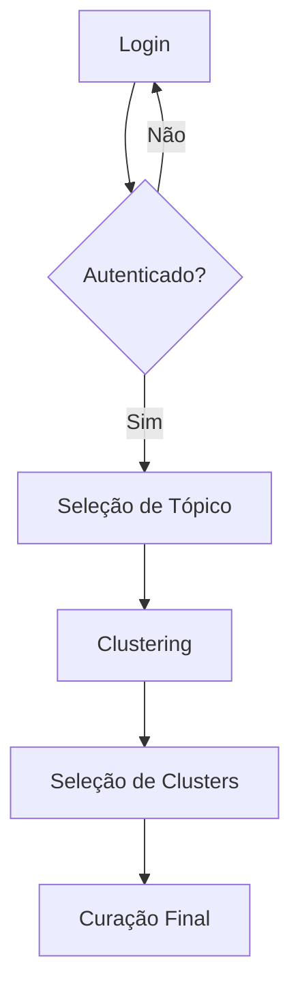

# 🏗️ Keyphrase Curation - Arquitetura MVVM

## 📊 Visão Geral

Este é um frontend React implementado seguindo o padrão **Model-View-ViewModel (MVVM)** para sistema de curação de keyphrases. A arquitetura promove separação clara de responsabilidades, testabilidade e manutenibilidade.

## 🎯 Arquitetura MVVM

### 📂 Estrutura do Projeto

```
src-mvvm/
├── models/                 # 📊 MODEL - Dados + API + Lógica de Negócio
│   ├── entities/          # Entidades de domínio
│   │   ├── User.js        # Entidade de usuário
│   │   ├── Topic.js       # Entidade de tópico
│   │   ├── Keyphrase.js   # Entidade de keyphrase
│   │   ├── Cluster.js     # Entidade de cluster
│   │   └── Annotation.js  # Entidade de anotação
│   └── services/          # Comunicação com API
│       ├── AuthService.js      # APIs de autenticação
│       ├── TopicService.js     # APIs de tópicos
│       ├── KeyphraseService.js # APIs de keyphrases
│       ├── ClusterService.js   # APIs de clusters
│       └── AnnotationService.js # APIs de curação
│
├── viewmodels/            # 🧠 VIEWMODEL - Estado + Lógica de Apresentação
│   ├── stores/            # Stores Zustand para estado global
│   │   ├── useAuthStore.js     # Estado de autenticação
│   │   ├── useTopicStore.js    # Estado de tópicos
│   │   └── useFlowStore.js     # Estado do fluxo
│   └── hooks/             # Custom hooks para lógica de apresentação
│       ├── useLoginViewModel.js            # ViewModel do login
│       ├── useTopicSelectionViewModel.js   # ViewModel de seleção de tópico
│       ├── useKeyphraseClusteringViewModel.js # ViewModel de clustering
│       ├── useKeyphraseClustersViewModel.js   # ViewModel de seleção
│       └── useCuratedKeyphrasesViewModel.js   # ViewModel de curação
│
└── views/                 # 🎨 VIEW - UI Pura (sem lógica de negócio)
    ├── components/        # Componentes reutilizáveis
    │   ├── Button.jsx          # Botão padronizado
    │   ├── TextField.jsx       # Campo de texto padronizado
    │   ├── Chip.jsx           # Chip padronizado
    │   ├── Dialog.jsx         # Modal padronizado
    │   ├── KeyphraseItem.jsx  # Item de keyphrase
    │   └── ClusterCard.jsx    # Card de cluster
    ├── layouts/           # Layouts da aplicação
    │   ├── AuthLayout.jsx     # Layout para autenticação
    │   └── MainLayout.jsx     # Layout principal
    ├── pages/             # Páginas principais
    │   ├── LoginView.jsx              # Página de login
    │   ├── TopicSelectionView.jsx     # Página de seleção de tópico
    │   ├── KeyphraseClusteringView.jsx # Página de clustering
    │   ├── KeyphraseClustersView.jsx   # Página de seleção
    │   └── CuratedKeyphrasesView.jsx   # Página de curação
    └── index.js           # Exports centralizados
```

### 🔄 Fluxo MVVM

```
┌─────────────┐    User Events    ┌──────────────┐    API Calls    ┌─────────────┐
│    VIEW     │ =================> │  VIEWMODEL   │ ===============> │    MODEL    │
│  (UI Pura)  │ <================= │(Lógica + UI) │ <=============== │(Dados + API)│
│React Components│  Data Binding   │   Estado     │   JSON Data     │Business Logic│
└─────────────┘                   └──────────────┘                 └─────────────┘
```

## 🚀 Fluxo da Aplicação

### 📱 Rotas Principais

1. **`/`** - Login
2. **`/topics`** - Seleção de Tópico
3. **`/clustering`** - Clustering de Keyphrases
4. **`/clusters`** - Seleção de Clusters
5. **`/curation`** - Curação Final

### 🔐 Fluxo de Autenticação



## 🎨 Camadas Detalhadas

### 📊 MODEL (Dados + API)

**Responsabilidades:**
- Comunicação com APIs
- Validação de dados
- Regras de negócio
- Cache e persistência

**Principais Services:**
- `AuthService`: 6 APIs de autenticação
- `TopicService`: 4 APIs de tópicos
- `KeyphraseService`: 4 APIs de keyphrases
- `ClusterService`: 7 APIs de clusters
- `AnnotationService`: 3 APIs de curação

### 🧠 VIEWMODEL (Estado + Lógica de Apresentação)

**Responsabilidades:**
- Gerenciar estado da UI
- Formatação de dados
- Validação de formulários
- Coordenação entre View e Model

**Stores Zustand:**
- `useAuthStore`: Estado global de autenticação
- `useTopicStore`: Estado global de tópicos
- `useFlowStore`: Estado global do fluxo

**Custom Hooks:**
- `useLoginViewModel`: Lógica do formulário de login
- `useTopicSelectionViewModel`: Lógica de seleção de tópico
- `useKeyphraseClusteringViewModel`: Lógica de drag & drop de clustering
- `useKeyphraseClustersViewModel`: Lógica de seleção de clusters
- `useCuratedKeyphrasesViewModel`: Lógica de curação com aliases

### 🎨 VIEW (UI Pura)

**Responsabilidades:**
- Renderização da interface
- Captura de eventos do usuário
- ZERO lógica de negócio

**Componentes Principais:**
- `LoginView`: Formulário de login puro
- `TopicSelectionView`: Interface de seleção de tópico
- `KeyphraseClusteringView`: Interface de drag & drop
- `KeyphraseClustersView`: Interface de seleção com chips
- `CuratedKeyphrasesView`: Interface de curação com aliases

## 🔧 Como Usar

### 🏃‍♂️ Executar Aplicação MVVM

```bash
# Instalar dependências (se necessário)
npm install

# Executar aplicação MVVM
npm run dev:mvvm   # Porta 5174

# Para comparação, executar aplicação original
npm run dev        # Porta 5173
```

### 📝 Desenvolvimento

#### Criando uma Nova View

1. **Criar ViewModel** em `src-mvvm/viewmodels/hooks/`:
```javascript
export const useMyViewModel = () => {
  // Estado local
  const [data, setData] = useState([]);
  
  // Stores globais
  const authStore = useAuthStore();
  
  // Handlers
  const handleAction = () => {
    // Lógica aqui
  };
  
  // Retornar estado e ações para a View
  return {
    data,
    handleAction,
    // ... outros dados e handlers
  };
};
```

2. **Criar View** em `src-mvvm/views/pages/`:
```javascript
const MyView = ({
  data,
  handleAction,
  // ... props do ViewModel
}) => {
  return (
    <MainLayout>
      {/* UI pura aqui */}
    </MainLayout>
  );
};
```

3. **Conectar no App**:
```javascript
function MyPage() {
  const viewModel = useMyViewModel();
  return <MyView {...viewModel} />;
}

// Adicionar rota
<Route path="/my-page" element={<MyPage />} />
```

#### Adicionando uma Nova API

1. **Atualizar Service** em `src-mvvm/models/services/`:
```javascript
// ExampleService.js
class ExampleService {
  async newMethod(param) {
    return await apiClient.get(`/endpoint/${param}`);
  }
}
```

2. **Usar no ViewModel**:
```javascript
import { exampleService } from '../../models/services/ExampleService.js';

export const useMyViewModel = () => {
  const loadData = async () => {
    const data = await exampleService.newMethod(param);
    setData(data);
  };
  
  // ...
};
```

## 🧪 Benefícios da Arquitetura MVVM

### ✅ Vantagens

1. **Separação Clara**: Cada camada tem responsabilidade bem definida
2. **Testabilidade**: Models e ViewModels podem ser testados isoladamente
3. **Reutilização**: Components e Services podem ser reutilizados
4. **Manutenibilidade**: Mudanças isoladas em cada camada
5. **Escalabilidade**: Estrutura organizada para crescimento

### 🔄 Comparação com Frontend Atual

| Aspecto | Frontend Atual (`src/`) | Frontend MVVM (`src-mvvm/`) |
|---------|-------------------------|----------------------------|
| **Arquitetura** | Componentes com lógica mista | MVVM com separação clara |
| **Estado** | Stores Zustand diretos | Stores + ViewModels |
| **API** | apiService.js monolítico | Services especializados |
| **Testabilidade** | Difícil (lógica + UI) | Fácil (camadas isoladas) |
| **Reutilização** | Limitada | Alta |
| **Manutenção** | Complexa | Simples |

## 📚 Documentação Adicional

### 🔗 Links Úteis

- [Zustand Documentation](https://github.com/pmndrs/zustand)
- [Material-UI Components](https://mui.com/components/)
- [React Router](https://reactrouter.com/)
- [MVVM Pattern](https://learn.microsoft.com/en-us/dotnet/architecture/maui/mvvm)

### 🛠️ Configuração do Ambiente

Para executar ambos os frontends simultaneamente:

```bash
# Terminal 1 - Frontend atual
npm run dev        # http://localhost:5173

# Terminal 2 - Frontend MVVM
npm run dev:mvvm   # http://localhost:5174
```

### 🎯 Próximos Passos

1. ✅ **FASE 1**: Models implementados
2. ✅ **FASE 2**: ViewModels implementados
3. ✅ **FASE 3**: Views implementadas
4. ⏳ **Configurar scripts para desenvolvimento paralelo**
5. ⏳ **Testes e validação da arquitetura**
6. ⏳ **Documentação de migração**

---

**🎉 Arquitetura MVVM implementada com sucesso!**

*Frontend modular, testável e maintível para sistema de curação de keyphrases.*