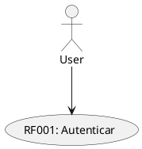
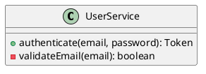
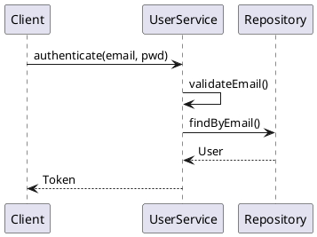
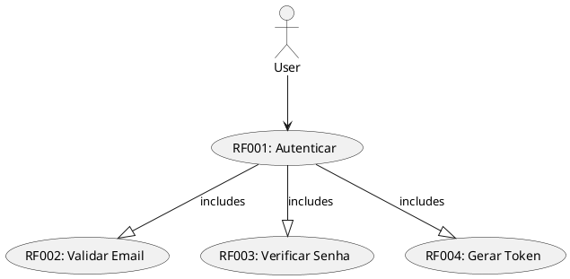

# 🧩 FASE 3 — Integração SDD + MDE

## ✅ Status: CONCLUÍDO

**Data**: Mai 2026  
**Responsável**: GitHub Copilot (Spec-Kit Framework)

---

## 📌 Resumo Executivo

A FASE 3 estabeleceu as **convenções de integração** entre Especificação (SDD) e Modelagem (MDE):

✅ 4 Modelos PlantUML Oficiais (obrigatórios)  
✅ Convenções de Rastreabilidade (RF → Código → Teste)  
✅ Padrões de Nomenclatura (RF001 → UserService.authenticate())  
✅ Documentação Completa com Exemplos  

---

## 🎯 Objetivos da FASE 3

- [x] Definir modelos oficiais
- [x] Criar convenções de rastreabilidade
- [x] Padronizar naming
- [x] Documentar integração SDD + MDE

---

## 🏗️ Os Quatro Modelos Oficiais

### 1. 🎭 Diagrama de Casos de Uso

**Propósito**: Mostrar interações com atores  
**Quando**: Especificar funcionalidades de usuário  
**Obrigatório**: SIM

**Exemplo**:


**Arquivo**: `kpc-spec-kit/MODELS.md::1. Diagrama de Casos de Uso`

---

### 2. 📊 Diagrama de Classes

**Propósito**: Mostrar estrutura (classes, métodos, atributos)  
**Quando**: Modelar entidades e serviços  
**Obrigatório**: SIM

**Exemplo**:


**Arquivo**: `kpc-spec-kit/MODELS.md::2. Diagrama de Classes`

---

### 3. 🔄 Diagrama de Sequência

**Propósito**: Mostrar fluxos de interação (ordem de chamadas)  
**Quando**: Detalhar como RF é executado  
**Obrigatório**: SIM

**Exemplo**:


**Arquivo**: `kpc-spec-kit/MODELS.md::3. Diagrama de Sequência`

---

### 4. 🏗️ Diagrama de Componentes

**Propósito**: Mostrar arquitetura (packages, dependências)  
**Quando**: Visualizar estrutura geral  
**Obrigatório**: SIM

**Exemplo**:
```puml
@startuml
package "API Layer" {
  component [User Service] as SVC
}

package "Data Layer" {
  component [User Repository] as REPO
}

package "External" {
  component [Database] as DB
}

SVC --> REPO --> DB
@enduml
```

**Arquivo**: `kpc-spec-kit/MODELS.md::4. Diagrama de Componentes`

---

## 🔗 Convenções de Rastreabilidade

### Estrutura Geral

```
Requisito (RF)
    ↓
Especificação (spec.md)
    ↓
Modelo (PlantUML: 4 diagramas)
    ↓
Código (src/)
    ↓
Teste (tests/)
```

### Padrão de Vinculação

**Na Especificação**:
```markdown
## RF001 — Autenticar Usuário

Critério BDD:
- Dado usuário registrado
- Quando submete credenciais
- Então retorna token válido

**Modelos**: 
- Diagrama: .specify/diagrams/auth_usecases.puml::UC_AUTH
- Classes: .specify/diagrams/auth_classes.puml::UserService::authenticate()
- Sequência: .specify/diagrams/auth_sequence.puml::fluxo_principal
- Componentes: .specify/diagrams/auth_components.puml::Auth Layer
```

**No Código**:
```python
class UserService:
    """
    RF001 — Autenticação
    
    Rastreamento:
    - Especificação: specs/auth/spec.md::RF001
    - Modelo: diagrams/auth_classes.puml::UserService
    - Teste: tests/test_user_service.py::test_authenticate_success
    """
    
    def authenticate(self, email: str, password: str) -> Token:
        """
        RF001 — Autentica com email/senha
        
        Rastreamento:
        - Diagrama: diagrams/auth_sequence.puml::fluxo_principal
        - Teste: tests/test_user_service.py::test_authenticate_success
        """
        pass
```

**No Teste**:
```python
def test_authenticate_success(self):
    """
    RF001 — Autentica com credenciais válidas
    
    Rastreamento:
    - Requisito: specs/auth/spec.md::RF001
    - Método: UserService::authenticate()
    - Diagrama: diagrams/auth_sequence.puml::fluxo_principal
    """
    pass
```

**Arquivo Completo**: `kpc-spec-kit/TRACEABILITY-CONVENTIONS.md`

---

## 📝 Padrões de Nomenclatura

### Mapeamento RF → Código

```
RF001 → UserService.authenticate()
RF002 → UserService.validateEmail()
RF003 → UserService.verifyPassword()
RF004 → TokenGenerator.generateToken()

RNF001 → @performance_requirement (decorator/annotation)
RNF002 → SecurityValidator
```

### Padrões por Tipo

| Tipo | Padrão | Exemplo |
|------|--------|---------|
| **Classe Service** | `[Domínio]Service` | UserService, AuthService |
| **Classe Repository** | `[Domínio]Repository` | UserRepository |
| **Classe Controller** | `[Domínio]Controller` | AuthController |
| **Classe Exception** | `[Erro]Exception` | AutenticacaoFalhadaException |
| **Método CRUD** | `create`, `get`, `update`, `delete` | create_user(), get_by_id() |
| **Método Ação** | `[verbo][Coisa]` | authenticate(), validate_email() |
| **Variável** | `[tipo]_[significado]` | authentication_token, is_valid |
| **Arquivo** | `[classe_principal].py` | user_service.py |

### Exemplo Completo

```python
# ✅ CORRETO

# src/auth/user_service.py
class UserService:
    """RF001-004"""
    
    def authenticate(self, email: str, password: str) -> Token:
        """RF001"""
        # Validação (RF002)
        if not self.validate_email(email):
            raise EmailInvalidoException()
        
        # Verificação (RF003)
        user = self._find_user(email)
        if not user or not user.verify_password(password):
            raise AutenticacaoFalhadaException()
        
        # Geração (RF004)
        authentication_token = self._generate_token(user)
        return authentication_token
    
    def validate_email(self, email: str) -> bool:
        """RF002"""
        pass
    
    def _generate_token(self, user: User) -> Token:
        """RF004"""
        pass

# tests/test_user_service.py
class TestUserService:
    def test_authenticate_success(self):
        """RF001"""
        pass
    
    def test_validate_email_success(self):
        """RF002"""
        pass
```

**Arquivo Completo**: `kpc-spec-kit/NAMING-CONVENTIONS.md`

---

## 📁 Estrutura de Integração

### Layout de Pasta (Exemplo)

```
kpc-spec-kit/
├── specs/auth/
│   ├── spec.md                      # RF001-004, RNF001-002
│   ├── tasks.md                     # Decomposição
│   ├── acceptance.md                # Testes BDD
│   └── traceability.md              # Matriz RF → Código
│
├── .specify/
│   └── diagrams/
│   ├── auth_usecases.puml          # Casos de uso (RF)
│   ├── auth_classes.puml           # Classes (RF → Classe)
│   ├── auth_sequence.puml          # Fluxos (RF → Sequência)
│   └── auth_components.puml        # Arquitetura

kpc-backend/
├── src/auth/
│   ├── user_service.py             # UserService (RF001-004)
│   ├── user_repository.py          # UserRepository
│   ├── auth_controller.py          # AuthController
│   ├── exceptions.py               # AutenticacaoException
│   └── models.py                   # User, Token
│
├── tests/
│   ├── test_user_service.py        # Testes RF001-004
│   ├── acceptance/
│   │   └── auth.feature            # Testes BDD (Gherkin)
│   └── integration/
│       └── test_auth_flow.py       # Testes fluxo completo
```

---

## 🔄 Ciclo de Integração

### Quando Criar Nova Feature

```
1. CRIAR ESPECIFICAÇÃO (specs/auth/spec.md)
   ├─ RF001, RF002, RF003, ...
   ├─ RNF001, RNF002, ...
   └─ Critérios BDD

2. CRIAR 4 DIAGRAMAS (.specify/diagrams/auth_*.puml)
   ├─ auth_usecases.puml
   ├─ auth_classes.puml
   ├─ auth_sequence.puml
   └─ auth_components.puml

3. CRIAR RASTREABILIDADE (specs/auth/traceability.md)
   ├─ Matriz RF → Modelo → Código → Teste
   └─ Validar cobertura 100%

4. IMPLEMENTAR CÓDIGO (src/auth/)
   ├─ Classes com docstrings (rastreabilidade)
   ├─ Métodos nomeados por RF
   └─ Comentários com RF

5. CRIAR TESTES (tests/)
   ├─ Testes unitários (RF)
   ├─ Testes BDD (Gherkin)
   └─ Cobertura > 80%

6. VALIDAR ALINHAMENTO
   ├─ Todos RF têm código
   ├─ Todos métodos têm testes
   ├─ Rastreabilidade 100%
   └─ Matriz atualizada
```

---

## ✅ Checklist de Integração

Para cada nova feature:

- [ ] **Especificação**
  - [ ] RF001, RF002, ... identificados
  - [ ] RNF001, RNF002, ... identificados
  - [ ] Critérios em formato BDD

- [ ] **Modelos (4 Diagramas)**
  - [ ] Casos de Uso (RF → UC)
  - [ ] Classes (RF → Classe/Método)
  - [ ] Sequência (RF → Fluxo)
  - [ ] Componentes (Arquitetura completa)

- [ ] **Rastreabilidade**
  - [ ] Matriz RF → Modelo → Código → Teste
  - [ ] Cobertura 100%
  - [ ] Sem órfãos (RF sem código, etc)

- [ ] **Código**
  - [ ] Cada classe vinculada a RF
  - [ ] Cada método vinculada a RF
  - [ ] Rastreabilidade inline (docstrings)
  - [ ] Nomes semânticos (não genéricos)

- [ ] **Testes**
  - [ ] Testes unitários para cada método (RF)
  - [ ] Testes BDD para cada cenário (Gherkin)
  - [ ] Cobertura > 80%
  - [ ] Testes passando

---

## 🎓 Exemplo Prático Completo

### Feature: Autenticação de Usuário

#### 1. Especificação (specs/auth/spec.md)

```markdown
# 📋 Especificação — Autenticação (RF001-004)

## RF001 — Autenticar Usuário
Dado usuário registrado
Quando submete email e senha
Então retorna token JWT

## RF002 — Validar Email
Validar formato RFC 5322

## RF003 — Verificar Senha
Comparar com hash bcrypt

## RF004 — Gerar Token
Gerar JWT com exp 1 hora
```

#### 2. Diagramas (.specify/diagrams/auth_*.puml)



#### 3. Código (src/auth/user_service.py)

```python
class UserService:
    """RF001-004 — Autenticação"""
    
    def authenticate(self, email: str, pwd: str) -> Token:
        """RF001"""
        is_email_valid = self.validate_email(email)
        if not is_email_valid:
            raise EmailInvalidoException()
        
        user = self._find_user(email)
        is_password_correct = user.verify_password(pwd)
        if not is_password_correct:
            raise AutenticacaoFalhadaException()
        
        token = self._generate_token(user)
        return token
```

#### 4. Testes (tests/test_user_service.py)

```python
def test_authenticate_success(self):
    """RF001 — Sucesso"""
    token = service.authenticate("joao@ex.com", "senha123")
    assert token is not None
```

#### 5. Testes BDD (tests/acceptance/auth.feature)

```gherkin
Cenário: Login bem-sucedido (RF001)
  Dado usuário "joao@ex.com" com senha "senha123"
  Quando autentica
  Então retorna token válido
```

#### 6. Rastreabilidade (specs/auth/traceability.md)

| RF | Modelo | Código | Teste | Status |
|----|--------|--------|-------|--------|
| RF001 | ✅ | ✅ | ✅ | ✅ 100% |
| RF002 | ✅ | ✅ | ✅ | ✅ 100% |
| RF003 | ✅ | ✅ | ✅ | ✅ 100% |
| RF004 | ✅ | ✅ | ✅ | ✅ 100% |

---

## 📖 Documentação da FASE 3

| Arquivo | Propósito |
|---------|-----------|
| **MODELS.md** | 4 modelos PlantUML obrigatórios com exemplos |
| **TRACEABILITY-CONVENTIONS.md** | Convenções de rastreabilidade RF ↔ Código ↔ Teste |
| **NAMING-CONVENTIONS.md** | Padrões de nomeação (RF001 → UserService) |
| **docs/FASE3_INTEGRACAO.md** | Esta documentação |

---

## 🔗 Boas Práticas

1. **4 Diagramas Obrigatórios**: Nunca pule um tipo
2. **Rastreabilidade Bidirecional**: RF→Código e Código→RF
3. **Nomenclatura Semântica**: Nomes refletem responsabilidade
4. **Anotações Inline**: Cada classe/método com docstring RF
5. **Matriz Atualizada**: Verdade única sobre alinhamento
6. **Testes por RF**: Um teste para cada requisito

---

## 🚀 Próximos Passos (FASE 4)

### FASE 4 — Fluxo Completo de Desenvolvimento

- [ ] Criar exemplo end-to-end com 1 feature real
- [ ] Documentar ciclo completo (Arquiteto → Dev → QA)
- [ ] Executar em projeto real (KPC)
- [ ] Validar metodologia

---

## 📊 Status da Implementação

| FASE | Status | Arquivos | Conclusão |
|------|--------|----------|-----------|
| FASE 1: Estrutura | ✅ | 8 | Mai 2026 |
| FASE 2: Agentes | ✅ | 5 | Mai 2026 |
| FASE 3: SDD + MDE | ✅ | 3 | Mai 2026 |
| FASE 4: Fluxo Completo | ⏳ | - | - |
| FASE 5+: Próximas | ⏳ | - | - |

---

## 📂 Arquivos Criados

```
kpc-spec-kit/
├── MODELS.md                       # 4 modelos PlantUML
├── TRACEABILITY-CONVENTIONS.md    # Convenções rastreabilidade
├── NAMING-CONVENTIONS.md          # Padrões nomeação
└── docs/
    └── FASE3_INTEGRACAO.md        # Esta documentação
```

---

## 🔗 Referências

- Plano original: `plano-de-acao-speck-kit.txt`
- FASE 1: `docs/FASE1_ESTRUTURA.md`
- FASE 2: `docs/FASE2_AGENTES.md`
- Modelos: `MODELS.md`
- Rastreabilidade: `TRACEABILITY-CONVENTIONS.md`
- Nomenclatura: `NAMING-CONVENTIONS.md`

---

**Status Final**: ✅ **FASE 3 COMPLETA**  
**Data de Conclusão**: Mai 2026  
**Próxima Fase**: FASE 4 — Fluxo Completo de Desenvolvimento

---

*Integração SDD + MDE para Spec-Kit Framework — Trabalho de Conclusão de Curso (TCC)*

---

## 🔗 Ligação com o Protocolo

- **Validação por sprint e por commit**: cada entrega deve apresentar evidência ligada ao sprint e ao(s) commit(s) correspondentes.
- **QA como gate de merge**: o time de QA pode bloquear merge enquanto houver inconsistências abertas; sempre abrir issue(s) vinculadas aos commits/sprints afetados.
- **Grupos de Métrica**: A — qualidade de modelo; B — alinhamento modelo↔código; C — qualidade de código; D — processo. Associe requisitos/tarefas a um grupo e registre a evidência.
- **Rastreabilidade de Evidências**: registre IDs de commit, número da issue e sprint no campo "Evidências" das especificações e na `traceability.md`.
- **Procedimento**: em caso de inconsistência detectada pelo QA, documentar, bloquear merge e solicitar correção via issue vinculada.

