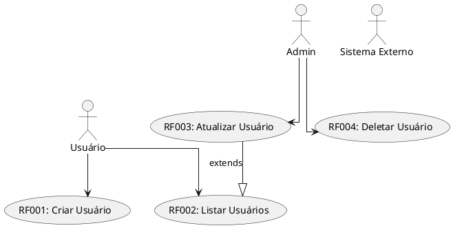
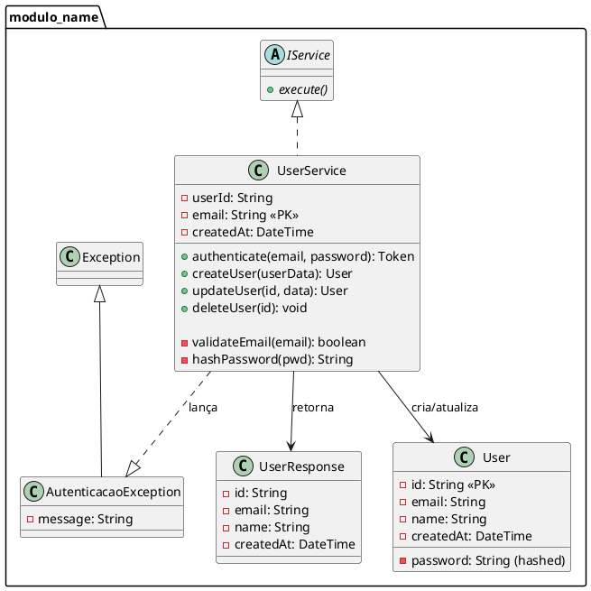
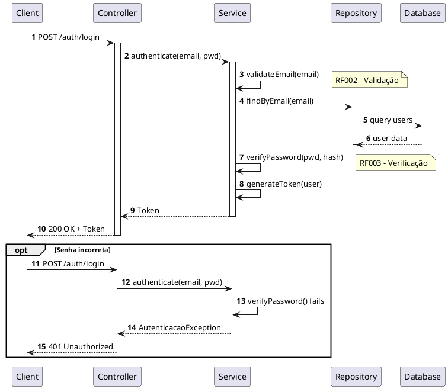
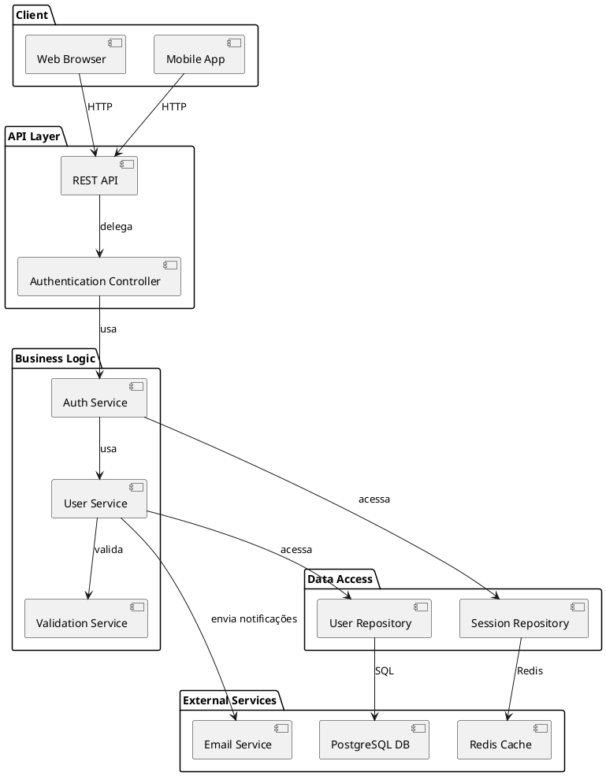
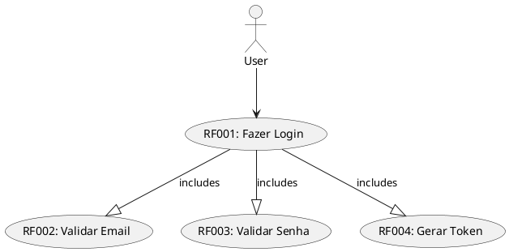
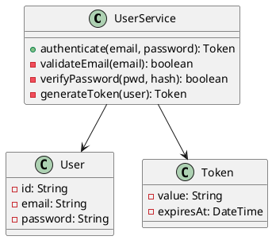
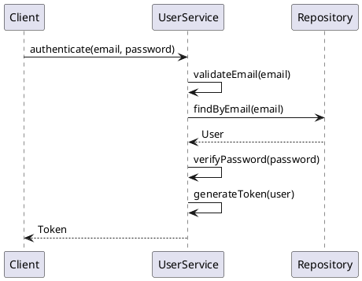
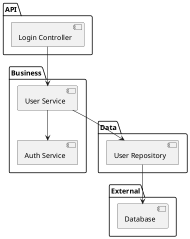

# 📐 MODELS.md — Modelos Oficiais PlantUML

## 📌 Visão Geral

Este arquivo define os **modelos oficiais** para diagramas PlantUML no framework Spec-Kit.

Os 4 tipos de diagramas são **obrigatórios** em toda especificação para garantir cobertura completa:

1. **Diagrama de Casos de Uso** — Interações com atores
2. **Diagrama de Classes** — Estrutura do sistema
3. **Diagrama de Sequência** — Fluxos de interação
4. **Diagrama de Componentes** — Arquitetura de alto nível

---

## 🎭 1. Diagrama de Casos de Uso

### Propósito
Mostrar as **interações entre atores e sistema**.

### Quando Usar
- Especificar funcionalidades do ponto de vista do usuário
- Identificar casos de uso principais
- Mapear RF → Casos de Uso

### Padrão Obrigatório



### Componentes Obrigatórios

**Atores**:
```puml
actor "Nome do Ator" as ALIAS
```

**Casos de Uso** (com RF):
```puml
usecase "RF001: Descrição" as ALIAS
```

**Relações**:
```puml
Actor --> UseCase
UseCase --|> OtherUseCase : extends
UseCase ..|> OtherUseCase : includes
```

---

## 📊 2. Diagrama de Classes

### Propósito
Mostrar a **estrutura do sistema**, classes, atributos e métodos.

### Quando Usar
- Modelar entidades de dados
- Definir interfaces e contracts
- Mapear RF → Classes/Métodos
- Mostrar relacionamentos (herança, composição)

### Padrão Obrigatório



### Componentes Obrigatórios

**Classes**:
```puml
class NomeDaClasse {
  - atributo_privado: tipo
  # atributo_protegido: tipo
  + metodo_publico(): retorno
}
```

**Anotações RF**:
```puml
class UserService {
  ' RF001, RF002 — Autenticação
  + authenticate(email, password): Token
  
  ' RF003 — Validação
  - validateEmail(email): boolean
}
```

**Relacionamentos**:
```puml
ClasseA --> ClasseB : associação
ClasseA --|> ClasseB : herança
ClasseA ..|> ClasseB : implementa interface
ClasseA *-- ClasseB : composição (forte)
ClasseA --o ClasseB : agregação (fraca)
```

---

## 🔄 3. Diagrama de Sequência

### Propósito
Mostrar **fluxos de interação** entre componentes.

### Quando Usar
- Detalhar como RF são executados
- Mostrar ordem de chamadas
- Identificar pontos de sincronização
- Mapear com testes de aceitação (BDD)

### Padrão Obrigatório



### Componentes Obrigatórios

**Participantes**:
```puml
participant Nome
actor Ator
database Database
```

**Interações**:
```puml
Actor -> Componente: mensagem()
Componente --> Actor: retorno
Componente -> Componente: auto-chamada
```

**Anotações**:
```puml
autonumber           ' Numeração automática
activate Obj         ' Objeto ativo
deactivate Obj       ' Inativo
note right: RF001 - Descrição
alt Alternativa
  ...
else Outra alternativa
  ...
end
```

---

## 🏗️ 4. Diagrama de Componentes

### Propósito
Mostrar **arquitetura de alto nível**, componentes e dependências.

### Quando Usar
- Mostrar estrutura geral do sistema
- Definir módulos/packages
- Mapear dependências externas (BD, APIs)
- Visualizar interfaces entre componentes

### Padrão Obrigatório



### Componentes Obrigatórios

**Packages**:
```puml
package "Nome do Package" {
  component [Componente A] as A
  component [Componente B] as B
}
```

**Componentes**:
```puml
component [Nome Legível] as ALIAS
interface "NomeInterface" as I
```

**Relacionamentos**:
```puml
ComponentA --> ComponentB : usar/chamar
ComponentA ..> ComponentB : dependência opcional
ComponentA -| ComponentB : implementa
```

---

## 📋 Checklist de Diagrama Completo

### Para Cada Feature/RF

- [ ] **Diagrama de Casos de Uso**
  - [ ] Todos os atores identificados
  - [ ] Todos os RF como casos de uso
  - [ ] Relacionamentos (extends, includes)

- [ ] **Diagrama de Classes**
  - [ ] Classes principais
  - [ ] Métodos anotados com RF
  - [ ] Atributos com tipos
  - [ ] Relacionamentos (herança, composição)

- [ ] **Diagrama de Sequência**
  - [ ] Fluxo principal
  - [ ] Fluxos alternativos (erro)
  - [ ] Sincronizações
  - [ ] Anotações RF

- [ ] **Diagrama de Componentes**
  - [ ] Todos os componentes
  - [ ] Dependências
  - [ ] Serviços externos
  - [ ] Fluxos principais

---

## 🔗 Exemplo Prático: Feature Login

### 1. Casos de Uso



### 2. Classes



### 3. Sequência



### 4. Componentes



---

## 🎯 Boas Práticas

1. **Nomeação Clara**: Use nomes descritivos, não genéricos
2. **Anotações RF**: Sempre anotar qual RF implementa
3. **Simplicidade**: Cada diagrama com um propósito claro
4. **Sincronização**: Manter diagramas sincronizados com código
5. **Versão**: Atualizar quando código muda
6. **Documentação**: Adicionar notas explicativas quando necessário

---

## 📎 Vinculação com Especificação

Cada diagrama deve ser **linkado** na especificação:

```markdown
## Modelos

### Diagrama de Casos de Uso
**Arquivo**: `.specify/diagrams/[feature]_usecases.puml`

```puml
[incluir PlantUML]
```
```

---

**Versão**: 1.0  
**Data**: Mai 2026  
**Status**: Ativo
