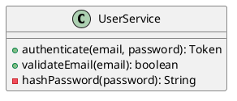

# 🔗 TRACEABILITY-CONVENTIONS.md — Convenções de Rastreabilidade

## 📌 Visão Geral

Este arquivo define como criar **rastreabilidade completa** entre:

```
Requisito (RF) → Modelo (PlantUML) → Código → Teste
```

O objetivo é garantir que **toda** mudança em um artefato afete os outros de forma explícita.

---

## 📋 Padrão Geral de Rastreabilidade

### 1. Requisito → Modelo

**Requisito na Especificação**:
```markdown
## RF001 — Autenticar Usuário

Critério BDD:
- Dado um usuário com email e senha válidos
- Quando submete credenciais
- Então retorna token válido
```

**Implementação no Diagrama**:
```puml
usecase "RF001: Autenticar Usuário" as UC_AUTH
class UserService {
  ' RF001 — Autenticação
  + authenticate(email, password): Token
}
```

**Vinculação**:
- Diagrama de Casos de Uso: `.specify/diagrams/[feature]_usecases.puml::RF001`
- Diagrama de Classes: `.specify/diagrams/[feature]_classes.puml::UserService::authenticate()`
- Diagrama de Sequência: `.specify/diagrams/[feature]_sequence.puml::fluxo_principal`

---

### 2. Modelo → Código

**Classe no Diagrama**:


**Implementação no Código**:
```python
class UserService:
    """
    RF001 — Autenticação de Usuário
    
    Rastreamento:
    - Modelo: .specify/diagrams/auth_classes.puml::UserService
    - Especificação: specs/auth/spec.md::RF001
    - Testes: tests/test_user_service.py::TestUserService
    """
    
    def authenticate(self, email: str, password: str) -> Token:
        """
        RF001 — Autentica com email/senha
        
        Rastreamento:
        - Diagrama: .specify/diagrams/auth_classes.puml::UserService::authenticate()
        - Teste: tests/test_user_service.py::test_authenticate_success
        
        BDD:
        Dado usuário registrado
        Quando submete credenciais corretas
        Então retorna token válido
        """
        if not self.validateEmail(email):
            raise EmailInvalidoException()
        
        user = self._find_by_email(email)
        if not user or not user.verify_password(password):
            raise AutenticacaoFalhadaException()
        
        return self._generate_token(user)
    
    def validateEmail(self, email: str) -> bool:
        """
        RF002 — Validar formato de email
        
        Rastreamento:
        - Diagrama: .specify/diagrams/auth_classes.puml::UserService::validateEmail()
        - Teste: tests/test_user_service.py::test_validate_email_success
        """
        pass
```

---

### 3. Código → Teste

**Classe com Método**:
```python
class UserService:
    def authenticate(self, email: str, password: str) -> Token:
        """RF001 — Autenticar"""
        pass
```

**Teste Unitário**:
```python
class TestUserService:
    """
    Testes para UserService (RF001)
    
    Rastreamento:
    - Classe testada: src/services/user_service.py::UserService
    - Requisito: specs/auth/spec.md::RF001
    """
    
    def test_authenticate_success(self):
        """
        RF001 — Autentica com credenciais válidas
        
        Rastreamento:
        - Método testado: UserService::authenticate()
        - Requisito: specs/auth/spec.md::RF001
        
        BDD:
        Dado usuário registrado
        Quando autentica com credenciais corretas
        Então retorna token válido
        """
        # Arrange
        user = User(email="joao@ex.com", password="senha123")
        service = UserService()
        
        # Act
        token = service.authenticate("joao@ex.com", "senha123")
        
        # Assert
        assert token is not None
        assert token.usuario_id == user.id
```

**Teste de Aceitação (BDD)**:
```gherkin
Funcionalidade: Autenticação (RF001)
  Como usuário
  Quero fazer login
  Para acessar minha conta

  Cenário: Login bem-sucedido
    # Rastreamento: RF001
    Dado que existe usuário "joao@ex.com" com senha "senha123"
    Quando executa login com "joao@ex.com" / "senha123"
    Então retorna token válido
```

---

## 📐 Estrutura de Pastas

```
specs/[feature-name]/
├── spec.md                  # Especificação (RF001, RF002, ...)
├── tasks.md                 # Tarefas (Task 1.1, 1.2, ...)
├── acceptance.md            # Testes de aceitação (BDD)
└── traceability.md          # Matriz de rastreabilidade

diagrams/
├── [feature-name]_usecases.puml      # Casos de uso (RF → UC)
├── [feature-name]_classes.puml       # Classes (RF → Classe)
├── [feature-name]_sequence.puml      # Sequência (RF → Fluxo)
└── [feature-name]_components.puml    # Componentes

src/
└── [modulo]/
    ├── service.py           # Classes (RF → Método)
    ├── repository.py        # Acesso a dados
    └── exceptions.py        # Exceções (RNF)

tests/
├── test_[modulo].py         # Testes unitários
├── test_[feature]_integration.py  # Testes integração
└── acceptance/
    └── [feature].feature    # Testes BDD (Gherkin)
```

---

## 🔄 Ciclo de Rastreabilidade

### Quando Criar

1. **Especificação Criada** → Anotar RF
2. **Diagrama Criado** → Ligar RF ao diagrama
3. **Código Escrito** → Anotar qual RF implementa
4. **Testes Criados** → Ligar testes ao RF

### Quando Atualizar

1. **RF Mudou** → Atualizar código + testes + diagrama
2. **Código Mudou** → Validar se diagrama ainda é válido
3. **Diagrama Mudou** → Validar se código reflete mudança
4. **Teste Falhou** → Investigar qual RF não foi atendido

### Quando Remover

**Nunca remova rastreabilidade sem documentar!**

```python
# ❌ ERRADO
# def authenticate(self):  # Removeu RF001
#     pass

# ✅ CORRETO
# DESCONTINUADO: RF001 foi movido para AuthenticationService
# Veja: specs/auth/spec.md::DEPRECATED
def authenticate_legacy(self):
    """[DEPRECATED] Use AuthenticationService.authenticate()"""
    pass
```

---

## 📊 Matriz de Rastreabilidade

Exemplo de matriz preenchida:

| RF | Modelo | Classe | Método | Teste | Status |
|----|--------|--------|--------|-------|--------|
| RF001 | ✅ .specify/diagrams/auth_classes.puml | UserService | authenticate() | test_authenticate_success | ✅ 100% |
| RF002 | ✅ .specify/diagrams/auth_classes.puml | UserService | validateEmail() | test_validate_email_success | ✅ 100% |
| RF003 | ✅ .specify/diagrams/auth_classes.puml | UserService | verifyPassword() | test_verify_password_success | ✅ 100% |
| RF004 | ✅ .specify/diagrams/auth_classes.puml | TokenGenerator | generateToken() | test_generate_token_success | ✅ 100% |
| RNF001 | ⚠️ Não diagramado | UserService | - | test_authenticate_performance | ⚠️ 50% |

---

## 🔍 Detectando Falta de Rastreabilidade

### Requisito Órfão

```
RF001 está em specs/auth/spec.md
Mas NÃO está em .specify/diagrams/auth_classes.puml
Mas NÃO está em src/services/user_service.py

✗ ERRO: Rastreabilidade quebrada
```

### Código Órfão

```
Classe UserValidator
Mas NÃO tem RF associado
Mas NÃO está em .specify/diagrams/

✗ AVISO: Over-engineering
```

### Teste Órfão

```
test_authenticate_special_case()
Mas NÃO tem RF associado
Mas NÃO está em specs/

✗ AVISO: Teste sem requisito
```

---

## ✅ Checklist de Rastreabilidade

### Para Cada Feature

- [ ] **Especificação (spec.md)**
  - [ ] RF001, RF002, ... identificados
  - [ ] RNF001, RNF002, ... identificados
  - [ ] Critérios em formato BDD
  - [ ] Cada RF é mencionado

- [ ] **Modelos (4 Diagramas)**
  - [ ] Casos de Uso: todos RF como UC
  - [ ] Classes: todas RF como método/classe
  - [ ] Sequência: fluxo completo de RF
  - [ ] Componentes: todos componentes necessários

- [ ] **Código (src/)**
  - [ ] Cada classe tem docstring com RF
  - [ ] Cada método tem docstring com RF
  - [ ] Rastreabilidade inline em comentários

- [ ] **Testes (tests/)**
  - [ ] Cada teste vinculado a RF
  - [ ] Testes unitários para cada método
  - [ ] Testes de aceitação em BDD
  - [ ] Cobertura > 80%

- [ ] **Matriz de Rastreabilidade (traceability.md)**
  - [ ] Todos RF têm entrada
  - [ ] Cobertura 100%
  - [ ] Sem inconsistências

---

## 🎯 Exemplo Completo: Feature Login

### 1. Especificação (specs/auth/spec.md)

```markdown
# 📋 Especificação — Login (RF001)

## RF001 — Autenticar Usuário
- Email obrigatório
- Senha obrigatória
- Validar formato email
- Retorna token válido
```

### 2. Diagrama de Classes (.specify/diagrams/auth_classes.puml)

```puml
class UserService {
  ' RF001 — Autenticação
  + authenticate(email, password): Token
  
  ' RF002 — Validação Email
  - validateEmail(email): boolean
}
```

### 3. Código (src/auth/user_service.py)

```python
class UserService:
    """
    RF001 — Autenticação
    
    Rastreamento:
    - Especificação: specs/auth/spec.md::RF001
    - Modelo: diagrams/auth_classes.puml::UserService
    - Testes: tests/test_user_service.py::TestUserService
    """
    
    def authenticate(self, email: str, password: str) -> Token:
        """
        RF001 — Autentica com email/senha
        
        Rastreamento:
        - Especificação: specs/auth/spec.md::RF001
        - Teste: tests/test_user_service.py::test_authenticate_success
        """
        # Implementação
        pass
```

### 4. Teste Unitário (tests/test_user_service.py)

```python
def test_authenticate_success(self):
    """
    RF001 — Autentica com credenciais válidas
    
    Rastreamento:
    - Método: UserService::authenticate()
    - Requisito: specs/auth/spec.md::RF001
    """
    # Implementação
    pass
```

### 5. Teste BDD (tests/acceptance/auth.feature)

```gherkin
Cenário: Login bem-sucedido
  # Rastreamento: RF001
  Dado que existe usuário "joao@ex.com"
  Quando autentica com credenciais corretas
  Então retorna token válido
```

### 6. Matriz (specs/auth/traceability.md)

| RF | Modelo | Código | Teste | Status |
|----|--------|--------|-------|--------|
| RF001 | ✅ | ✅ | ✅ | ✅ 100% |

---

## 🔗 Boas Práticas

1. **Sempre bidirecional**: Se RF→Código, então Código→RF
2. **Atualizar junto**: Nunca mude código sem atualizar rastreabilidade
3. **Documentar mudanças**: Use comentários quando alterar RF
4. **Validar regularmente**: Executar validação de rastreabilidade
5. **Manter matriz atualizada**: Matriz = verdade única

---

**Versão**: 1.0  
**Data**: Mai 2026  
**Status**: Ativo
