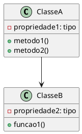

# 🔗 Rastreabilidade — [NOME_DA_FEATURE]

## 📌 Informações Básicas

| Campo | Valor |
|-------|-------|
| **Identificador** | RF001 |
| **Feature** | [Nome da feature] |
| **Data de Criação** | YYYY-MM-DD |
| **Responsável** | [Nome do Arquiteto] |

---

## 🎯 Objetivo

Garantir rastreabilidade completa entre requisitos, modelos, implementação e testes.

---

## 🔄 Matriz de Rastreabilidade

### Requisito → Modelo → Código → Teste

| Requisito | Modelo | Classe/Função | Teste |
|-----------|--------|---------------|-------|
| RF1.1 | ClasseA | `src/modulo/classe_a.py::metodo1()` | `tests/test_metodo1.py::test_metodo1_success` |
| RF1.1 | ClasseA | `src/modulo/classe_a.py::metodo2()` | `tests/test_metodo2.py::test_metodo2_success` |
| RF1.2 | ClasseB | `src/modulo/classe_b.py::funcao1()` | `tests/test_funcao1.py::test_funcao1_success` |

---

## 📦 Mapeamento de Artefatos

### 1. Especificação Funcional

**Arquivo**: `specs/[FEATURE_NAME]/spec.md`

**Requisitos Formais**:
- RF1.1 — [Descrição]
- RF1.2 — [Descrição]

---

### 2. Modelos (PlantUML)

#### Diagrama de Classes

**Arquivo**: `diagrams/[FEATURE_NAME]_classes.puml`

**Classes Definidas**:
- `ClasseA` → Implementa RF1.1
- `ClasseB` → Implementa RF1.2



---

#### Diagrama de Sequência

**Arquivo**: `diagrams/[FEATURE_NAME]_sequence.puml`

**Fluxos Modelados**:
- Fluxo 1: Interação entre ClasseA e ClasseB
- Fluxo 2: Tratamento de erros

---

### 3. Implementação

#### Estrutura de Código

```
src/
└── modulo/
    ├── classe_a.py          # Implementa ClasseA (RF1.1)
    │   ├── metodo1()        # Implementa requisito específico
    │   └── metodo2()        # Implementa requisito específico
    ├── classe_b.py          # Implementa ClasseB (RF1.2)
    │   └── funcao1()        # Implementa requisito específico
    └── __init__.py
```

---

#### Exemplo de Rastreabilidade Inline

```python
# src/modulo/classe_a.py

class ClasseA:
    """
    Implementação de ClasseA (RF1.1)
    
    Rastreamento:
    - RF1.1: Descrição do requisito
    - Modelo: diagrams/[FEATURE_NAME]_classes.puml::ClasseA
    - Testes: tests/test_classe_a.py::TestClasseA
    """
    
    def metodo1(self):
        """
        RF1.1.1 - Implementa comportamento específico
        
        Rastreamento:
        - Especificação: specs/[FEATURE_NAME]/spec.md::RF1.1.1
        - Modelo: ClasseA::metodo1()
        - Teste: tests/test_classe_a.py::test_metodo1_success
        """
        pass
```

---

### 4. Testes Unitários

**Arquivo**: `tests/test_[FEATURE_NAME].py`

**Testes Associados**:

| Teste | Função Testada | Requisito | Status |
|-------|---|---|---|
| `test_metodo1_success` | `ClasseA::metodo1()` | RF1.1.1 | ✅ |
| `test_metodo2_success` | `ClasseA::metodo2()` | RF1.1.2 | ✅ |
| `test_funcao1_success` | `ClasseB::funcao1()` | RF1.2.1 | ✅ |

---

### 5. Testes de Aceitação

**Arquivo**: `specs/[FEATURE_NAME]/acceptance.md`

**Cenários de Aceitação**:

| Cenário | Requisito | Status |
|---------|-----------|--------|
| Cenário 1 | RF1.1 | ✅ |
| Cenário 2 | RF1.1 | ✅ |
| Cenário 3 | RF1.2 | ✅ |

---

## 🔀 Mapeamento Reverso

### Classe → Requisito

```
src/modulo/classe_a.py
  ├── ClasseA (RF1.1)
  │   ├── __init__() [Helper]
  │   ├── metodo1() → RF1.1.1
  │   └── metodo2() → RF1.1.2
  └── ClasseB (RF1.2)
      └── funcao1() → RF1.2.1
```

---

### Teste → Requisito

```
tests/test_classe_a.py
  ├── TestClasseA
  │   ├── test_metodo1_success → RF1.1.1
  │   ├── test_metodo1_invalid_input → RF1.1.1
  │   ├── test_metodo2_success → RF1.1.2
  │   └── test_metodo2_edge_case → RF1.1.2
  └── TestClasseB
      ├── test_funcao1_success → RF1.2.1
      └── test_funcao1_error_handling → RF1.2.1
```

---

## ✅ Validação de Cobertura

### Cobertura de Requisitos

| Requisito | Modelo | Código | Teste | Status |
|-----------|--------|--------|-------|--------|
| RF1.1 | ✅ | ✅ | ✅ | ✅ 100% |
| RF1.2 | ✅ | ✅ | ✅ | ✅ 100% |
| RNF1 | ❌ | ⭕ | ⭕ | ⚠️ 0% |

---

### Cobertura de Código

| Arquivo | Cobertura | Status |
|---------|-----------|--------|
| `src/modulo/classe_a.py` | 90% | ✅ |
| `src/modulo/classe_b.py` | 85% | ✅ |

---

## 🚨 Análise de Inconsistências

### Inconsistências Detectadas

#### Inconsistência 1: [Descrição]

**Local**:
- Modelo: `diagrams/[FEATURE_NAME]_classes.puml`
- Código: `src/modulo/classe_a.py::metodo1()`

**Divergência**: [Descrever diferença]

**Ação Corretiva**:
- [ ] Atualizar modelo
- [ ] Atualizar código
- [ ] Atualizar testes

---

## 📊 Relatório de Rastreabilidade

### Métricas

| Métrica | Valor | Status |
|---------|-------|--------|
| Requisitos Implementados | 2/2 | ✅ 100% |
| Modelos Implementados | 2/2 | ✅ 100% |
| Código Implementado | 100% | ✅ |
| Testes Implementados | 5/5 | ✅ 100% |
| Cobertura de Código | 87% | ✅ |
| Inconsistências | 0 | ✅ |

---

## 🔗 Artefatos Relacionados

- **Especificação**: `spec.md`
- **Tarefas**: `tasks.md`
- **Testes de Aceitação**: `acceptance.md`
- **Diagramas**: `diagrams/[FEATURE_NAME]_*.puml`

---

## 📈 Histórico de Mudanças

| Versão | Data | Mudança |
|--------|------|---------|
| 1.0 | YYYY-MM-DD | Criação inicial |
| 1.1 | YYYY-MM-DD | Atualização após revisão |

---

**Data de Atualização**: YYYY-MM-DD  
**Status**: Completo / Em Progresso  
**Próxima Revisão**: YYYY-MM-DD
