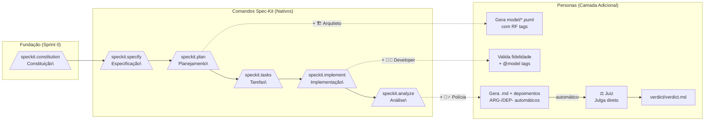

# Fluxo de Trabalho: Spec-Kit + Personas de IA

**Propósito:** Guia prático de como os comandos nativos do Spec-Kit e as 4 personas de IA
atuam **em conjunto** no fluxo de desenvolvimento.

**Atualizado em:** 2026-06-17
**Versão:** 2.0 — Formato .md com IDs e depoimentos automáticos

---

## Visão Geral do Pipeline



---

## Sistema de IDs

| Prefixo | Onde | Exemplo | Descrição |
|---------|------|---------|-----------|
| `CONST-` | constitution.md | CONST-R1 | Princípio/norma da constituição do projeto |
| `RF-` | spec.md | RF-001 | Requisito funcional |
| `EVD-` | evidence/inconsistencies.md | EVD-SPRINT01-001 | Evidência de inconsistência |
| `ARG-` | evidence/inconsistencies.md | ARG-SPRINT01-001 | Depoimento do Arquiteto |
| `DEP-` | evidence/inconsistencies.md | DEP-SPRINT01-001 | Depoimento do Developer |
| `VER-` | verdict/verdict.md | VER-SPRINT01-001 | Veredicto do Juiz |
| `CHK-` | evidence/inconsistencies.md | CHK-CLASS-01 | Item do checklist |
| `// @model:` | Código fonte | // @model: classes.puml | Rastreabilidade no código |

---

## Passo a Passo: Sprint 01 (Exemplo — Componente de Login)

### Passo 0: Constituição do Projeto (Sprint 0)

**Primeiro passo — antes de qualquer especificação ou modelagem.**

```
> /speckit.constitution
```

**O que acontece:** Cria a constituição do projeto, que define os princípios, regras e gates que toda sprint deve seguir. Este arquivo é lido por todos os comandos subsequentes (`/speckit.plan`, `/speckit.implement`, `/speckit.analyze`) para validação automática.

| Ação | Artefato | Conteúdo |
|------|----------|----------|
| Definir princípios do projeto | `.specify/memory/constitution.md` | `CONST-R1` a `CONST-R5` com regras MUST/SHOULD |

**O que a Constituição contém:**

| ID | Princípio | Exemplo |
|----|-----------|---------|
| CONST-R1 | MDE+SDD First | Modelagem cobre frontend + backend |
| CONST-R2 | Zero over-engineering | Código apenas se modelado |
| CONST-R3 | Rastreabilidade | `@rf:`, `// @model:`, `# @model:` |
| CONST-R4 | Arquitetura MVVM + FastAPI | Camadas separadas frontend e backend |
| CONST-R5 | Pipeline de Verificação | Polícia + Juiz automáticos |

**Exemplo de criação:**
> **Daired:** `/speckit.constitution` — Crie a constituição do projeto frontend e backend do KPC.
> **🤖 Spec-Kit:** "Constituição criada em `.specify/memory/constitution.md` com 6 princípios (CONST-R1 a CONST-R6), cobrindo `kpc-frontend/` e `kpc-backend/`."

**Impacto:** A constituição é validada automaticamente em todo `speckit.plan` (Constitution Check gate) e em todo `speckit.analyze` (Constitution Alignment detection pass).

---

### Passo 1: Especificação

```
> /speckit.specify
```

**O que acontece:** Gera `spec.md` com os requisitos funcionais.
**Persona envolvida:** Nenhuma (apenas Spec-Kit nativo).
**IDs gerados:** RF-001, RF-002, etc. (requisitos funcionais)

---

### Passo 2: Planejamento + Arquiteto

```
> /speckit.plan
```

**O que acontece:**

| Camada | Ação | Artefato |
|--------|------|----------|
| 🟦 Spec-Kit nativo | Setup, Constitution Check, Fases 0-1-2, hooks | `plan.md`, `research.md`, `data-model.md` |
| 🟩 **+ Arquiteto** | Lê persona-arquiteto.md, modela diagramas PlantUML com tags `@rf:` | `specs/<feature>/model/classes.puml` |

**Exemplo de diálogo no chat:**
> **Daired:** "Notei que no `class-diagram.puml` não temos um estado para mensagens de erro no frontend, e no backend falta modelar o endpoint de login."
> **🤖 Arquiteto:** "Atualizando o modelo para incluir `errorMessage: String` na classe `LoginForm` (frontend) e o endpoint `POST /users/login` no diagrama de componentes do backend, ambos com `@rf: RF-001`."

---

### Passo 3: Geração de Tarefas

```
> /speckit.tasks
```

**O que acontece:** Gera `tasks.md` com as tarefas estruturadas por fase.
**Persona envolvida:** Nenhuma (apenas Spec-Kit nativo).

---

### Passo 4: Implementação + Developer

```
> /speckit.implement
```

**O que acontece:**

| Camada | Ação | Artefato |
|--------|------|----------|
| 🟦 Spec-Kit nativo | Check-prerequisites, load tasks, setup verification, execução por fase | Código implementado |
| 🟩 **+ Developer** | Lê persona-developer.md, valida cobertura modelo vs tasks, insere `// @model:` tags, varre over-engineering | Código com rastreabilidade |

**IDs gerados:** `// @model: specs/<feature>/model/classes.puml` em cada arquivo.

---

### Passo 5: Commit (Ação Humana)

```
> git commit -m "feat: implementa componente de login"
```

---

### Passo 6: Análise + Polícia + Juiz (Tudo Automático)

```
> /speckit.analyze
```

**O que acontece — Pipeline completo em série:**

| Etapa | Quem | Ação | Artefato |
|-------|------|------|----------|
| 1 | 🟦 Spec-Kit nativo | Load artifacts, semantic models, detection passes | Relatório textual de análise |
| 2 | 👮‍♂️ **Polícia** | Varre modelo vs código, coleta evidências E depoimentos | `evidence/inconsistencies.md` |
| 3 | ⚖️ **Juiz (automático)** | Lê o inconsistencies.md, aplica árvore de decisão, profere veredito | `verdict/verdict.md` |

**Um único comando. Três saídas.**

#### Etapa 2 — Polícia (automática):
1. 🔍 Detecta cada inconsistência → `EVD-SPRINT01-001`
2. 🗣️ Lê `persona-arquiteto.md` → simula `ARG-SPRINT01-001`
3. 🗣️ Lê `persona-developer.md` → simula `DEP-SPRINT01-001`

#### Etapa 3 — Juiz (automático, sem pausa):
1. Lê `evidence/inconsistencies.md`
2. Para cada `EVD-`, usa `ARG-` e `DEP-` para decidir
3. Gera `VER-SPRINT01-001` com fundamentação e sentença

**Saídas geradas:**

```markdown
# evidence/inconsistencies.md
### EVD-SPRINT01-003 — OVER_ENGINEERING
...
#### Depoimento Arquiteto (ARG-SPRINT01-003)
#### Depoimento Developer (DEP-SPRINT01-003)
```

```markdown
# verdict/verdict.md
### VER-SPRINT01-003 — Julgamento de EVD-SPRINT01-003
**Decisão:** `AMBOS — Ambos Errados`
**Sentença:** Arquiteto avalia modelo; Developer remove/isola componente.
```

**Zero comandos manuais. Zero chat. Zero audiência.**

**Decide direto. Não precisa entrevistar ninguém.**

```markdown
### VER-SPRINT01-003 — Julgamento de EVD-SPRINT01-003

| Campo | Valor |
|-------|-------|
| **Evidência** | EVD-SPRINT01-003 — OVER_ENGINEERING |
| **Depoimento Arquiteto** | ARG-SPRINT01-003 |
| **Depoimento Developer** | DEP-SPRINT01-003 |

**Decisão:** `AMBOS — Ambos Errados`

**Fundamentação:**
Componente implementado sem estar modelado. Arquiteto confirma que não
estava na especificação. Developer admite adição sem modelagem prévia.

**Sentença:**
1. Arquiteto deve avaliar inclusão no modelo para próxima sprint.
2. Developer deve remover ou isolar o componente até lá.
```

Salvo em: `specs/<feature>/verdict/verdict.md`

---

## Mapa de Ativação das Personas

| Comando | Persona | Arquivo | Gatilho | Gera |
|---------|---------|---------|---------|------|
| `/speckit.constitution` | — | — | Sprint 0 (único) | `.specify/memory/constitution.md` (CONST-R\*) |
| `/speckit.plan` | 🏗️ Arquiteto | `persona-arquiteto.md` | Automático | `model/*.puml` com `@rf:` |
| `/speckit.implement` | 👨‍💻 Developer | `persona-developer.md` | Automático | Código + `// @model:` / `# @model:` (frontend + backend) |
| `/speckit.analyze` | 👮‍♂️ Polícia + ⚖️ Juiz | `persona-policia.md` + `persona-juiz.md` | Automático (em série) | `evidence/inconsistencies.md` (EVD-/ARG-/DEP-) + `verdict/verdict.md` (VER-) |

---

## Estrutura de Artefatos (por Sprint)

```text
.specify/
└── memory/
    └── constitution.md              # CONST-R1, CONST-R2...

specs/<feature>/
├── spec.md                          # RF-001, RF-002...
├── plan.md                          # Plano de implementação
├── tasks.md                         # Tarefas
├── model/                           # 🏗️ Arquiteto
│   ├── classes.puml                 #   @rf: RF-001
│   ├── components.puml              #   @rf: RF-002
│   └── sequences.puml               #   @rf: RF-003
├── evidence/                        # 👮 Polícia
│   └── inconsistencies.md           #   EVD-, ARG-, DEP-
└── verdict/                         # ⚖️ Juiz
    └── verdict.md                   #   VER-
```

---

## Regra de Ouro

> **As personas NUNCA substituem os comandos nativos do Spec-Kit.**
> Elas são uma **camada adicional de comportamento** que se soma ao fluxo padrão,
> adicionando rigor de modelagem, contenção de over-engineering e verificação de consistência.
>
> **A Constituição é o primeiro passo.** Antes de qualquer especificação ou modelagem,
> execute `/speckit.constitution` para definir os princípios que governarão todo o projeto.
> Os comandos subsequentes a validam automaticamente.
>
> **O pipeline de verificação é FULLY AUTOMATED:** `/speckit.analyze` executa:
> 1. Análise nativa Spec-Kit (incluindo Constitution Alignment check)
> 2. 👮‍♂️ Polícia → `evidence/inconsistencies.md` (com EVD- + ARG- + DEP-)
> 3. ⚖️ Juiz → `verdict/verdict.md` (com VER-)
>
> **Zero comandos manuais entre a Polícia e o Juiz.**