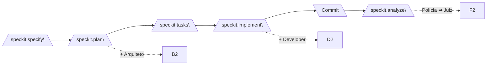
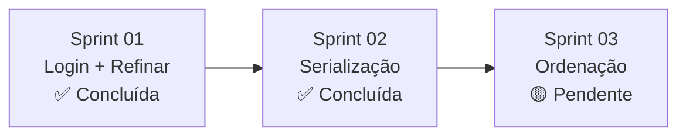

# Plano de Sprints — Keyphrase Curation (KPC)

**Projeto:** Frontend MVVM de curadoria de keyphrases com backend FastAPI
**Pipeline:** Spec-Kit + 4 Personas (Arquiteto, Developer, Polícia, Juiz)
**Total de Sprints:** 3 sprints
**Ritmo:** 1 sprint por dia útil (~4h/dia)

---

## Convenções do Pipeline

Cada sprint deste plano executa **obrigatoriamente** o pipeline completo:

| Passo | Comando | Persona | Artefato |
|-------|---------|---------|----------|
| 0 | `/speckit.constitution` | — | `.specify/memory/constitution.md` |
| 1 | `/speckit.specify` | — | `specs/<feature>/spec.md` (RF-N) |
| 2 | `/speckit.plan` | 🏗️ Arquiteto | `specs/<feature>/model/*.puml` com `@rf:` |
| 3 | `/speckit.tasks` | — | `specs/<feature>/tasks.md` |
| 4 | `/speckit.implement` | 👨‍💻 Developer | Código com `// @model:` |
| 5 | `git commit` | Humano | Commit |
| 6 | `/speckit.analyze` | 👮‍♂️ Polícia + ⚖️ Juiz | `evidence/inconsistencies.md` + `verdict/verdict.md` |

---

## Sprint 01 — Autenticação e Timeline de Tópicos

**Escopo:** Tela de login funcional + seletor de tópicos (abortion, cloning, etc.).

### RFs da Sprint

| RF | Descrição | Prioridade |
|----|-----------|------------|
| RF-001 | Login com e-mail e senha via API | P1 |
| RF-002 | Seletor de tópicos carregado do backend | P1 |

### O que precisa ser feito

| Tarefa | Backend | Frontend | Artefato Esperado |
|--------|---------|----------|-------------------|
| **T001** | ✅ (já existe endpoint de login em `/auth/login`) | Criar/refinar `LoginView.jsx` com formulário e store `useAuthStore` | `specs/sprint-01/model/login.puml` → `views/pages/LoginView.jsx` |
| **Status** | � Concluída | **3 rodadas completas:** R1 (6 evidências DE → correções ST001.1), R2 (6 RESOLVIDAS, GATE-03 liberado), R3 (runtime legados corrigido ST001.2). |
| **ST001.1** | N/A | Aplicar correções determinadas pelo veredito da Rodada 1 (`specs/001-login-component/verdict/verdict.md`): refatorar `User.js` para escopo mínimo, refatorar `AuthService.js` para expor apenas `login()`, remover ações não modeladas de `useAuthStore`, adicionar `// @model:` em `config.js`, corrigir `maxRows` no `TextField.jsx`, alinhar nomenclatura do hook `useAuth` | Executar novo ciclo: `commit` → `/speckit.analyze` (Rodada 2) |
| **Status ST001.1** | 🟢 Concluída | Rodada 2 aprovou todas as 6 correções como RESOLVIDAS. GATE-03 (over-engineering) liberado. |
| **ST001.2** | N/A | Aplicar correções determinadas pelo veredito da Rodada 2 e corrigir bug de runtime: (1) `authService` não exportado — corrigir imports em 6 arquivos legados; (2) varredura de imports quebrados em `src-mvvm/`; (3) console limpo | Executar novo ciclo: `commit` → `/speckit.analyze` (Rodada 3) |
| **Status ST001.2** | 🟢 Concluída | Rodada 3 confirmou runtime sem erros. 0 novas evidências. 6 evidências R1 mantidas RESOLVIDAS. |
| **T002** | ✅ (já existe endpoint de tópicos em `/topics`) | Criar/refinar `TopicSelectionView.jsx` com store `useTopicStore` | `specs/sprint-01/model/topics.puml` → `views/pages/TopicSelectionView.jsx` |

### Arquivos impactados (frontend)

| Arquivo | Ação |
|---------|------|
| `views/pages/LoginView.jsx` | Refatorar para MVVM puro |
| `viewmodels/stores/useAuthStore.js` | Ajustar fluxo de erro |
| `models/services/AuthService.js` | Verificar contrato com API |
| `views/pages/TopicSelectionView.jsx` | Refatorar loading/error states |
| `viewmodels/stores/useTopicStore.js` | Adicionar cache |

---

## Sprint 02 — Correção de Serialização: Pairwise + Centroid Similarity

**Escopo:** Corrigir `500 Internal Server Error` nos endpoints `GET /topic/clusters/{username}/{topic}/pairwise_similarity` e `GET /topic/clusters/{username}/{topic}/centroid_similarity`.

**Causa raiz:** O backend retorna `numpy.int64` na resposta JSON, que o Pydantic/FastAPI não consegue serializar (`PydanticSerializationError: Unable to serialize unknown type: <class 'numpy.int64'>`). A solução foi criar o `NumpyConverter.to_native()` em `util/json_encoder.py` e aplicá-lo no retorno da API.

**Backend:** `kpc-backend/` — endpoint em `src/keyphrase_curation/`

### RFs da Sprint

| RF | Descrição | Prioridade |
|----|-----------|------------|
| RF-003 | Corrigir serialização do endpoint pairwise_similarity | P1 |
| RF-004 | Corrigir serialização do endpoint centroid_similarity (resolvido pelo NumpyConverter da T002) | P1 |

### O que precisa ser feito

| Tarefa | Backend | Frontend | Artefato Esperado |
|--------|---------|----------|-------------------|
| **T002** | 🟢 **Concluída** — `NumpyConverter.to_native()` criado em `util/json_encoder.py` e aplicado no retorno completo de `list_clusters()` em `api/topic.py:268`. | N/A | `curl http://localhost:3132/topic/clusters/daired/cloning/pairwise_similarity` → HTTP 200 ✅ |
| **Status** | 🟢 Concluída | **2 rodadas completas:** R1 (2 evidências — 1 AMBOS, 1 AE), R2 (2 RESOLVIDAS — ambas NE). GATES aprovados. SC-001 (HTTP 200) alcançado. |
| **ST002.1** | 🟢 **Concluída** — Corrigir alcance do `NumpyConverter.to_native()` — aplicado em TODO o dicionário de retorno (`return NumpyConverter.to_native({...})`). Modelo (`sequence.puml`, `classes.puml`, `components.puml`) atualizado com `@rf: RF-003-C1`. | N/A | `curl` → HTTP 200. Veredito R2: NE (Ninguém Errado). |
| **T003** | 🟢 **Concluída** — Resolvida automaticamente pelo `NumpyConverter` da T002. O endpoint `centroid_similarity` passa pelo mesmo `list_clusters()` que aplica `NumpyConverter.to_native()` em todo o dicionário. | N/A | `curl http://localhost:3132/topic/clusters/daired/cloning/centroid_similarity` → HTTP 200 ✅ |

### Arquivos impactados (backend)

| Arquivo | Ação |
|---------|------|
| `src/keyphrase_curation/util/json_encoder.py` | Criado — `NumpyConverter.to_native()` |
| `src/keyphrase_curation/api/topic.py` | Modificado — `return NumpyConverter.to_native({...})` |

---

## Sprint 03 — Correção de Ordenação de Clusters

**Escopo:** Corrigir a ordenação dos endpoints `cluster_cohesion` e `centroid_similarity` — atualmente retornam do menor para o maior, mas devem retornar do maior para o menor.

**Backend:** `kpc-backend/` — `src/keyphrase_curation/model/cluster.py`

### RFs da Sprint

| RF | Descrição | Prioridade |
|----|-----------|------------|
| RF-005 | Ordenar cluster_cohesion do maior para o menor | P1 |
| RF-006 | Ordenar centroid_similarity do maior para o menor | P1 |

### O que precisa ser feito

| Tarefa | Backend | Frontend | Artefato Esperado |
|--------|---------|----------|-------------------|
| **T004** | 🔴 Corrigir ordenação do endpoint `/topic/clusters/{username}/{topic}/cluster_cohesion` — atualmente retorna da **coesão mais baixa para a mais alta** (ascendente). Deve retornar da **coesão mais alta para a mais baixa** (descendente). Localizar a lógica de ordenação em `model/cluster.py` e inverter o `reverse` ou o sorting key. | N/A (frontend apenas consome) | `curl http://localhost:3132/topic/clusters/daired/cloning/cluster_cohesion` retorna clusters ordenados do maior valor de coesão para o menor |
| **T005** | 🔴 Corrigir ordenação do endpoint `/topic/clusters/{username}/{topic}/centroid_similarity` — atualmente retorna da **similaridade mais baixa para a mais alta** (ascendente). Deve retornar da **similaridade mais alta para a mais baixa** (descendente). Como o `NumpyConverter` já resolveu a serialização (T003), o foco é apenas inverter a ordenação. | N/A (frontend apenas consome) | `curl http://localhost:3132/topic/clusters/daired/cloning/centroid_similarity` retorna clusters ordenados do maior valor de similaridade para o menor |

### Arquivos impactados (backend)

| Arquivo | Ação |
|---------|------|
| `src/keyphrase_curation/model/cluster.py` | Localizar lógica de ordenação de `cluster_cohesion` e `centroid_similarity` e inverter ordem (ascendente → descendente) |

---

## Mapa de Dependências entre Sprints

| Sprint | Depende de | É pré-requisito para |
|--------|-----------|----------------------|
| 01 — Login + Refinar | — | 02 |
| 02 — Serialização (pairwise + centroid) | 01 | 03 |
| 03 — Ordenação de clusters | 02 | — |

---

## Resumo de Esforço por Sprint

| Sprint | RFs | Tarefas | Frontend | Backend |
|--------|-----|---------|----------|---------|
| Sprint 01 | RF-001, RF-002 | T001 + ST001.1 + ST001.2 | Refatorar 4 arquivos | Nenhum |
| Sprint 02 | RF-003, RF-004 | T002 + ST002.1 + T003 | N/A | `json_encoder.py` (criar), `api/topic.py` (modificar) |
| Sprint 03 | RF-005, RF-006 | T004 + T005 | N/A | `model/cluster.py` (corrigir ordenação) |

> **Nota:** O backend (`kpc-backend`) já está implementado e funcional. As sprints focam exclusivamente no frontend (`kpc-frontend/src-mvvm/`), consumindo as APIs existentes.