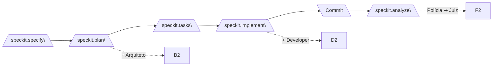
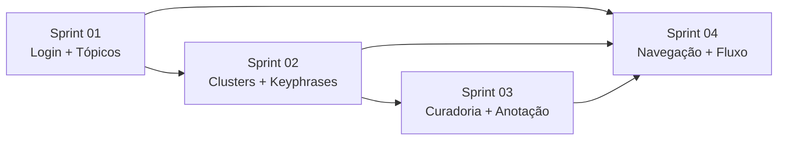

# Plano de Sprints — Keyphrase Curation (KPC)

**Projeto:** Frontend MVVM de curadoria de keyphrases com backend FastAPI
**Pipeline:** Spec-Kit + 4 Personas (Arquiteto, Developer, Polícia, Juiz)
**Total de Sprints:** 4 sprints
**Ritmo:** 1 sprint por dia útil (~4h/dia)

---

## Convenções do Pipeline

Cada sprint deste plano executa **obrigatoriamente** o pipeline completo:

| Passo | Comando | Persona | Artefato |
|-------|---------|---------|----------|
| 0 | `/speckit.constitution` | — | `.specify/memory/constitution.md` |
| 1 | `/speckit.specify` | — | `specs/<feature>/spec.md` (RF-N) |
| 2 | `/speckit.plan` | 🏗️ Arquiteto | `specs/<feature>/model/*.puml` com `@rf:` |
| 3 | `/speckit.tasks` | — | `specs/<feature>/tasks.md` |
| 4 | `/speckit.implement` | 👨‍💻 Developer | Código com `// @model:` |
| 5 | `git commit` | Humano | Commit |
| 6 | `/speckit.analyze` | 👮‍♂️ Polícia + ⚖️ Juiz | `evidence/inconsistencies.md` + `verdict/verdict.md` |

---

## Sprint 01 — Autenticação e Timeline de Tópicos

**Escopo:** Tela de login funcional + seletor de tópicos (abortion, cloning, etc.).

### RFs da Sprint

| RF | Descrição | Prioridade |
|----|-----------|------------|
| RF-001 | Login com e-mail e senha via API | P1 |
| RF-002 | Seletor de tópicos carregado do backend | P1 |

### O que precisa ser feito

| Tarefa | Backend | Frontend | Artefato Esperado |
|--------|---------|----------|-------------------|
| **T001** | ✅ (já existe endpoint de login em `/auth/login`) | Criar/refinar `LoginView.jsx` com formulário e store `useAuthStore` | `specs/sprint-01/model/login.puml` → `views/pages/LoginView.jsx` |
| **Status** | 🟡 Em desenvolvimento | Rodada 1 concluída (evidências e veredito gerados). Pendente implementação de correções. |
| **ST001.1** | N/A | Aplicar correções determinadas pelo veredito da Rodada 1 (`specs/001-login-component/verdict/verdict.md`): refatorar `User.js` para escopo mínimo, refatorar `AuthService.js` para expor apenas `login()`, remover ações não modeladas de `useAuthStore`, adicionar `// @model:` em `config.js`, corrigir `maxRows` no `TextField.jsx`, alinhar nomenclatura do hook `useAuth` | Executar novo ciclo: `commit` → `/speckit.analyze` (Rodada 2) |
| **Status ST001.1** | 🟢 Concluída | Rodada 2 aprovou todas as 6 correções como RESOLVIDAS. GATE-03 (over-engineering) liberado. |
| **ST001.2** | N/A | Aplicar correções determinadas pelo veredito da Rodada 2 (`specs/001-login-component/verdict/verdict.md` — seção R2) e corrigir bug de runtime: (1) **Bug crítico:** `Uncaught SyntaxError: The requested module '/models/services/AuthService.js' does not provide an export named 'authService'` — o `AuthService` foi refatorado para expor apenas `login()` como método público e o singleton `authService` foi removido, mas `useTopicSelectionViewModel.js` ainda importa `{ authService }`. Corrigir import removendo referência ao singleton ou recriando export nomeado se necessário. (2) Verificar se há outros imports quebrados nos arquivos `src-mvvm/` que referenciam métodos/export removidos (ex: `AuthService.basicLogin`, `AuthService.listUsers`, `User.canAccessTopic`, `useAuthStore.getToken`, `useAuthStore.canAccessTopic`). (3) Garantir que o fluxo de login + tópicos funcione sem erros no console. | Executar novo ciclo: `commit` → `/speckit.analyze` |
| **T002** | ✅ (já existe endpoint de tópicos em `/topics`) | Criar/refinar `TopicSelectionView.jsx` com store `useTopicStore` | `specs/sprint-01/model/topics.puml` → `views/pages/TopicSelectionView.jsx` |

### Arquivos impactados (frontend)

| Arquivo | Ação |
|---------|------|
| `views/pages/LoginView.jsx` | Refatorar para MVVM puro |
| `viewmodels/stores/useAuthStore.js` | Ajustar fluxo de erro |
| `models/services/AuthService.js` | Verificar contrato com API |
| `views/pages/TopicSelectionView.jsx` | Refatorar loading/error states |
| `viewmodels/stores/useTopicStore.js` | Adicionar cache |

---

## Sprint 02 — Cluster de Keyphrases

**Escopo:** Visualização dos clusters de keyphrases para o tópico selecionado.

### RFs da Sprint

| RF | Descrição | Prioridade |
|----|-----------|------------|
| RF-003 | Exibir lista de clusters do tópico selecionado | P1 |
| RF-004 | Exibir keyphrases dentro de cada cluster | P2 |

### O que precisa ser feito

| Tarefa | Backend | Frontend | Artefato Esperado |
|--------|---------|----------|-------------------|
| **T003** | ✅ (endpoint `/clusters/{topic}` existe) | Criar `KeyphraseClustersView.jsx` com store `useClusterStore` | `specs/sprint-02/model/clusters.puml` → `views/pages/KeyphraseClustersView.jsx` |
| **T004** | ✅ (endpoint `/keyphrases/{cluster}` existe) | Componente `ClusterCard.jsx` com lista de keyphrases | `specs/sprint-02/model/keyphrases.puml` → `views/components/ClusterCard.jsx` |

### Arquivos impactados (frontend)

| Arquivo | Ação |
|---------|------|
| `views/pages/KeyphraseClustersView.jsx` | Criar ou refatorar |
| `views/components/ClusterCard.jsx` | Refatorar para receber keyphrases por props |
| `views/components/KeyphraseItem.jsx` | Ajustar exibição |
| `models/services/ClusterService.js` | Verificar parâmetros da rota |
| `models/services/KeyphraseService.js` | Verificar parâmetros |

---

## Sprint 03 — Curadoria e Anotação

**Escopo:** Funcionalidade de curadoria (aprovar/rejeitar keyphrases) + anotação manual.

### RFs da Sprint

| RF | Descrição | Prioridade |
|----|-----------|------------|
| RF-005 | Aprovar/rejeitar keyphrase individualmente | P1 |
| RF-006 | Adicionar anotação textual a uma keyphrase | P2 |

### O que precisa ser feito

| Tarefa | Backend | Frontend | Artefato Esperado |
|--------|---------|----------|-------------------|
| **T005** | ✅ (endpoint `/curate/{keyphrase}` existe) | Criar `CuratedKeyphrasesView.jsx` com controles de aprovação | `specs/sprint-03/model/curation.puml` → `views/pages/CuratedKeyphrasesView.jsx` |
| **T006** | ✅ (endpoint `/annotate/{keyphrase}` existe) | Componente `Dialog.jsx` para anotação textual | `specs/sprint-03/model/annotation.puml` → `views/components/Dialog.jsx` |

### Arquivos impactados (frontend)

| Arquivo | Ação |
|---------|------|
| `views/pages/CuratedKeyphrasesView.jsx` | Criar ou refatorar |
| `views/components/Dialog.jsx` | Adaptar para formulário de anotação |
| `viewmodels/stores/useFlowStore.js` | Adicionar estado de curadoria |
| `models/services/AnnotationService.js` | Verificar contrato |

---

## Sprint 04 — Navegação e Fluxo Completo

**Escopo:** Roteamento entre telas, breadcrumb, estado global de sessão e sincronia.

### RFs da Sprint

| RF | Descrição | Prioridade |
|----|-----------|------------|
| RF-007 | Navegação entre telas (login → tópicos → clusters → curadoria) | P1 |
| RF-008 | Barra de progresso / breadcrumb do fluxo | P2 |

### O que precisa ser feito

| Tarefa | Backend | Frontend | Artefato Esperado |
|--------|---------|----------|-------------------|
| **T007** | N/A | Configurar `react-router-dom` com rotas protegidas | `specs/sprint-04/model/navigation.puml` → `AppMVVM.jsx` (rotas) |
| **T008** | N/A | Componente `Breadcrumb.jsx` no layout principal | `specs/sprint-04/model/layout.puml` → `views/components/Breadcrumb.jsx` |

### Arquivos impactados (frontend)

| Arquivo | Ação |
|---------|------|
| `AppMVVM.jsx` | Adicionar React Router com rotas |
| `views/components/index.js` | Exportar novos componentes |
| `viewmodels/stores/useFlowStore.js` | Gerenciar etapa atual do fluxo |
| `shared/config.js` | Adicionar constantes de rota |

---

## Mapa de Dependências entre Sprints

| Sprint | Depende de | É pré-requisito para |
|--------|-----------|----------------------|
| 01 — Login + Tópicos | — | 02, 04 |
| 02 — Clusters + Keyphrases | 01 | 03, 04 |
| 03 — Curadoria + Anotação | 02 | 04 |
| 04 — Navegação + Fluxo | 01, 02, 03 | — |

---

## Resumo de Esforço por Sprint

| Sprint | RFs | Tarefas | Frontend | Backend |
|--------|-----|---------|----------|---------|
| Sprint 01 | RF-001, RF-002 | T001, T002 | Refatorar 4 arquivos | Nenhum (já existe) |
| Sprint 02 | RF-003, RF-004 | T003, T004 | Criar/refatorar 4 arquivos | Nenhum (já existe) |
| Sprint 03 | RF-005, RF-006 | T005, T006 | Criar/refatorar 4 arquivos | Nenhum (já existe) |
| Sprint 04 | RF-007, RF-008 | T007, T008 | Configurar roteamento + 2 componentes | N/A |

> **Nota:** O backend (`kpc-backend`) já está implementado e funcional. As sprints focam exclusivamente no frontend (`kpc-frontend/src-mvvm/`), consumindo as APIs existentes.