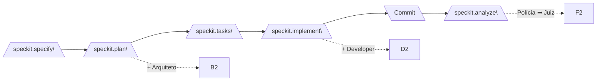
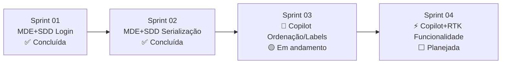

# Plano de Sprints — Keyphrase Curation (KPC)

**Projeto:** Frontend MVVM de curadoria de keyphrases com backend FastAPI
**Total de Sprints:** 4 sprints
**Ritmo:** 1 sprint por dia útil (~4h/dia)

---

## Natureza dos Experimentos

| Sprint | Metodologia | Descrição | Status |
|--------|-------------|-----------|--------|
| **Sprint 01** | 🏗️ **MDE+SDD (Spec-Kit + 4 Personas)** | Teste do pipeline Spec-Kit com Arquitetura, Developer, Polícia e Juiz — componente de Login | ✅ Concluída |
| **Sprint 02** | 🏗️ **MDE+SDD (Spec-Kit + 4 Personas)** | Teste do pipeline Spec-Kit — correção de serialização numpy no backend | ✅ Concluída |
| **Sprint 03** | 🤖 **Copilot (sem metodologia)** | Teste do Copilot puro, sem Spec-Kit, sem personas, sem pipeline — correção de ordenação via chat direto + labels + pareamento | 🟡 Em andamento (T004/T005 ✅, T006/T007 🟡) |
| **Sprint 04** | ⚡ **Copilot + RTK (Redux Toolkit)** | Teste do Copilot com RTK — implementação de nova funcionalidade completa no frontend | ⬜ Planejada |

---

## Convenções do Pipeline da Sprint 01 e Sprint 02

A Sprint 01 e Sprint 02 deste plano executa **obrigatoriamente** o pipeline completo:

| Passo | Comando | Persona | Artefato |
|-------|---------|---------|----------|
| 0 | `/speckit.constitution` | — | `.specify/memory/constitution.md` |
| 1 | `/speckit.specify` | — | `specs/<feature>/spec.md` (RF-N) |
| 2 | `/speckit.plan` | 🏗️ Arquiteto | `specs/<feature>/model/*.puml` com `@rf:` |
| 3 | `/speckit.tasks` | — | `specs/<feature>/tasks.md` |
| 4 | `/speckit.implement` | 👨‍💻 Developer | Código com `// @model:` |
| 5 | `git commit` | Humano | Commit |
| 6 | `/speckit.analyze` | 👮‍♂️ Polícia + ⚖️ Juiz | `evidence/inconsistencies.md` + `verdict/verdict.md` |

---

## Sprint 01 — Autenticação e Timeline de Tópicos

**Escopo:** Tela de login funcional + seletor de tópicos (abortion, cloning, etc.).

### RFs da Sprint

| RF | Descrição | Prioridade |
|----|-----------|------------|
| RF-001 | Login com e-mail e senha via API | P1 |
| RF-002 | Seletor de tópicos carregado do backend | P1 |

### O que precisa ser feito

| Tarefa | Backend | Frontend | Artefato Esperado |
|--------|---------|----------|-------------------|
| **T001** | ✅ (já existe endpoint de login em `/auth/login`) | Criar/refinar `LoginView.jsx` com formulário e store `useAuthStore` | `specs/sprint-01/model/login.puml` → `views/pages/LoginView.jsx` |
| **Status** | � Concluída | **3 rodadas completas:** R1 (6 evidências DE → correções ST001.1), R2 (6 RESOLVIDAS, GATE-03 liberado), R3 (runtime legados corrigido ST001.2). |
| **ST001.1** | N/A | Aplicar correções determinadas pelo veredito da Rodada 1 (`specs/001-login-component/verdict/verdict.md`): refatorar `User.js` para escopo mínimo, refatorar `AuthService.js` para expor apenas `login()`, remover ações não modeladas de `useAuthStore`, adicionar `// @model:` em `config.js`, corrigir `maxRows` no `TextField.jsx`, alinhar nomenclatura do hook `useAuth` | Executar novo ciclo: `commit` → `/speckit.analyze` (Rodada 2) |
| **Status ST001.1** | 🟢 Concluída | Rodada 2 aprovou todas as 6 correções como RESOLVIDAS. GATE-03 (over-engineering) liberado. |
| **ST001.2** | N/A | Aplicar correções determinadas pelo veredito da Rodada 2 e corrigir bug de runtime: (1) `authService` não exportado — corrigir imports em 6 arquivos legados; (2) varredura de imports quebrados em `src-mvvm/`; (3) console limpo | Executar novo ciclo: `commit` → `/speckit.analyze` (Rodada 3) |
| **Status ST001.2** | 🟢 Concluída | Rodada 3 confirmou runtime sem erros. 0 novas evidências. 6 evidências R1 mantidas RESOLVIDAS. |
| **T002** | ✅ (já existe endpoint de tópicos em `/topics`) | Criar/refinar `TopicSelectionView.jsx` com store `useTopicStore` | `specs/sprint-01/model/topics.puml` → `views/pages/TopicSelectionView.jsx` |

### Arquivos impactados (frontend)

| Arquivo | Ação |
|---------|------|
| `views/pages/LoginView.jsx` | Refatorar para MVVM puro |
| `viewmodels/stores/useAuthStore.js` | Ajustar fluxo de erro |
| `models/services/AuthService.js` | Verificar contrato com API |
| `views/pages/TopicSelectionView.jsx` | Refatorar loading/error states |
| `viewmodels/stores/useTopicStore.js` | Adicionar cache |

---

## Sprint 02 — Correção de Serialização: Pairwise + Centroid Similarity

**Escopo:** Corrigir `500 Internal Server Error` nos endpoints `GET /topic/clusters/{username}/{topic}/pairwise_similarity` e `GET /topic/clusters/{username}/{topic}/centroid_similarity`.

**Causa raiz:** O backend retorna `numpy.int64` na resposta JSON, que o Pydantic/FastAPI não consegue serializar (`PydanticSerializationError: Unable to serialize unknown type: <class 'numpy.int64'>`). A solução foi criar o `NumpyConverter.to_native()` em `util/json_encoder.py` e aplicá-lo no retorno da API.

**Backend:** `kpc-backend/` — endpoint em `src/keyphrase_curation/`

### RFs da Sprint

| RF | Descrição | Prioridade |
|----|-----------|------------|
| RF-003 | Corrigir serialização do endpoint pairwise_similarity | P1 |
| RF-004 | Corrigir serialização do endpoint centroid_similarity (resolvido pelo NumpyConverter da T002) | P1 |

### O que precisa ser feito

| Tarefa | Backend | Frontend | Artefato Esperado |
|--------|---------|----------|-------------------|
| **T002** | 🟢 **Concluída** — `NumpyConverter.to_native()` criado em `util/json_encoder.py` e aplicado no retorno completo de `list_clusters()` em `api/topic.py:268`. | N/A | `curl http://localhost:3132/topic/clusters/daired/cloning/pairwise_similarity` → HTTP 200 ✅ |
| **Status** | 🟢 Concluída | **2 rodadas completas:** R1 (2 evidências — 1 AMBOS, 1 AE), R2 (2 RESOLVIDAS — ambas NE). GATES aprovados. SC-001 (HTTP 200) alcançado. |
| **ST002.1** | 🟢 **Concluída** — Corrigir alcance do `NumpyConverter.to_native()` — aplicado em TODO o dicionário de retorno (`return NumpyConverter.to_native({...})`). Modelo (`sequence.puml`, `classes.puml`, `components.puml`) atualizado com `@rf: RF-003-C1`. | N/A | `curl` → HTTP 200. Veredito R2: NE (Ninguém Errado). |
| **T003** | 🟢 **Concluída** — Resolvida automaticamente pelo `NumpyConverter` da T002. O endpoint `centroid_similarity` passa pelo mesmo `list_clusters()` que aplica `NumpyConverter.to_native()` em todo o dicionário. | N/A | `curl http://localhost:3132/topic/clusters/daired/cloning/centroid_similarity` → HTTP 200 ✅ |

### Arquivos impactados (backend)

| Arquivo | Ação |
|---------|------|
| `src/keyphrase_curation/util/json_encoder.py` | Criado — `NumpyConverter.to_native()` |
| `src/keyphrase_curation/api/topic.py` | Modificado — `return NumpyConverter.to_native({...})` |

---

## Sprint 03 — Correção de Ordenação de Clusters — 🤖 Copilot (sem metodologia)

**Natureza:** Experimento **Copilot puro** — sem Spec-Kit, sem personas, sem pipeline MDE+SDD. O objetivo é testar a produtividade e qualidade do Copilot agindo livremente, sem amarras metodológicas.

**Escopo:** Corrigir a ordenação dos endpoints `cluster_cohesion` e `centroid_similarity` — atualmente retornam do menor para o maior, mas devem retornar do maior para o menor.

**Backend:** `kpc-backend/` — `src/keyphrase_curation/model/cluster.py`

### RFs da Sprint

| RF | Descrição | Prioridade |
|----|-----------|------------|
| RF-005 | Ordenar cluster_cohesion do maior para o menor | P1 |
| RF-006 | Ordenar centroid_similarity do maior para o menor | P1 |
| RF-007 | Padronizar labels do order by "Source Keyphrases" com enum `KeyphraseSortingLabels` | P2 |
| RF-008 | Agrupar pares recíprocos no pairwise_similarity do backend | P2 |

### O que precisa ser feito

| Tarefa | Backend | Frontend | Artefato Esperado |
|--------|---------|----------|-------------------|
| **T004** | 🟢 **Concluída** — `model/cluster.py`: `reverse=False` → `reverse=True` no `sorted()` de `cluster_cohesion`. Testado com `curl` → ordenação descendente confirmada (`[1.0, 1.0, 1.0, 0.92, 0.75, ...]`). Log experimental: `relatorios/log-copilot-sprint3-t004.md` | N/A (frontend apenas consome) | `curl http://localhost:3132/topic/clusters/daired/cloning/cluster_cohesion` ✅ Ordem descendente |
| **T005** | 🟢 **Concluída** — `model/cluster.py`: `reverse=False` → `reverse=True` no `sorted()` de `centroid_similarity`. Testado com `curl` → ordenação descendente confirmada (`[1.0, 1.0, 1.0, 0.92, 0.75, 0.74, ...]`). Corrigido em conjunto com T004 por compartilharem o mesmo padrão de erro e mesmo arquivo. | N/A (frontend apenas consome) | `curl http://localhost:3132/topic/clusters/daired/cloning/centroid_similarity` ✅ Ordem descendente |
| **T006** | N/A | 🤖 **Corrigir labels do order by "Source Keyphrases"** — o select de ordenação em `KeyphraseClusteringView.jsx` (linhas ~175-182) usa labels hardcoded como `"Similaridade de Cluster"` e `"Similaridade Pareada"`. Deve seguir o padrão do "Keyphrase Clusters" que usa `ClusterSortingLabels` no enum `ClusterSorting.js`. Criar `KeyphraseSortingLabels` em `KeyphraseSorting.js` nos mesmos moldes e usar no select. | Select de ordenação com labels padronizados via enum, igual ao "Keyphrase Clusters" |
| **T007** | 🐍 **Corrigir ordenação pairwise_similarity no backend** — em `model/cluster.py:get_keyphrase_descriptions()`, quando `sort_by=PAIRWISE_SIMILARITY`, a ordenação é feita por `sort_column=3` (similarity), o que não garante que pares recíprocos fiquem adjacentes. Ex: `Therapeutic cloning(18): (48, 1.00)` e `Therapeutic cloning(48): (18, 1.00)` podem ficar distantes. O backend deve **agrupar pares recíprocos** na listagem — quando dois clusters têm `similar_cluster` apontando um para o outro com `similarity` igual, devem ser consecutivos. | N/A (frontend apenas consome) | Listagem pairwise_similarity com pares recíprocos adjacentes |

### Status Geral da Sprint

| Critério | Resultado |
|----------|-----------|
| RF-005 (cluster_cohesion descendente) | ✅ OK — `reverse=True` em `model/cluster.py:387` |
| RF-006 (centroid_similarity descendente) | ✅ OK — `reverse=True` em `model/cluster.py:410` |
| RF-007 (labels do order by Source Keyphrases) | 🟡 Pendente — criar `KeyphraseSortingLabels` no enum |
| RF-008 (pares pairwise adjacentes) | 🟡 Pendente — agrupar pares recíprocos no backend |
| Teste HTTP 200 | ✅ Ambos endpoints retornam 200 |
| Log experimental | ✅ `relatorios/log-copilot-sprint3-t004.md` criado |
| Tempo total (parcial) | ~25 minutos (T004 + T005) |

### Arquivos impactados (frontend + backend)

| Arquivo | Ação |
|---------|------|
| `kpc-backend/src/keyphrase_curation/model/cluster.py` | ✅ Ordenação cluster_cohesion/centroid_similarity (ascendente → descendente) — Concluído |
| `kpc-backend/src/keyphrase_curation/model/cluster.py` | 🟡 Agrupar pares recíprocos em `get_keyphrase_descriptions()` p/ PAIRWISE_SIMILARITY (T007) |
| `kpc-frontend/src-mvvm/shared/enums/KeyphraseSorting.js` | 🟡 Criar `KeyphraseSortingLabels` padronizado (T006) |
| `kpc-frontend/src-mvvm/views/pages/KeyphraseClusteringView.jsx` | 🟡 Usar `KeyphraseSortingLabels` no select de ordenação (T006) |

---

## Sprint 04 — Implementação de Funcionalidade Completa — ⚡ Copilot + RTK

**Natureza:** Experimento **Copilot com RTK (Redux Toolkit)** — implementar uma nova funcionalidade completa no frontend utilizando RTK para gerenciamento de estado global. O objetivo é testar a eficácia do Copilot auxiliado por RTK vs Spec-Kit.

**Escopo:** Implementar uma nova funcionalidade de curadoria de keyphrases no frontend, consumindo a API existente do backend.

**Frontend:** `kpc-frontend/src-mvvm/`

### RFs da Sprint

| RF | Descrição | Prioridade |
|----|-----------|------------|
| RF-009 | Implementar tela de curadoria de keyphrases com RTK (selecionar, anotar, salvar) | P1 |

### O que precisa ser feito

| Tarefa | Backend | Frontend | Artefato Esperado |
|--------|---------|----------|-------------------|
| **T008** | N/A (API já existe) | ⚡ **Criar funcionalidade completa de curadoria de keyphrases** utilizando **RTK (Redux Toolkit)** para gerenciamento de estado: store global, slices, thunks assíncronos, componentes conectados. A funcionalidade deve consumir endpoints existentes do backend para listar, selecionar e salvar anotações de keyphrases por tópico. Incluir feedback visual (loading, sucesso, erro). | Tela funcional de curadoria com RTK — store, slice, thunks e UI conectada |

### Arquivos impactados (frontend)

| Arquivo | Ação |
|---------|------|
| `src-mvvm/store/` | Criar — estrutura RTK (store, slices, thunks) |
| `src-mvvm/views/pages/` | Criar — tela de curadoria |
| `src-mvvm/views/components/` | Criar — componentes de anotação |
| `src-mvvm/models/services/` | Criar — serviço HTTP para keyphrases |

---

## Mapa de Dependências entre Sprints

| Sprint | Metodologia | Depende de | É pré-requisito para |
|--------|-------------|-----------|----------------------|
| 01 — Login + Refinar | 🏗️ MDE+SDD (Spec-Kit) | — | 02 |
| 02 — Serialização (pairwise + centroid) | 🏗️ MDE+SDD (Spec-Kit) | 01 | 03 |
| 03 — Ordenação + Labels + Pareamento | 🤖 Copilot (sem metodologia) | 02 | 04 |
| 04 — Funcionalidade RTK | ⚡ Copilot + RTK | 03 | — |

---

## Resumo de Esforço por Sprint

| Sprint | Metodologia | RFs | Tarefas | Frontend | Backend |
|--------|-------------|-----|---------|----------|---------|
| Sprint 01 | 🏗️ MDE+SDD (Spec-Kit) | RF-001, RF-002 | T001 + ST001.1 + ST001.2 | Refatorar 4 arquivos | Nenhum |
| Sprint 02 | 🏗️ MDE+SDD (Spec-Kit) | RF-003, RF-004 | T002 + ST002.1 + T003 | N/A | `json_encoder.py` (criar), `api/topic.py` (modificar) |
| Sprint 03 | 🤖 Copilot (sem metodologia) | RF-005, RF-006, RF-007, RF-008 | T004 + T005 + T006 + T007 | `KeyphraseSorting.js` (criar labels enum), `KeyphraseClusteringView.jsx` (usar enum) | `model/cluster.py` (corrigir ordenação + parear pares) |
| Sprint 04 | ⚡ Copilot + RTK | RF-009 | T008 | Criar store RTK + páginas + componentes + serviços | N/A |