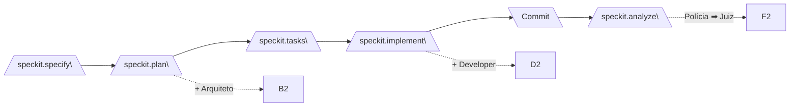
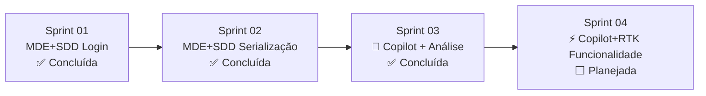

# Plano de Sprints — Keyphrase Curation (KPC)

**Projeto:** Frontend MVVM de curadoria de keyphrases com backend FastAPI
**Total de Sprints:** 4 sprints
**Ritmo:** 1 sprint por dia útil (~4h/dia)

---

## Natureza dos Experimentos

| Sprint | Metodologia | Descrição | Status |
|--------|-------------|-----------|--------|
| **Sprint 01** | 🏗️ **MDE+SDD (Spec-Kit + 4 Personas)** | Teste do pipeline Spec-Kit com Arquitetura, Developer, Polícia e Juiz — componente de Login | ✅ Concluída |
| **Sprint 02** | 🏗️ **MDE+SDD (Spec-Kit + 4 Personas)** | Teste do pipeline Spec-Kit — correção de serialização numpy no backend | ✅ Concluída |
| **Sprint 03** | 🤖 **Copilot (sem metodologia)** + 🏗️👨‍💻👮‍♂️⚖️ **Análise retroativa Spec-Kit** | Correção de ordenação + labels + pareamento via Copilot, seguido de análise retroativa com as 4 personas do Spec-Kit | ✅ Concluída |
| **Sprint 04** | ⚡ **Copilot + RTK (Redux Toolkit)** | Teste do Copilot com RTK — implementação de nova funcionalidade completa no frontend | ⬜ Planejada |

---

## Convenções do Pipeline da Sprint 01 e Sprint 02

A Sprint 01 e Sprint 02 deste plano executa **obrigatoriamente** o pipeline completo:

| Passo | Comando | Persona | Artefato |
|-------|---------|---------|----------|
| 0 | `/speckit.constitution` | — | `.specify/memory/constitution.md` |
| 1 | `/speckit.specify` | — | `specs/<feature>/spec.md` (RF-N) |
| 2 | `/speckit.plan` | 🏗️ Arquiteto | `specs/<feature>/model/*.puml` com `@rf:` |
| 3 | `/speckit.tasks` | — | `specs/<feature>/tasks.md` |
| 4 | `/speckit.implement` | 👨‍💻 Developer | Código com `// @model:` |
| 5 | `git commit` | Humano | Commit |
| 6 | `/speckit.analyze` | 👮‍♂️ Polícia + ⚖️ Juiz | `evidence/inconsistencies.md` + `verdict/verdict.md` |

---

## Sprint 01 — Autenticação e Timeline de Tópicos - 🏗️ MDE+SDD (Spec-Kit)

**Escopo:** Tela de login funcional + seletor de tópicos (abortion, cloning, etc.).

### RFs da Sprint

| RF | Descrição | Prioridade | Status |
|----|-----------|------------|--------|
| RF-001 | Login com e-mail e senha via API | P1 | ✅ Concluído |
| RF-002 | Seletor de tópicos carregado do backend | P1 | 🟡 Pendente |

### O que precisa ser feito

| Tarefa | Backend | Frontend | Artefato Esperado | Status |
|--------|---------|----------|-------------------|--------|
| **T001** | ✅ endpoint `/auth/login` existe | Criar/refinar `LoginView.jsx` + `useAuthStore` | `LoginView.jsx` funcional com MVVM | ✅ **Concluído** — 3 rodadas: R1 (6 evidências), R2 (6 RESOLVIDAS), R3 (runtime legados) |
| **ST001.1** | N/A | Aplicar correções do veredito R1: refatorar `User.js`, `AuthService.js`, `useAuthStore`, `config.js`, `TextField.jsx`, hook `useAuth` | Correções aplicadas e validadas | ✅ **Concluído** — R2 aprovou 6/6 correções, GATE-03 liberado |
| **ST001.2** | N/A | Corrigir imports quebrados em 6 arquivos legados de `src-mvvm/` | Runtime sem erros | ✅ **Concluído** — R3: 0 novas evidências, 6 mantidas RESOLVIDAS |

### Arquivos impactados (frontend)

| Arquivo | Ação |
|---------|------|
| `views/pages/LoginView.jsx` | Refatorar para MVVM puro |
| `viewmodels/stores/useAuthStore.js` | Ajustar fluxo de erro |
| `models/services/AuthService.js` | Verificar contrato com API |
| `views/pages/TopicSelectionView.jsx` | Refatorar loading/error states |
| `viewmodels/stores/useTopicStore.js` | Adicionar cache |

---

## Sprint 02 — Correção de Serialização: Pairwise + Centroid Similarity - 🏗️ MDE+SDD (Spec-Kit)

**Escopo:** Corrigir `500 Internal Server Error` nos endpoints `GET /topic/clusters/{username}/{topic}/pairwise_similarity` e `GET /topic/clusters/{username}/{topic}/centroid_similarity`.

**Causa raiz:** O backend retorna `numpy.int64` na resposta JSON, que o Pydantic/FastAPI não consegue serializar (`PydanticSerializationError: Unable to serialize unknown type: <class 'numpy.int64'>`). A solução foi criar o `NumpyConverter.to_native()` em `util/json_encoder.py` e aplicá-lo no retorno da API.

**Backend:** `kpc-backend/` — endpoint em `src/keyphrase_curation/`

### RFs da Sprint

| RF | Descrição | Prioridade | Status |
|----|-----------|------------|--------|
| RF-003 | Corrigir serialização do endpoint pairwise_similarity | P1 | ✅ Concluído |
| RF-004 | Corrigir serialização do endpoint centroid_similarity (resolvido pelo NumpyConverter) | P1 | ✅ Concluído |

### O que precisa ser feito

| Tarefa | Backend | Frontend | Artefato Esperado | Status |
|--------|---------|----------|-------------------|--------|
| **T002** | Criar `NumpyConverter.to_native()` em `util/json_encoder.py` e aplicar no retorno de `list_clusters()` | N/A | `curl pairwise_similarity` → HTTP 200 | ✅ **Concluído** — 2 rodadas: R1 (AMBOS+AE), R2 (NE+NE). SC-001 aprovado |
| **ST002.1** | Aplicar `to_native()` em TODO o dicionário de retorno (`return NumpyConverter.to_native({...})`). Modelo `.puml` atualizado com `@rf: RF-003-C1` | N/A | `curl` → HTTP 200, sem `PydanticSerializationError` | ✅ **Concluído** — Veredito R2: NE |
| **T003** | Resolvido automaticamente pelo `NumpyConverter` — `centroid_similarity` passa pelo mesmo `list_clusters()` | N/A | `curl centroid_similarity` → HTTP 200 | ✅ **Concluído** — Herdou solução da T002 |

### Arquivos impactados (backend)

| Arquivo | Ação |
|---------|------|
| `src/keyphrase_curation/util/json_encoder.py` | Criado — `NumpyConverter.to_native()` |
| `src/keyphrase_curation/api/topic.py` | Modificado — `return NumpyConverter.to_native({...})` |

---

## Sprint 03 — Correção de Ordenação de Clusters — 🤖 Copilot + Análise Retroativa 🏗️👨‍💻👮‍♂️⚖️

**Natureza:** Experimento híbrido — **Copilot puro** para implementação (sem metodologia) seguido de **análise retroativa com as 4 personas do Spec-Kit** para gerar artefatos de modelagem, evidências e vereditos sobre o que foi implementado.

**Fase 1 — Implementação com Copilot:** Correção de ordenação + labels + pareamento via chat direto.
**Fase 2 — Análise com Spec-Kit:** Aplicar Arquiteto, Developer, Polícia e Juiz retroativamente, gerando diagramas .puml, evidências e vereditos a partir dos logs experimentais.

**Escopo:** Corrigir a ordenação dos endpoints `cluster_cohesion` e `centroid_similarity` — atualmente retornam do menor para o maior, mas devem retornar do maior para o menor.

**Backend:** `kpc-backend/` — `src/keyphrase_curation/model/cluster.py`

### RFs da Sprint

| RF | Descrição | Prioridade | Status |
|----|-----------|------------|--------|
| RF-005 | Ordenar cluster_cohesion do maior para o menor | P1 | ✅ Concluído |
| RF-006 | Ordenar centroid_similarity do maior para o menor | P1 | ✅ Concluído |
| RF-007 | Padronizar labels do order by "Source Keyphrases" com enum `KeyphraseSortingLabels` | P2 | ✅ Concluído |
| RF-008 | Agrupar pares recíprocos no pairwise_similarity do backend | P2 | ✅ Concluído |
| RF-009 | Análise retroativa com personas (T004+T005) — gerar artefatos de modelagem, evidências e veredito | P3 | 🟡 Pendente |
| RF-010 | Análise retroativa com personas (T006) — gerar artefatos de modelagem, evidências e veredito | P3 | 🟡 Pendente |
| RF-011 | Análise retroativa com personas (T007) — gerar artefatos de modelagem, evidências e veredito | P3 | 🟡 Pendente |

### O que precisa ser feito

| Tarefa | Backend | Frontend | Artefato Esperado | Status |
|--------|---------|----------|-------------------|--------|
| **T004** | `model/cluster.py`: `reverse=False` → `reverse=True` no `sorted()` de `cluster_cohesion` | N/A | `curl cluster_cohesion` → ordem descendente | ✅ **Concluído** — Testado: `[1.0, 1.0, 1.0, 0.92, 0.75, ...]` |
| **T005** | `model/cluster.py`: `reverse=False` → `reverse=True` no `sorted()` de `centroid_similarity` | N/A | `curl centroid_similarity` → ordem descendente | ✅ **Concluído** — Testado: `[1.0, 1.0, 1.0, 0.92, 0.75, 0.74, ...]` |
| **T006** | N/A | `KeyphraseSorting.js`: criar `KeyphraseSortingLabels`. `KeyphraseClusteringView.jsx`: substituir labels hardcoded pelo enum | Select de ordenação padronizado via enum | ✅ **Concluído** — Log: `relatorios/log-copilot-sprint3-t006.md` |
| **T007** | `model/cluster.py`: pós-processamento em `get_keyphrase_descriptions()` p/ agrupar pares recíprocos adjacentes | N/A | Pares recíprocos adjacentes no pairwise_similarity | ✅ **Concluído** — Testado: 140/140 pares adjacentes. Log: `relatorios/log-copilot-sprint3-t007.md` |
| **T008** | 🏗️👮‍♂️⚖️ Aplicar personas (Arquiteto, Polícia, Juiz) nas correções **T004+T005**. Base: `/relatorios/sprint3-t004-t005/log-copilot-sprint3-t004-t005.md`. Para gerar: `/relatorios/sprint3-t004-t005/model/*.puml`, `/relatorios/sprint3-t004-t005/evidence/inconsistencies.md`, `/relatorios/sprint3-t004-t005/verdict/verdict.md` | N/A | Artefatos de modelagem + evidências + veredito para as correções de ordenação | 🟡 Pendente |
| **T009** | 🏗️👮‍♂️⚖️ Aplicar personas (Arquiteto, Polícia, Juiz) na correção **T006**. Base: `/relatorios/sprint3-t006/log-copilot-sprint3-t006.md`. Para gerar: `/relatorios/sprint3-t006/model/*.puml`, `/relatorios/sprint3-t006/evidence/inconsistencies.md`, `/relatorios/sprint3-t006/verdict/verdict.md` | N/A | Artefatos de modelagem + evidências + veredito para padronização de labels | 🟡 Pendente |
| **T010** | 🏗️👮‍♂️⚖️ Aplicar personas (Arquiteto, Polícia, Juiz) na correção **T007**. Base: `/relatorios/sprint3-t007/log-copilot-sprint3-t007.md`. Para gerar: `/relatorios/sprint3-t007/model/*.puml`, `/relatorios/sprint3-t007/evidence/inconsistencies.md`, `/relatorios/sprint3-t007/verdict/verdict.md` | N/A | Artefatos de modelagem + evidências + veredito para pareamento de pares recíprocos | 🟡 Pendente |

### Status Geral da Sprint

| Critério | Resultado |
|----------|-----------|
| RF-005 (cluster_cohesion descendente) | ✅ OK — `reverse=True` em `model/cluster.py:387` |
| RF-006 (centroid_similarity descendente) | ✅ OK — `reverse=True` em `model/cluster.py:410` |
| RF-007 (labels do order by Source Keyphrases) | ✅ OK — `KeyphraseSortingLabels` criado em `KeyphraseSorting.js`, aplicado em ambos selects |
| RF-008 (pares pairwise adjacentes) | ✅ OK — Algoritmo de pós-processamento agrupa pares recíprocos. Testado: 140/140 adjacentes |
| RF-009 (análise retroativa T004+T005) | 🟡 Pendente — aguardando execução do pipeline Spec-Kit |
| RF-010 (análise retroativa T006) | 🟡 Pendente — aguardando execução do pipeline Spec-Kit |
| RF-011 (análise retroativa T007) | 🟡 Pendente — aguardando execução do pipeline Spec-Kit |
| Teste HTTP 200 | ✅ Todos os endpoints retornam 200 |
| Log experimental | ✅ `relatorios/log-copilot-sprint3-t004.md`, `t006.md`, `t007.md` |
| Tempo total | ~1h (T004+T005: 25min, T006: 15min, T007: 20min) |

### Arquivos impactados (frontend + backend)

| Arquivo | Ação |
|---------|------|
| `kpc-backend/src/keyphrase_curation/model/cluster.py` | ✅ Ordenação cluster_cohesion/centroid_similarity (ascendente → descendente) — Concluído |
| `kpc-backend/src/keyphrase_curation/model/cluster.py` | ✅ Pares recíprocos agrupados em `get_keyphrase_descriptions()` p/ PAIRWISE_SIMILARITY (T007) |
| `kpc-frontend/src-mvvm/shared/enums/KeyphraseSorting.js` | ✅ `KeyphraseSortingLabels` criado como alias PascalCase (T006) |
| `kpc-frontend/src-mvvm/views/pages/KeyphraseClusteringView.jsx` | ✅ Labels hardcoded substituídos por `KeyphraseSortingLabels` (T006) |
| `specs/003-ordenacao-clusters/` | 🟡 Gerar — artefatos de modelagem + evidências + veredito (T008) |
| `specs/004-keyphrase-sorting-labels/` | 🟡 Gerar — artefatos de modelagem + evidências + veredito (T009) |
| `specs/005-pairwise-reciprocal-pairs/` | 🟡 Gerar — artefatos de modelagem + evidências + veredito (T010) |

---

## Sprint 04 — Implementação de Funcionalidade Completa — ⚡ Copilot + RTK

**Natureza:** Experimento **Copilot com RTK (Redux Toolkit)** — implementar uma nova funcionalidade completa no frontend utilizando RTK para gerenciamento de estado global. O objetivo é testar a eficácia do Copilot auxiliado por RTK vs Spec-Kit.

**Escopo:** Implementar uma nova funcionalidade de curadoria de keyphrases no frontend, consumindo a API existente do backend.

**Frontend:** `kpc-frontend/src-mvvm/`

### RFs da Sprint

| RF | Descrição | Prioridade | Status |
|----|-----------|------------|--------|
| RF-012 | Implementar tela de curadoria de keyphrases com RTK (selecionar, anotar, salvar) | P1 | ⬜ Planejado |

### O que precisa ser feito

| Tarefa | Backend | Frontend | Artefato Esperado | Status |
|--------|---------|----------|-------------------|--------|
| **T011** | N/A (API já existe) | Criar store RTK (global, slices, thunks), páginas, componentes, serviços HTTP | Tela funcional de curadoria com RTK | ⬜ Planejado |

### Arquivos impactados (frontend)

| Arquivo | Ação |
|---------|------|
| `src-mvvm/store/` | Criar — estrutura RTK (store, slices, thunks) |
| `src-mvvm/views/pages/` | Criar — tela de curadoria |
| `src-mvvm/views/components/` | Criar — componentes de anotação |
| `src-mvvm/models/services/` | Criar — serviço HTTP para keyphrases |

---

## Mapa de Dependências entre Sprints

| Sprint | Metodologia | Depende de | É pré-requisito para |
|--------|-------------|-----------|----------------------|
| 01 — Login + Refinar | 🏗️ MDE+SDD (Spec-Kit) | — | 02 |
| 02 — Serialização (pairwise + centroid) | 🏗️ MDE+SDD (Spec-Kit) | 01 | 03 |
| 03 — Ordenação + Labels + Pareamento + Análise | 🤖 Copilot + 🏗️👨‍💻👮‍♂️⚖️ Análise | 02 | 04 |
| 04 — Funcionalidade RTK | ⚡ Copilot + RTK | 03 | — |

---

## Resumo de Esforço por Sprint

| Sprint | Metodologia | RFs | Tarefas | Frontend | Backend |
|--------|-------------|-----|---------|----------|---------|
| Sprint 01 | 🏗️ MDE+SDD (Spec-Kit) | RF-001, RF-002 | T001 + ST001.1 + ST001.2 | Refatorar 4 arquivos | Nenhum |
| Sprint 02 | 🏗️ MDE+SDD (Spec-Kit) | RF-003, RF-004 | T002 + ST002.1 + T003 | N/A | `json_encoder.py` (criar), `api/topic.py` (modificar) |
| Sprint 03 | 🤖 Copilot (sem metodologia) + análise retroativa Spec-Kit | RF-005 a RF-011 | T004 + T005 + T006 + T007 + T008 + T009 + T010 | `KeyphraseSorting.js` (criar labels enum), `KeyphraseClusteringView.jsx` (usar enum) | `model/cluster.py` (corrigir ordenação + parear pares) |
| Sprint 04 | ⚡ Copilot + RTK | RF-012 | T011 | Criar store RTK + páginas + componentes + serviços | N/A |