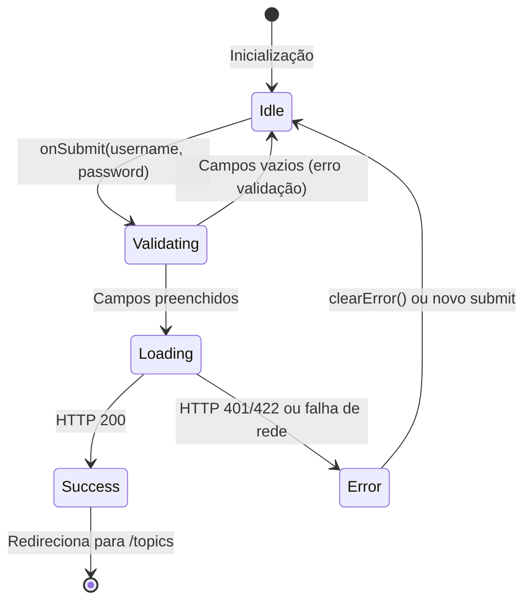
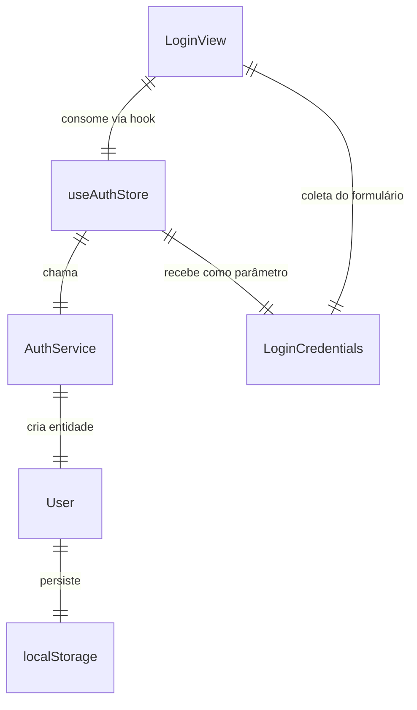

# Data Model — Login Component (Sprint 01)

> **Feature**: `001-login-component` | **RF**: RF-001 a RF-010 | **Data**: 2026-06-19

## Entidades

### AuthState (Zustand Store)

Estado global de autenticação gerenciado pela ViewModel.

| Campo | Tipo | Obrigatório | Padrão | Descrição | RF |
|-------|------|-------------|--------|-----------|----|
| `user` | `User \| null` | Sim | `null` | Usuário autenticado | RF-006 |
| `token` | `string \| null` | Sim | `null` | Token JWT de autenticação | RF-006 |
| `isAuthenticated` | `boolean` | Sim | `false` | Flag derivada: `!!token` | RF-009 |
| `loading` | `boolean` | Sim | `false` | Indica requisição em andamento | RF-003 |
| `error` | `string \| null` | Sim | `null` | Mensagem de erro para exibição | RF-008 |

**Ações**:

| Ação | Parâmetros | Retorno | Descrição | RF |
|------|------------|---------|-----------|----|
| `login` | `username: string, password: string` | `Promise<void>` | Autentica usuário via API | RF-005, RF-006 |
| `logout` | — | `void` | Limpa estado e remove persistência | RF-009 |
| `clearError` | — | `void` | Limpa mensagem de erro | RF-008 |

**Persistência**: `localStorage` via middleware `persist` do Zustand.
Chave no storage: `auth-storage`.

**Transições de Estado**:



---

### User (Entity)

Entidade de domínio que representa o usuário autenticado.

| Campo | Tipo | Obrigatório | Descrição | RF |
|-------|------|-------------|-----------|----|
| `username` | `string` | Sim | Nome de usuário | RF-001 |
| `token` | `string` | Sim | Token JWT de autenticação | RF-006 |

**Métodos**:

| Método | Parâmetros | Retorno | Descrição |
|--------|------------|---------|-----------|
| `fromApiResponse` | `username: string, accessToken: string` | `User` | Factory method para criar User a partir da resposta da API |

---

### LoginCredentials (DTO)

Dados de entrada do formulário de login.

| Campo | Tipo | Obrigatório | Validação | Descrição | RF |
|-------|------|-------------|-----------|-----------|----|
| `username` | `string` | Sim | `required, minLength(1)` | Nome de usuário | RF-001, RF-002 |
| `password` | `string` | Sim | `required, minLength(1)` | Senha do usuário | RF-001, RF-002, RF-010 |

---

## Relacionamentos



## Validações (Client-side)

| Campo | Regra | Mensagem de Erro | RF |
|-------|-------|-------------------|----|
| `username` | Não pode estar vazio | "O nome de usuário é obrigatório" | RF-002 |
| `password` | Não pode estar vazio | "A senha é obrigatória" | RF-002 |

## API Contract

### `POST /users/login`

**Request**:

- Content-Type: `application/x-www-form-urlencoded`
- Body:
  - `username`: string (required)
  - `password`: string (required)

**Response 200**:

```json
{
  "access_token": "eyJhbGciOiJIUzI1NiIs..."
}
```

**Response 422**:

```json
{
  "detail": [
    {
      "loc": ["body", "username"],
      "msg": "field required",
      "type": "value_error.missing"
    }
  ]
}
```

**Response 401**:

```json
{
  "detail": "Credenciais inválidas"
}
```