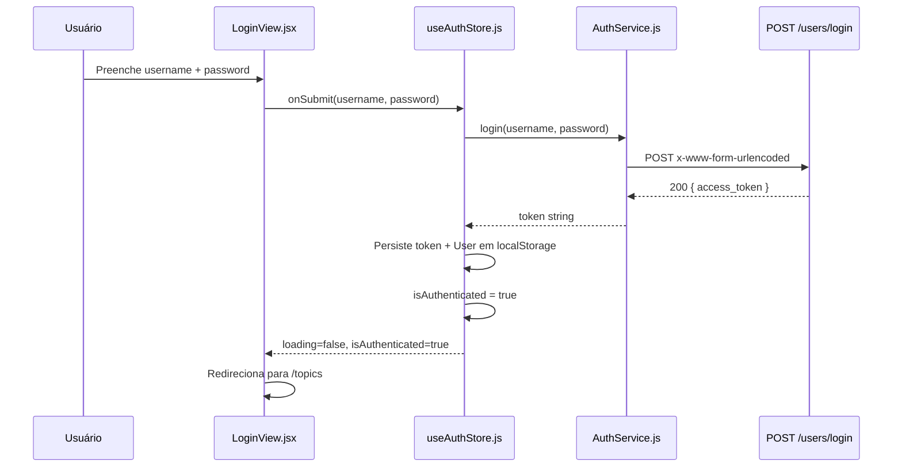

# Research — Login Component (Sprint 01)

> **Status**: Consolidado | **Data**: 2026-06-19

## Resumo

Pesquisa técnica para o componente de Login do KPC. Todas as decisões foram tomadas com base na especificação funcional (`spec.md`) e no endpoint `POST /users/login` do backend FastAPI.

---

## Decisões Técnicas

### 1. Arquitetura: MVVM com Zustand + Axios

- **Decision**: MVVM com View pura, ViewModel (Zustand store), Model (Axios service)
- **Rationale**: A constituição do projeto (CONST-R4) determina que o frontend DEVE seguir MVVM com camadas rigidamente separadas. Zustand foi escolhido por ser minimalista e não exigir boilerplate como Redux. Axios é o HTTP client padrão do ecossistema React.
- **Alternatives considered**: Redux Toolkit (over-engineering para um store de auth), Context API + useReducer (menos performático para persistência), React Query (não adequado para mutation de login com persistência de token).

### 2. Persistência: Zustand `persist` middleware + localStorage

- **Decision**: `persist` middleware do Zustand com `localStorage` como storage padrão
- **Rationale**: O middleware `persist` serializa automaticamente o estado para localStorage e o hidrata na inicialização. Não requer implementação manual de serialização/deserialização. Atende RF-006 e RF-009.
- **Alternatives considered**: localStorage manual (mais boilerplate), sessionStorage (perde estado ao fechar aba), cookies (não há necessidade de envio automático em cada request).

### 3. HTTP Client: Axios com configuração centralizada

- **Decision**: Axios com instância configurada em `shared/config.js`
- **Rationale**: Centralizar a base URL (`http://localhost:3132`) e configurações de timeout/headers em um único arquivo facilita manutenção. O `AuthService` importa essa instância configurada.
- **Alternatives considered**: Fetch API nativa (menos funcionalidades para interceptors/error handling), ky (menos ecossistema).

### 4. UI Framework: Material UI 5

- **Decision**: MUI 5 com componentes TextField, Button, Alert, CircularProgress
- **Rationale**: Já presente no projeto (`kpc-frontend`). Provê componentes acessíveis e com theming consistente. Alert MUI atende RF-008 diretamente.
- **Alternatives considered**: Chakra UI, Ant Design (não estão no projeto).

### 5. Formato da requisição: `application/x-www-form-urlencoded`

- **Decision**: Enviar `username` e `password` como `x-www-form-urlencoded`
- **Rationale**: O backend FastAPI espera este formato no endpoint `POST /users/login` (confirmado no OpenAPI do backend).
- **Alternatives considered**: `application/json` (não compatível com o backend atual).

### 6. Roteamento: React Router v6

- **Decision**: React Router v6 com `useNavigate` para redirecionamento pós-login
- **Rationale**: Já presente no projeto. `useNavigate` permite redirecionamento programático para `/topics` (RF-007).
- **Alternatives considered**: N/A — padrão do ecossistema.

---

## Dependências Externas Confirmadas

| Dependência | Versão | Uso |
|-------------|--------|-----|
| react | ^18.x | Runtime |
| @mui/material | ^5.x | Componentes de UI |
| zustand | ^4.x | Gerenciamento de estado com persist |
| axios | ^1.x | HTTP client |
| react-router-dom | ^6.x | Roteamento |

---

## Endpoint Backend

| Propriedade | Valor |
|-------------|-------|
| Método | `POST` |
| URL | `http://localhost:3132/users/login` |
| Content-Type | `application/x-www-form-urlencoded` |
| Body | `username` (string, required), `password` (string, required) |
| Sucesso | HTTP 200, body: `{ "access_token": "<jwt_token>" }` |
| Erro | HTTP 422 (validação), HTTP 401 (credenciais inválidas) |
| Falha de rede | Exceção capturada pelo Axios |

---

## Fluxo de Dados

