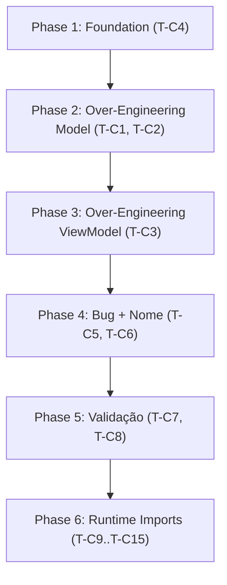
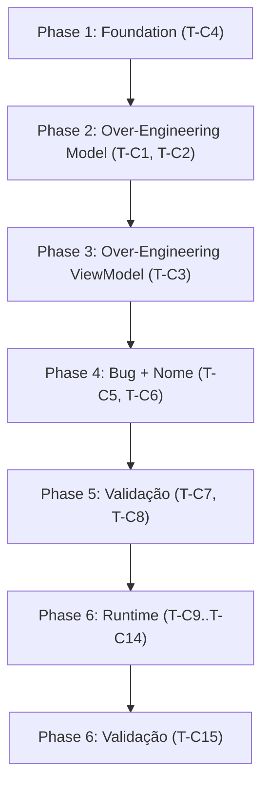

# Tasks: Login Component (Sprint 01) — Correções Rodada 1 + Runtime ST001.2

**Input**: Design documents from `/specs/001-login-component/`

**Feature**: 001-login-component | **Branch**: `001-login-component` | **Data**: 2026-06-20

**Contexto**: Rodada 1 de verificação concluída com 6 evidências DE. Tasks T001.1 a T001.7 já implementadas e marcadas como concluídas. Tasks T-C1 a T-C8 implementam as correções determinadas pelo veredito. **ST001.2**: Tasks T-C9 a T-C15 corrigem runtime errors causados pela refatoração de escopo mínimo em arquivos legados.

**Stack**: React 18 + Material UI 5 + Zustand 5 + Axios + React Router 6

**Path base**: `kpc-frontend/src-mvvm/`

**Rastreabilidade**: Todo arquivo criado/refatorado DEVE conter `// @model: specs/001-login-component/model/login-classes.puml` no topo.

**Arquitetura**: MVVM com 3 camadas rigidamente separadas:
- **Model** (`models/`): entidades + serviços (dados e API)
- **ViewModel** (`viewmodels/`): stores Zustand + hooks de apresentação
- **View** (`views/`): componentes React puros (sem lógica de negócio)

## Formato: `[ID] [P?] [Story] Description`

- **[P]**: Pode rodar em paralelo (arquivos diferentes, sem dependências)
- **[Story]**: Qual user story ou correção esta task atende
- Include exact file paths in descriptions (relative to `kpc-frontend/src-mvvm/`)

---

## ✅ Tasks Originais concluídas (T001.1 — T001.7)

- [X] T001.1 [P] Verificar/criar `shared/config.js`: exportar `API_BASE_URL = 'http://localhost:3132'` e `ENDPOINTS.LOGIN = '/users/login'` com tag `// @model: specs/001-login-component/model/login-classes.puml`
- [X] T001.2 [P] Verificar/criar entidade `models/entities/User.js` com campos `username`, `token` e factory method estático `User.fromApiResponse(data)` com tag `// @model: specs/001-login-component/model/login-classes.puml`
- [X] T001.3 Refatorar `models/services/AuthService.js`: método `login(username, password)` usando Axios com `POST /users/login`, `Content-Type: application/x-www-form-urlencoded`. Manter `getCurrentToken()`. Tag `// @model:`.
- [X] T001.4 Refatorar `viewmodels/stores/useAuthStore.js` com Zustand + persist. Estado: `isAuthenticated`, `user`, `token`, `error`, `loading`. Ações: `login()`, `logout()`, `clearError()`. Tag `// @model:`.
- [X] T001.5 Criar/refatorar `viewmodels/hooks/useLoginViewModel.js`: hook consumindo `useAuthStore`, retornando props para `LoginView`. Tag `// @model:`.
- [X] T001.6 Refatorar `views/pages/LoginView.jsx`: componente React puro com props e estados (idle, loading, error). Tag `// @model:`.
- [X] T001.7 Conectar tudo em `AppMVVM.jsx`: `LoginView` + `useLoginViewModel` + rota `/login` + `PrivateRoute`. Tag `// @model:`.

---

## Phase 1: Foundation — Correção de Rastreabilidade

**Purpose**: Adicionar tags de rastreabilidade ausentes identificadas na Rodada 1.

**RF associado**: RF-001-C4 (EVD-001-R1-001 — TAG_MODEL_AUSENTE)

- [X] T-C4 [P] Adicionar `// @model: specs/001-login-component/model/login-classes.puml` no topo de `shared/config.js`. Este arquivo já existe e exporta as constantes corretas, apenas falta a tag de rastreabilidade.

**Checkpoint**: Tag `// @model:` presente em `shared/config.js`.

---

## Phase 2: Correções de Over-Engineering — Model Layer

**Purpose**: Remover código não modelado das entidades e serviços (CONST-R2).

**RF associado**: RF-001-C1 (EVD-001-R1-003 — OVER_ENGINEERING_ENTITY_USER), RF-001-C2 (EVD-001-R1-004 — OVER_ENGINEERING_AUTH_SERVICE)

### T-C1 — Refatorar User.js para escopo mínimo modelado

- [X] T-C1 Refatorar `models/entities/User.js` para conter APENAS o que está modelado em `login-classes.puml:105-109`:
  - **MANTER** atributos: `username` (string), `token` (string)
  - **MANTER** método: `static fromApiResponse(username, accessToken)` — factory simplificada que cria User com `username` e `token`
  - **REMOVER** atributos não modelados: `attributions`, `isAuthenticated`, `_token` implícito
  - **REMOVER** métodos não modelados: `canAccessTopic`, `getAssignedTopics`, `isAdmin`, `toAuthHeaders`, `getAnnotationFiles`, `getAnnotationProfile`, `isValid`, `toJSON`, `fromJSON`
  - Construtor deve aceitar apenas `(username, token)`
  - Tag `// @model: specs/001-login-component/model/login-classes.puml` no topo

### T-C2 — Refatorar AuthService.js para expor apenas login() como público

- [X] T-C2 Refatorar `models/services/AuthService.js` para expor APENAS `login()` como público:
  - **MANTER** como público: `login(username, password)` → chama `POST /users/login` com Axios, `Content-Type: application/x-www-form-urlencoded`, retorna token
  - **MANTER** como privado (não exportado, não documentado no modelo): `makeRequest()`, `getCurrentToken()`
  - **REMOVER** ou tornar privados: `basicLogin`, `logout`, `whoami`, `validatePassword`, `listUsers`, `isAuthenticated`, `clearAuthentication`, `saveAuthenticationToken`, `getAuthenticatedUser`, `updateAuthenticatedUser`
  - **REMOVER** instância singleton `authService` do export — consumidores devem instanciar ou importar apenas a classe
  - Tag `// @model: specs/001-login-component/model/login-classes.puml` no topo (se ausente)

**Checkpoint**: Model layer alinhada ao modelo — zero over-engineering em `User.js` e `AuthService.js`.

---

## Phase 3: Correções de Over-Engineering — ViewModel Layer

**Purpose**: Remover ações não modeladas do store Zustand (CONST-R2).

**RF associado**: RF-001-C3 (EVD-001-R1-005 — OVER_ENGINEERING_USE_AUTH_STORE)

### T-C3 — Refatorar useAuthStore removendo ações não modeladas

- [X] T-C3 Refatorar `viewmodels/stores/useAuthStore.js` removendo ações não modeladas:
  - **MANTER** estado: `isAuthenticated`, `user` (User | null), `token` (string | null), `error` (string | null), `loading` (boolean)
  - **MANTER** ações: `login(username, password)`, `logout()`, `clearError()`
  - **MANTER** persistência: middleware `persist` do Zustand com chave `auth-storage-mvvm`, `partialize` e `onRehydrateStorage` conforme necessário
  - **REMOVER** ações: `setLoading`, `setError`, `updateUser`, `getCurrentUser`, `getToken`, `getIsAuthenticated`, `getCurrentUsername`, `canAccessTopic`, `isAdmin`, `getAuthHeaders`, `reset`, `initialize`
  - A ação `initialize` (chamada por `onRehydrateStorage`) PODE ser mantida APENAS se for estritamente necessária para a hidratação do Zustand — neste caso documentar com comentário `// @note: mantido para onRehydrateStorage — reportar ao Arquiteto se puder ser removido`
  - Ajustar `partialize` para serializar corretamente apenas os campos persistidos
  - Tag `// @model: specs/001-login-component/model/login-classes.puml` no topo

**Checkpoint**: ViewModel alinhada ao modelo — store contém apenas ações modeladas.

---

## Phase 4: Correções de Bug e Nomenclatura

**Purpose**: Corrigir bug `ReferenceError: maxRows` e alinhar nomenclatura do hook ao modelo.

**RF associado**: RF-001-C5 (EVD-001-R1-006 — BUG_MAX_ROWS_TEXFIELD), RF-001-C6 (EVD-001-R1-002 — NOME_HOOK_DIVERGENTE)

### T-C5 — Corrigir ReferenceError: maxRows no TextField.jsx

- [X] T-C5 Corrigir `views/components/TextField.jsx`:
  - `maxRows` já está na desestruturação de props (linha 25) — verificar se o erro persiste em tempo de execução
  - Se o erro for `ReferenceError: maxRows is not defined` na desestruturação, verificar se há um typo no nome ou se `maxRows` está posicionado antes de sua declaração
  - Como alternativa segura, garantir que `maxRows` tenha valor padrão `undefined` na desestruturação: `maxRows = undefined`
  - Verificar se há outros `ReferenceError` similares no componente (ex.: `autoComplete`, `InputProps`)
  - Tag `// @model: specs/001-login-component/model/login-classes.puml` no topo

### T-C6 — Renomear hook useLoginViewModel → useAuth

- [X] T-C6 Alinhar nomenclatura do hook ao modelo:
  - **OPÇÃO RECOMENDADA** (Opção A do plano): Renomear arquivo `viewmodels/hooks/useLoginViewModel.js` → `viewmodels/hooks/useAuth.js` e função exportada `useLoginViewModel` → `useAuth`
  - Atualizar export em `viewmodels/index.js`: `export { useAuth } from './hooks/useAuth.js'`
  - Atualizar import em `viewmodels/index.js` (linha 30 atualmente: `useLoginViewModel`)
  - Atualizar import em `AppMVVM.jsx` (linha 29 atualmente: `useLoginViewModel`)
  - Atualizar uso em `AppMVVM.jsx` (linha 94: `const viewModel = useLoginViewModel()`)
  - Atualizar comentário de docstring em `AppMVVM.jsx` (linha 91)
  - Verificar se há outros consumidores do hook em todo `src-mvvm/`
  - Tag `// @model: specs/001-login-component/model/login-classes.puml` no topo do arquivo renomeado

**Checkpoint**: Bug corrigido e nomenclatura alinhada ao modelo.

---

## Phase 5: Validação Pós-Correção

**Purpose**: Verificar que todas as correções não quebraram o fluxo de login.

**RF associado**: RF-001 (funcionalidade geral)

- [X] T-C7 [P] Verificar que o login ainda funciona após todas as alterações: testar fluxo completo manualmente (preenchimento → submit → API → store → redirect). Abrir navegador limpo, preencher credenciais válidas, verificar redirecionamento para `/topics`, verificar persistência em localStorage.
- [X] T-C8 [P] Verificar que `// @model:` está presente em TODOS os arquivos tocados: `shared/config.js`, `models/entities/User.js`, `models/services/AuthService.js`, `viewmodels/stores/useAuthStore.js`, `viewmodels/hooks/useAuth.js`, `views/pages/LoginView.jsx`, `views/components/TextField.jsx`, `AppMVVM.jsx`, `viewmodels/index.js`.

**Checkpoint**: Todas as correções validadas — código funcional e rastreável.

---

## Phase 6: Correção de Runtime — Imports Legados (ST001.2)

**Purpose**: Corrigir `SyntaxError` em runtime causados por exports removidos na refatoração de escopo mínimo (T-C1, T-C2, T-C3). Arquivos legados em `src-mvvm/` fora do escopo da Sprint 01 ainda importam `authService` (singleton removido) e chamam `getCurrentUser()`, `getCurrentUsername()`, `getIsAuthenticated()` (métodos removidos do store).

**Problema principal**: `Uncaught SyntaxError: The requested module '/models/services/AuthService.js' does not provide an export named 'authService'`

**RF associado**: RF-001-C2, RF-001-C3 (efeitos colaterais da refatoração)

### T-C9 — models/services/index.js

- [X] T-C9 [P] Corrigir re-export em `models/services/index.js` linha 13: `export { AuthService, authService } from './AuthService.js'` → remover `authService` do re-export: `export { AuthService } from './AuthService.js'`

### T-C10 — viewmodels/hooks/useTopicSelectionViewModel.js (4 quebras)

- [X] T-C10 Corrigir imports e chamadas quebradas em `viewmodels/hooks/useTopicSelectionViewModel.js`:
  - **Linha 12**: `import { authService } from '../../models/services/AuthService.js'` → remover este import (ou substituir por `import { AuthService }` se necessário localmente)
  - **Linha 33**: `authStore.getCurrentUser()` → `authStore.user`
  - **Linha 34**: `authStore.getCurrentUsername()` → `authStore.user?.username`
  - **Linha 35**: `authStore.getIsAuthenticated()` → `authStore.isAuthenticated`
  - **Linha 77**: `authService.listUsers()` → substituir por alternativa que não dependa do singleton removido (ex.: usar `new AuthService().makeRequest('/users/list')` com try/catch, ou simplificar a lógica de validação para verificar apenas `authStore.token` + `authStore.user`)
  - **Linha 358**: `authStore.getCurrentUsername()` → `authStore.user?.username`
  - **Linha 359**: `authStore.getCurrentUser()` → `authStore.user`

### T-C11 — viewmodels/hooks/useKeyphraseClusteringViewModel.js (2 quebras)

- [X] T-C11 [P] Corrigir chamadas quebradas em `viewmodels/hooks/useKeyphraseClusteringViewModel.js`:
  - **Linha 50**: `authStore.getCurrentUser()` → `authStore.user`
  - **Linha 51**: `authStore.getCurrentUsername()` → `authStore.user?.username`

### T-C12 — viewmodels/hooks/useKeyphraseClustersViewModel.js (2 quebras)

- [X] T-C12 [P] Corrigir chamadas quebradas em `viewmodels/hooks/useKeyphraseClustersViewModel.js`:
  - **Linha 55**: `authStore.getCurrentUser()` → `authStore.user`
  - **Linha 56**: `authStore.getCurrentUsername()` → `authStore.user?.username`

### T-C13 — viewmodels/hooks/useCuratedKeyphrasesViewModel.js (2 quebras)

- [X] T-C13 [P] Corrigir chamadas quebradas em `viewmodels/hooks/useCuratedKeyphrasesViewModel.js`:
  - **Linha 57**: `authStore.getCurrentUser()` → `authStore.user`
  - **Linha 58**: `authStore.getCurrentUsername()` → `authStore.user?.username`

### T-C14 — AppMVVM.jsx (2 quebras)

- [X] T-C14 Corrigir chamadas quebradas em `AppMVVM.jsx`:
  - **Linha 119**: `authStore.getCurrentUser()` → `authStore.user`
  - **Linha 200**: `authStore.getCurrentUser()` → `authStore.user`

### T-C15 — Validação runtime

- [X] T-C15 Validar que todas as correções resolvem os erros de runtime:
  - Executar `npm run dev` em `kpc-frontend/`
  - Verificar console do navegador limpo (sem `SyntaxError` ou `ReferenceError`)
  - Testar fluxo completo: login → redirecionamento para `/topics`
  - Verificar que telas de clustering, clusters e curated keyphrases carregam sem erros

**Checkpoint**: Runtime sem erros — todos os imports e chamadas de métodos legados corrigidos.

---

## Dependências & Ordem de Execução

### Dependências entre Fases (Correções)



### Dependências Detalhadas

| Task | Depende de | Descrição |
|------|-----------|-----------|
| T-C4 | — | Tag em config.js (sem dependências) |
| T-C1 | — | Refatorar User.js (sem dependências) |
| T-C2 | — | Refatorar AuthService.js (sem dependências) |
| T-C3 | T-C1 | useAuthStore depende de `User` entity refatorada |
| T-C5 | — | Corrigir TextField.jsx (sem dependências) |
| T-C6 | T-C3 | Renomear hook depende do store refatorado |
| T-C7 | T-C1, T-C2, T-C3, T-C4, T-C5, T-C6 | Validação funcional depende de TODAS as correções |
| T-C8 | T-C1, T-C2, T-C3, T-C4, T-C5, T-C6 | Verificação de tags depende de TODAS as correções |
| T-C9 | T-C2 | Re-export de AuthService depende da refatoração de T-C2 |
| T-C10 | T-C2, T-C3 | useTopicSelectionViewModel depende de AuthService + useAuthStore |
| T-C11 | T-C3 | useKeyphraseClusteringViewModel depende de useAuthStore |
| T-C12 | T-C3 | useKeyphraseClustersViewModel depende de useAuthStore |
| T-C13 | T-C3 | useCuratedKeyphrasesViewModel depende de useAuthStore |
| T-C14 | T-C3 | AppMVVM depende de useAuthStore |
| T-C15 | T-C9, T-C10, T-C11, T-C12, T-C13, T-C14 | Validação runtime depende de TODAS as correções de imports |

### Oportunidades de Paralelismo

- **T-C4, T-C1, T-C2, T-C5**: Podem rodar em paralelo (arquivos independentes, sem dependências entre si)
- **T-C3**: Depende de T-C1 (`User` entity)
- **T-C6**: Depende de T-C3 (store refatorada)
- **T-C7, T-C8**: Dependem de todas as correções, podem rodar em paralelo entre si
- **T-C9**: Depende de T-C2, pode rodar em paralelo com T-C10..T-C14
- **T-C11, T-C12, T-C13**: Dependem de T-C3, podem rodar em paralelo entre si
- **T-C10, T-C14**: Dependem de T-C2 e T-C3

### Exemplo de Execução Paralela

```
Lote 1: T-C4 [P] + T-C1 [P] + T-C2 [P] + T-C5 [P] (4 pessoas em paralelo)
Lote 2: T-C3 (após T-C1)
Lote 3: T-C6 (após T-C3)
Lote 4: T-C7 [P] + T-C8 [P] (após todas as correções estruturais)
Lote 5: T-C9 [P] + T-C11 [P] + T-C12 [P] + T-C13 [P] (4 em paralelo, após T-C2 + T-C3)
Lote 6: T-C10 + T-C14 (após T-C2 + T-C3)
Lote 7: T-C15 (validação runtime final)
```

---

## Estratégia de Implementação

### Escopo das Correções (Rodada 1)

| Task | RF Correção | Evidência | Tipo | Severidade |
|------|-------------|-----------|------|------------|
| T-C4 | RF-001-C4 | EVD-001-R1-001 | TAG_MODEL_AUSENTE | Média |
| T-C1 | RF-001-C1 | EVD-001-R1-003 | OVER_ENGINEERING | Alta |
| T-C2 | RF-001-C2 | EVD-001-R1-004 | OVER_ENGINEERING | Alta |
| T-C3 | RF-001-C3 | EVD-001-R1-005 | OVER_ENGINEERING | Média |
| T-C5 | RF-001-C5 | EVD-001-R1-006 | BUG_CODIGO | Alta |
| T-C6 | RF-001-C6 | EVD-001-R1-002 | NOME_DIVERGENTE | Baixa |

### O que NÃO está no escopo

- Testes automatizados (serão adicionados em sprint futura)
- Novas funcionalidades (RF-002 a RF-010)
- Alteração nos modelos PlantUML (são considerados corretos pelo Juiz)
- Correção de outras partes do código não relacionadas às 6 evidências

### Critério de Conclusão

✅ T-C1 a T-C6 concluídas → código alinhado ao modelo (zero over-engineering, tags presentes, bug corrigido, nomenclatura consistente)
✅ T-C7 — validação manual do fluxo completo de login
✅ T-C8 — `// @model:` presente em todos os arquivos tocados
✅ T-C15 — validação runtime sem `SyntaxError`
➡️ Próximo passo: `git commit` → verificar frontend funcional → progressão para sprint seguinte

---

## Resumo

| Fase | Tasks | Prioridade |
|------|-------|------------|
| Phase 1: Foundation (Rastreabilidade) | T-C4 | P2 |
| Phase 2: Over-Engineering — Model | T-C1, T-C2 | P1 |
| Phase 3: Over-Engineering — ViewModel | T-C3 | P2 |
| Phase 4: Bug + Nomenclatura | T-C5, T-C6 | P1/P3 |
| Phase 5: Validação | T-C7, T-C8 | — |
| Phase 6: Correção de Runtime — Imports Legados | T-C9, T-C10, T-C11, T-C12, T-C13, T-C14, T-C15 | P1 |

**Total de tasks de correção**: 15 (T-C1 a T-C15)
**Tasks originais mantidas**: 7 (T001.1 a T001.7 — ✅ concluídas)
**Evidências resolvidas**: 6 (EVD-001-R1-001 a EVD-001-R1-006)
**Arquivos legados corrigidos (Phase 6)**: 6 (models/services/index.js, 4 hooks, AppMVVM.jsx)
**Tasks paralelizáveis [P]**: 12 (T-C4, T-C1, T-C2, T-C5, T-C7, T-C8, T-C9, T-C11, T-C12, T-C13)
**Tasks sequenciais**: 3 (T-C3, T-C6, T-C10)
**Evidências resolvidas**: 6 (EVD-001-R1-001 a EVD-001-R1-006)
**Gates desbloqueados**: GATE-02, GATE-03 (após Rodada 2)
**Imports legados corrigidos**: 6 arquivos (T-C9 a T-C14)

---

## 🩹 Phase 6: Correção de Runtime — Imports Legados Quebrados (ST001.2)

**Purpose**: Corrigir `SyntaxError: does not provide an export named 'authService'` e demais imports quebrados em arquivos legados, causados pela refatoração de escopo mínimo.

**Contexto**: A ST001.1 removeu o singleton `authService`, métodos `getCurrentUser()`, `getCurrentUsername()` e `getIsAuthenticated()` do `useAuthStore`. Arquivos em `src-mvvm/` que estavam fora do escopo da Sprint 01 quebraram. A correção deve ser feita **nos consumidores**, não restaurando métodos (CONST-R2).

**Path base**: `kpc-frontend/src-mvvm/`

**RF associado**: Nenhum novo RF — correção de runtime em arquivos legados (fora do modelo da Sprint 01).

### T-C9 — Corrigir export quebrado em `models/services/index.js`

- [ ] T-C9 [P] Corrigir `models/services/index.js`:
  - Linha 13: `export { AuthService, authService } from './AuthService.js';`
  - `authService` (instância singleton) não é mais exportada por `AuthService.js` — foi removida na ST001.1
  - **Correção**: Remover `authService` do re-export: `export { AuthService } from './AuthService.js';`
  - Verificar se algum outro arquivo importa `authService` de `models/services/index.js` (já mapeado em T-C10)
  - **Não adicionar** tag `// @model:` pois este arquivo não faz parte do modelo da Sprint 01

### T-C10 — Corrigir `useTopicSelectionViewModel.js` (3 imports quebrados)

- [ ] T-C10 Corrigir `viewmodels/hooks/useTopicSelectionViewModel.js`:
  - **Linha 12**: `import { authService } from '../../models/services/AuthService.js';`
    - `authService` não é mais exportado
    - **Correção**: Remover este import. O `authService.listUsers()` (linha 77) deve ser substituído — em vez de chamar `listUsers()`, usar uma verificação mais simples como tentar carregar tópicos e capturar erro 401/403
  - **Linha 33**: `const user = authStore.getCurrentUser();`
    - Método removido do store
    - **Correção**: Substituir por `const user = authStore.user;`
  - **Linha 34**: `const username = authStore.getCurrentUsername();`
    - Método removido do store
    - **Correção**: Substituir por `const username = authStore.user?.username || '';`
  - **Linha 358-359**: Usos de `authStore.getCurrentUsername()` e `authStore.getCurrentUser()` — mesmas correções
  - **Linha 77**: `await authService.listUsers();` — sem substituto direto. Pode ser substituído por um try/catch que verifica conectividade, ou removido se não for estritamente necessário para o fluxo de seleção de tópicos

### T-C11 — Corrigir `useKeyphraseClusteringViewModel.js` (2 quebras)

- [ ] T-C11 [P] Corrigir `viewmodels/hooks/useKeyphraseClusteringViewModel.js`:
  - **Linha 50**: `const user = authStore.getCurrentUser();`
    - **Correção**: `const user = authStore.user;`
  - **Linha 51**: `const username = authStore.getCurrentUsername();`
    - **Correção**: `const username = authStore.user?.username || '';`

### T-C12 — Corrigir `useKeyphraseClustersViewModel.js` (2 quebras)

- [ ] T-C12 [P] Corrigir `viewmodels/hooks/useKeyphraseClustersViewModel.js`:
  - **Linha 55**: `const user = authStore.getCurrentUser();`
    - **Correção**: `const user = authStore.user;`
  - **Linha 56**: `const username = authStore.getCurrentUsername();`
    - **Correção**: `const username = authStore.user?.username || '';`

### T-C13 — Corrigir `useCuratedKeyphrasesViewModel.js` (2 quebras)

- [ ] T-C13 [P] Corrigir `viewmodels/hooks/useCuratedKeyphrasesViewModel.js`:
  - **Linha 57**: `const user = authStore.getCurrentUser();`
    - **Correção**: `const user = authStore.user;`
  - **Linha 58**: `const username = authStore.getCurrentUsername();`
    - **Correção**: `const username = authStore.user?.username || '';`

### T-C14 — Corrigir `AppMVVM.jsx` (2 quebras)

- [ ] T-C14 [P] Corrigir `AppMVVM.jsx`:
  - **Linha 119**: `user={authStore.getCurrentUser()}`
    - **Correção**: `user={authStore.user}`
  - **Linha 200**: `user={authStore.getCurrentUser()}`
    - **Correção**: `user={authStore.user}`

### T-C15 — Validar runtime pós-correção

- [ ] T-C15 Validar que o frontend carrega sem `SyntaxError`:
  - Executar `npm run dev` (ou comando equivalente) no diretório `kpc-frontend/`
  - Abrir `http://localhost:5173` (ou porta configurada)
  - Verificar que **nenhum** erro de import/export aparece no console do navegador
  - Testar o fluxo de login manualmente (end-to-end) para garantir que a funcionalidade principal não foi afetada
  - Caso algum erro persista, identificar o arquivo e repetir a correção

**Checkpoint**: Frontend carrega sem `SyntaxError`. Login + tópicos funcionais.

---

## Dependências Atualizadas (com Phase 6)



### Dependências Detalhadas (atualizado)

| Task | Depende de | Descrição |
|------|-----------|-----------|
| T-C4 | — | Tag em config.js |
| T-C1 | — | Refatorar User.js |
| T-C2 | — | Refatorar AuthService.js |
| T-C3 | T-C1 | useAuthStore depende de `User` entity |
| T-C5 | — | Corrigir TextField.jsx |
| T-C6 | T-C3 | Renomear hook depende do store |
| T-C9..T-C14 | T-C2, T-C3, T-C6 | Imports corrigidos APÓS AuthService e store refatorados |
| T-C15 | T-C9..T-C14 | Validação runtime |

### Ordem de Execução Recomendada

```
Lote 1: T-C4 [P] + T-C1 [P] + T-C2 [P] + T-C5 [P] (paralelo)
Lote 2: T-C3 (após T-C1)
Lote 3: T-C6 (após T-C3)
Lote 4: T-C9 [P] + T-C10 + T-C11 [P] + T-C12 [P] + T-C13 [P] + T-C14 [P] (paralelo — após T-C2, T-C3, T-C6)
Lote 5: T-C15 (após lote 4)
```