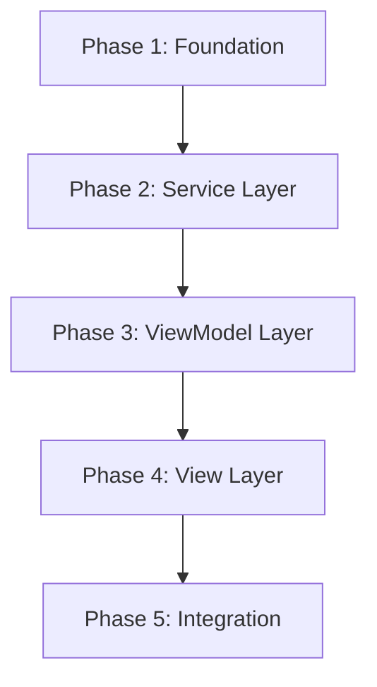

# Tasks: Login Component (Sprint 01)

**Input**: Design documents from `/specs/001-login-component/`

**Feature**: 001-login-component | **Branch**: `001-login-component` | **Data**: 2026-06-19

**Único RF desta sprint**: RF-001 (Login com username e senha via API)

**Stack**: React 18 + Material UI 5 + Zustand 5 + Axios + React Router 6

**Path base**: `kpc-frontend/src-mvvm/`

**Rastreabilidade**: Todo arquivo criado/refatorado DEVE conter `// @model: specs/001-login-component/model/login-classes.puml` no topo.

**Arquitetura**: MVVM com 3 camadas rigidamente separadas:
- **Model** (`models/`): entidades + serviços (dados e API)
- **ViewModel** (`viewmodels/`): stores Zustand + hooks de apresentação
- **View** (`views/`): componentes React puros (sem lógica de negócio)

## Formato: `[ID] [P?] [Story] Description`

- **[P]**: Pode rodar em paralelo (arquivos diferentes, sem dependências)
- **[Story]**: Qual user story esta task atende
- Include exact file paths in descriptions (relative to `kpc-frontend/src-mvvm/`)

---

## Phase 1: Foundation — Setup (Shared Infrastructure)

**Purpose**: Configuração base e entidades de domínio compartilhadas.

**⚠️ Nenhuma task das fases seguintes pode começar antes desta fase.**

- [X] T001.1 [P] Verificar/criar `shared/config.js`: exportar `API_BASE_URL = 'http://localhost:3132'` e `ENDPOINTS.LOGIN = '/users/login'` com tag `// @model: specs/001-login-component/model/login-classes.puml`
- [X] T001.2 [P] Verificar/criar entidade `models/entities/User.js` com campos `username`, `token` e factory method estático `User.fromApiResponse(data)` com tag `// @model: specs/001-login-component/model/login-classes.puml`

**Checkpoint**: Foundation pronta — config e entidade User disponíveis para as camadas superiores.

---

## Phase 2: Service Layer — Model (Business Logic & API)

**Purpose**: Implementar o serviço de autenticação que faz a chamada HTTP ao backend.

- [X] T001.3 Refatorar `models/services/AuthService.js`: método `login(username, password)` deve usar Axios com `POST /users/login`, `Content-Type: application/x-www-form-urlencoded`, retornar token. Manter método `getCurrentToken()` existente. Adicionar tag `// @model: specs/001-login-component/model/login-classes.puml`.

**Checkpoint**: Service layer concluída — `AuthService.login()` funcional com API real.

---

## Phase 3: ViewModel Layer — Store & Hooks (State Management)

**Purpose**: Implementar o estado global de autenticação (Zustand com persist) e o hook de apresentação que conecta View ao Model.

- [X] T001.4 Refatorar `viewmodels/stores/useAuthStore.js` com Zustand + middleware `persist`:
  - Estado: `isAuthenticated`, `user` (User | null), `token` (string | null), `error` (string | null), `loading` (boolean)
  - Ações: `login(username, password)` (chama AuthService, trata 200/422, persiste em localStorage), `logout()`, `clearError()`
  - Persistência via middleware `persist` do Zustand com chave `auth-storage-mvvm`
  - Adicionar tag `// @model: specs/001-login-component/model/login-classes.puml`

- [X] T001.5 Criar/refatorar `viewmodels/hooks/useLoginViewModel.js`: hook que consome `useAuthStore` e retorna props prontas para `LoginView`:
  - Estado: `username`, `password`, `loading`, `error`
  - Handlers: `onUsernameChange`, `onPasswordChange`, `onSubmit`
  - Integração com React Router (`useNavigate` para redirecionar para `/topics`)
  - Adicionar tag `// @model: specs/001-login-component/model/login-classes.puml`

**Checkpoint**: ViewModel layer concluída — store com persistência funcional, hook com validação e integração com roteamento.

---

## Phase 4: View Layer — UI (Pure Components)

**Purpose**: Implementar a view pura de login, sem lógica de negócio, recebendo tudo via props.

- [X] T001.6 Refatorar `views/pages/LoginView.jsx`: componente React puro com props (`username`, `password`, `loading`, `error`, `onUsernameChange`, `onPasswordChange`, `onSubmit`). Estados: idle, loading, error. Usar `TextField`, `Button`, `Alert`, `AuthLayout` do MUI. Adicionar tag `// @model: specs/001-login-component/model/login-classes.puml`.

**Checkpoint**: View layer concluída — `LoginView` renderizando corretamente todos os estados de UI.

---

## Phase 5: Integration — AppMVVM

**Purpose**: Conectar todas as camadas no ponto de entrada da aplicação MVVM.

- [X] T001.7 Conectar tudo em `AppMVVM.jsx`: `LoginView` recebendo props do hook `useLoginViewModel`, rota `/login` como inicial (rota raiz `/` redirecionando para `/login`), `PrivateRoute` protegendo as demais rotas com verificação de `isAuthenticated`. Adicionar tag `// @model: specs/001-login-component/model/login-classes.puml`.

**Checkpoint**: Integração completa — login funcional com API real, persistência em localStorage e redirecionamento para `/topics`.

---

## Dependências & Ordem de Execução

### Dependências entre Fases



### Dependências Detalhadas

| Task | Depende de | Descrição |
|------|-----------|-----------|
| T001.1 | — | Config compartilhada (sem dependências) |
| T001.2 | — | Entidade User (sem dependências) |
| T001.3 | T001.1 | AuthService precisa de `API_BASE_URL` e `ENDPOINTS.LOGIN` |
| T001.4 | T001.2, T001.3 | useAuthStore precisa de `User` entity e `AuthService` |
| T001.5 | T001.4 | useLoginViewModel consome `useAuthStore` |
| T001.6 | — | LoginView é componente puro (sem dependências de outras tasks) |
| T001.7 | T001.5, T001.6 | AppMVVM precisa do hook e da view |

### Oportunidades de Paralelismo

- **T001.1 e T001.2** (Phase 1): Podem rodar em paralelo — são arquivos diferentes sem dependência entre si.
- **T001.6** (Phase 4): Pode ser feita em paralelo com as fases 2 e 3, pois é um componente puro que só define a interface visual.
- **Demais tasks**: Sequenciais devido à cadeia de dependências.

### Exemplo de Execução Paralela

```
Dia 1: T001.1 [P] + T001.2 [P] + T001.6 [P] (3 pessoas em paralelo)
Dia 2: T001.3 (após T001.1)
Dia 3: T001.4 (após T001.2 + T001.3)
Dia 4: T001.5 (após T001.4)
Dia 5: T001.7 (após T001.5 + T001.6)
```

---

## Estratégia de Implementação

### MVP Scope (Sprint 01)

O MVP desta sprint cobre **exclusivamente o RF-001**: formulário de login com username e senha, chamada à API `POST /users/login`, persistência do token, e redirecionamento para `/topics`.

### O que NÃO está no escopo

- Testes automatizados (serão adicionados em sprint futura)
- User Story 2 (Persistência de sessão entre recargas — P2, será abordada em tasks futuras)
- Demais RFs da spec (RF-002 a RF-010)
- Tela de tópicos (`/topics`) — assumir que já existe ou será criada em outra sprint

### Critério de Conclusão

✅ T001.1 a T001.7 concluídas → login funcional com API real, persistência em localStorage e redirecionamento para `/topics`.

---

## Resumo

| Fase | Tasks | US | Prioridade |
|------|-------|----|------------|
| Phase 1: Foundation | T001.1, T001.2 | — | Setup |
| Phase 2: Service Layer | T001.3 | US1 | P1 |
| Phase 3: ViewModel Layer | T001.4, T001.5 | US1 | P1 |
| Phase 4: View Layer | T001.6 | US1 | P1 |
| Phase 5: Integration | T001.7 | US1 | P1 |

**Total de tasks**: 7
**Tasks paralelizáveis**: 3 (T001.1, T001.2, T001.6)
**Tasks sequenciais**: 4 (T001.3, T001.4, T001.5, T001.7)
**User stories cobertas**: 1 (US1 — Autenticação)