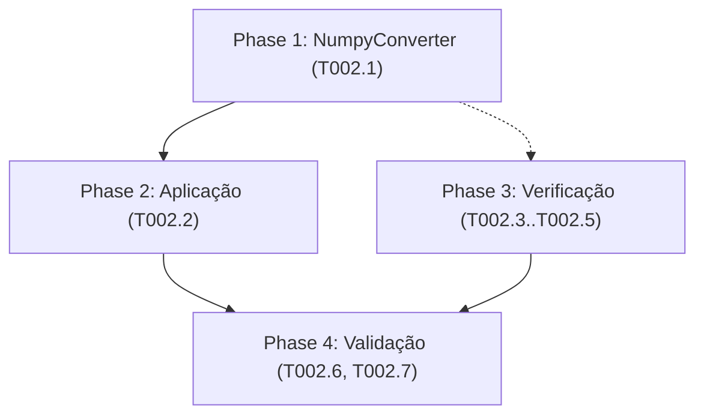
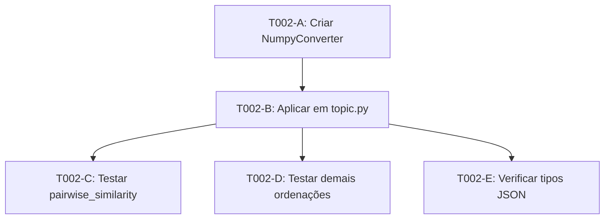

# Tasks: Pairwise Similarity Serialization Fix (Sprint 02)

**Input**: Design documents from `/specs/002-pairwise-similarity-fix/`

**Feature**: `002-pairwise-similarity-fix` | **Branch**: `002-pairwise-similarity-fix` | **Data**: 2026-06-20

**Contexto**: O endpoint `GET /topic/clusters/{username}/{topic}/{cluster_order}` com `cluster_order=pairwise_similarity` retorna HTTP 500 com `PydanticSerializationError: Unable to serialize unknown type: <class 'numpy.int64'>`. A causa raiz está em `model/cluster.py:328-348` (`get_pairwise_cluster_similarity()`), que insere valores `numpy.int64` e `numpy.float64` no dicionário `result`, propagando até o retorno da API em `api/topic.py:258-263`.

**Stack**: Python 3.12 + FastAPI 0.115.12 + NumPy. Backend em `kpc-backend/`.

**Path base**: `kpc-backend/src/keyphrase_curation/`

**Rastreabilidade**: Todo código alterado DEVE conter no topo `# @model: specs/002-pairwise-similarity-fix/model/classes.puml` e `# RF: RF-003`.

**Diagramas de referência**:
- `specs/002-pairwise-similarity-fix/model/classes.puml` — estrutura de classes
- `specs/002-pairwise-similarity-fix/model/sequence.puml` — fluxo antes/depois
- `specs/002-pairwise-similarity-fix/model/components.puml` — dependências entre módulos

## Formato: `[ID] [P?] Description`

- **[P]**: Pode rodar em paralelo (arquivos diferentes, sem dependências)
- Include exact file paths in descriptions (relative to `kpc-backend/src/keyphrase_curation/`)

---

## Phase 1: Criação do Utilitário de Conversão (Foundation)

**Purpose**: Criar o `NumpyConverter.to_native()`, um conversor reutilizável que percorre recursivamente estruturas de dados convertendo tipos numpy para Python nativos.

**RF associado**: RF-003, RF-004, RF-006

**Diagrama**: `model/classes.puml` — classe `NumpyConverter`

### T002.1 — Criar NumpyConverter em util/json_encoder.py

- [X] T002.1 [P] Criar `util/json_encoder.py` com:
  - Cabeçalho de rastreabilidade:
    ```python
    # @model: specs/002-pairwise-similarity-fix/model/classes.puml
    # RF: RF-003, RF-004, RF-006 — Conversão global de tipos numpy para Python nativos
    ```
  - Classe `NumpyConverter` com:
    - Método estático `to_native(obj: Any) → Any`:
      - Se `obj` é `dict`: retorna `{k: to_native(v) for k, v in obj.items()}`
      - Se `obj` é `list` ou `tuple`: retorna `[to_native(v) for v in obj]`
      - Se `obj` é `set`: retorna `{to_native(v) for v in obj}`
      - Caso base: delega para `_convert_value(obj)`
    - Método privado estático `_convert_value(value: Any) → Any`:
      - `isinstance(value, numpy.integer)` → `int(value)`
      - `isinstance(value, numpy.floating)` → `float(value)`
      - `isinstance(value, numpy.ndarray)` → `value.tolist()`
      - `isinstance(value, numpy.bool_)` → `bool(value)`
      - Caso contrário → retorna `value` (tipos já nativos)
  - Docstring com exemplo de uso e tipos suportados
  - Import `import numpy as np`

**Checkpoint**: `util/json_encoder.py` criado — `NumpyConverter.to_native()` pronto para uso em qualquer endpoint.

---

## Phase 2: Aplicação no Endpoint Afetado

**Purpose**: Aplicar `NumpyConverter.to_native()` no retorno de `list_clusters()` para converter `clusters_meta_info` antes da serialização Pydantic.

**RF associado**: RF-003, RF-005

**Diagrama**: `model/sequence.puml` (fluxo "depois")

### T002.2 — Aplicar NumpyConverter em api/topic.py

- [X] T002.2 Modificar `api/topic.py` — função `list_clusters()` (linhas 214-263):
  - Adicionar import no topo do arquivo:
    ```python
    # @model: specs/002-pairwise-similarity-fix/model/classes.puml
    # RF: RF-003 — Conversão numpy → Python nativo no retorno da API
    from keyphrase_curation.util.json_encoder import NumpyConverter
    ```
  - Localizar o `return` (linhas ~258-263):
    ```python
    return {
        "sorting_applied": sorting.value,
        "clusters": clusters,
        "clusters_meta_info": clusters_meta_info
    }
    ```
  - Inserir conversão ANTES do return:
    ```python
    # RF-003, RF-004 — Converter tipos numpy para Python nativos
    # @model: specs/002-pairwise-similarity-fix/model/classes.puml
    clusters_meta_info = NumpyConverter.to_native(clusters_meta_info)
    ```
  - A conversão deve ser feita APÓS `_process_clusters_to_array()`, imediatamente antes do `return`
  - **Importante**: A estrutura da resposta (`{"sorting_applied", "clusters", "clusters_meta_info"}`) NÃO DEVE ser alterada — RF-005

**Checkpoint**: `api/topic.py` aplica `NumpyConverter.to_native()` em `clusters_meta_info` antes de retornar, resolvendo o erro de serialização.

---

## Phase 3: Verificação de Outros Endpoints

**Purpose**: Examinar o código-fonte para identificar outros endpoints que também possam retornar tipos numpy não serializáveis.

**RF associado**: RF-003, RF-007 (garantir que não há regressões)

### T002.3 — Verificar outros endpoints em controller/annotation.py

- [X] T002.3 Verificar `controller/annotation.py` — método `get_clusters()` (linhas 56-102):
  - O método lê `clusters_meta_info[cluster.id]['similar_cluster']` e `clusters_meta_info[cluster.id]['similarity']` e os utiliza para formatar strings de alias — estes valores são usados APENAS para formatação textual (f-strings), não afetam a serialização JSON
  - Verificar se `centroid_similarity` (Sprint 03) também propaga valores numpy via `get_cluster_centrality_scores()` em `model/cluster.py`

### T002.4 [P] — Verificar endpoint centroid_similarity

- [X] T002.4 [P] Verificar `model/cluster.py` — método `get_cluster_centrality_scores()` (linhas 350-392):
  - Os valores `centrality_scores[keyphrase_id][0]` e `centrality_scores[keyphrase_id][1]` são `float` ou `numpy.float64`?
  - Verificar se a rota `centroid_similarity` (futura Sprint 03) precisa da mesma correção
  - **Documentar em comentário no topo de `util/json_encoder.py`**:
    ```python
    # Nota: `get_cluster_centrality_scores()` em model/cluster.py também pode
    # gerar valores numpy — reavaliar na Sprint 03 (centroid_similarity)
    ```

### T002.5 [P] — Verificar demais endpoints sensíveis

- [X] T002.5 [P] Pesquisar por padrões de código que possam gerar valores numpy em retornos de API:
  - Buscar por `.value` ou `.item()` em arquivos de `api/` e `controller/`
  - Buscar por `numpy` ou `np` em `api/` e `controller/`
  - Verificar rotas em `api/cluster.py` e `api/keyphrase.py`
  - Relatar brevemente as descobertas (dentro do escopo da Sprint 02, apenas documentar)

**Checkpoint**: Outros endpoints mapeados — documentação preparada para Sprint 03 (centroid_similarity).

---

## Phase 4: Validação

**Purpose**: Verificar que a correção funciona (HTTP 200) e que as demais ordenações não foram afetadas (RF-007).

**RF associado**: RF-003, RF-005, RF-007, RF-008

**Diagrama**: `model/sequence.puml` (fluxo completo)

### T002.6 — Testar pairwise_similarity com curl

- [X] T002.6 Validar endpoint pairwise_similarity:
  ```bash
  # 1. Autenticar e obter token
  TOKEN=$(curl -s -X POST "http://localhost:3132/users/login" \
    -H "Content-Type: application/x-www-form-urlencoded" \
    -d "username=daired&password=daired" | python3 -c "import sys,json; print(json.load(sys.stdin).get('access_token',''))")

  # 2. Testar pairwise_similarity (deve retornar HTTP 200)
  curl -v "http://localhost:3132/topic/clusters/daired/cloning/pairwise_similarity" \
    -H "Authorization: Bearer $TOKEN" 2>&1 | tee /tmp/pairwise_test.log

  # 3. Verificar que o JSON é válido (parse com python)
  curl -s "http://localhost:3132/topic/clusters/daired/cloning/pairwise_similarity" \
    -H "Authorization: Bearer $TOKEN" | python3 -c "
  import sys, json
  data = json.load(sys.stdin)
  print('HTTP 200 OK - JSON válido')
  print(f'Chaves: {list(data.keys())}')
  print(f'clusters_meta_info keys: {list(data.get(\"clusters_meta_info\", {}).keys())[:5]}')
  # Verificar tipos nativos
  meta = data.get('clusters_meta_info', {})
  for k, v in list(meta.items())[:3]:
      assert isinstance(v['similar_cluster'], int), f'ERRO: similar_cluster não é int: {type(v[\"similar_cluster\"])}'
      assert isinstance(v['similarity'], (int, float)), f'ERRO: similarity não é float: {type(v[\"similarity\"])}'
  print('✅ Todos os valores são tipos Python nativos!')
  "

### T002.7 — Testar demais ordenações (regressão)

- [X] T002.7 Garantir que as outras ordenações não foram afetadas (RF-007):
  ```bash
  TOKEN=$(curl -s -X POST "http://localhost:3132/users/login" \
    -H "Content-Type: application/x-www-form-urlencoded" \
    -d "username=daired&password=daired" | python3 -c "import sys,json; print(json.load(sys.stdin).get('access_token',''))")

  # Testar NUMERICAL
  echo "=== NUMERICAL ==="
  curl -s "http://localhost:3132/topic/clusters/daired/cloning/numerical" \
    -H "Authorization: Bearer $TOKEN" | python3 -c "import sys,json; d=json.load(sys.stdin); print('✅ HTTP 200 OK' if d else '❌ FAIL')"

  # Testar CLUSTER_COHESION
  echo "=== CLUSTER_COHESION ==="
  curl -s "http://localhost:3132/topic/clusters/daired/cloning/cluster_cohesion" \
    -H "Authorization: Bearer $TOKEN" | python3 -c "import sys,json; d=json.load(sys.stdin); print('✅ HTTP 200 OK' if d else '❌ FAIL')"

  # Testar CENTROID_SIMILARITY
  echo "=== CENTROID_SIMILARITY ==="
  curl -s "http://localhost:3132/topic/clusters/daired/cloning/centroid_similarity" \
    -H "Authorization: Bearer $TOKEN" | python3 -c "import sys,json; d=json.load(sys.stdin); print('✅ HTTP 200 OK' if d else '❌ FAIL')"
  ```

**Checkpoint**: Endpoint pairwise_similarity retorna HTTP 200 com JSON válido. Todas as ordenações continuam funcionando.

---

## Dependências & Ordem de Execução

### Dependências entre Fases



### Dependências Detalhadas

| Task | Depende de | Descrição |
|------|-----------|-----------|
| T002.1 | — | Criar `util/json_encoder.py` (independente) |
| T002.2 | T002.1 | Aplicar `NumpyConverter` em `api/topic.py` |
| T002.3 | — | Verificar `controller/annotation.py` (leitura, sem escrita) |
| T002.4 | — | Verificar `model/cluster.py` (leitura, sem escrita) |
| T002.5 | — | Pesquisar outros endpoints (leitura, sem escrita) |
| T002.6 | T002.2 | Validar pairwise_similarity com curl |
| T002.7 | T002.2 | Validar demais ordenações com curl |

### Oportunidades de Paralelismo

- **T002.1, T002.3, T002.4, T002.5**: Podem rodar em paralelo (T002.1 é escrita, as demais são apenas leitura/análise)
- **T002.2**: Depende de T002.1 (precisa do utilitário)
- **T002.6, T002.7**: Dependem de T002.2, podem rodar em paralelo entre si

### Exemplo de Execução Paralela

```
Lote 1: T002.1 [P] (criar json_encoder.py) + T002.3 [P] (verificar controller) + T002.4 [P] (verificar centroid) + T002.5 [P] (pesquisar endpoints)
Lote 2: T002.2 (aplicar conversão em api/topic.py — após T002.1)
Lote 3: T002.6 [P] (testar pairwise) + T002.7 [P] (testar demais ordenações)
```

---

## Estratégia de Implementação

### Escopo (Sprint 02)

| Task | RF | Descrição |
|------|----|-----------|
| T002.1 | RF-003, RF-004, RF-006 | Criar `NumpyConverter.to_native()` |
| T002.2 | RF-003, RF-005 | Aplicar conversão em `api/topic.py` |
| T002.3 | RF-003 | Verificar `controller/annotation.py` (leitura) |
| T002.4 | RF-003 | Verificar `centroid_similarity` (leitura/documentação) |
| T002.5 | RF-003 | Pesquisar outros endpoints (leitura) |
| T002.6 | RF-003 | Testar pairwise_similarity com curl |
| T002.7 | RF-007 | Testar demais ordenações |

### Causa Raiz (para referência)

```
util/pairwise_similarity.py:get_pairwise_similarity()
  ↓ retorna list[list] — pair[0], pair[1] são numpy.int64, pair[2] é numpy.float64
model/cluster.py:get_pairwise_cluster_similarity() (linhas 328-348)
  ↓ insere pair[0]+1, pair[1]+1 (numpy.int64), pair[2] (numpy.float64) no dict result
  EXEMPLO: result[pair[0]+1] = {'similar_cluster': pair[1]+1, 'similarity': pair[2]}
model/cluster.py:get_clusters() (linha 392)
  ↓ clusters_meta_info = self.get_pairwise_cluster_similarity()
controller/annotation.py:get_clusters()
  ↓ passa clusters_meta_info adiante (lê valores para alias string, não modifica)
api/topic.py:list_clusters() (linhas 258-263)
  ↓ return {"clusters_meta_info": clusters_meta_info} ← AQUI FALHA ⚡
  FastAPI/Pydantic tenta serializar numpy.int64 → PydanticSerializationError
```

### Critério de Conclusão

✅ T002.1 — `util/json_encoder.py` criado com `NumpyConverter.to_native()`  
✅ T002.2 — `api/topic.py` aplica conversão antes do return  
✅ T002.3, T002.4, T002.5 — Outros endpoints verificados e documentados  
✅ T002.6 — `curl` retorna HTTP 200 com JSON válido e tipos nativos  
✅ T002.7 — Demais ordenações (NUMERICAL, CLUSTER_COHESION, CENTROID_SIMILARITY) continuam funcionando  
➡️ **Nenhuma alteração no frontend** (RF-008)

---

## Resumo

| Fase | Tasks | Prioridade |
|------|-------|------------|
| Phase 1: Utilitário de Conversão | T002.1 | P1 |
| Phase 2: Aplicação no Endpoint | T002.2 | P1 |
| Phase 3: Verificação de Outros Endpoints | T002.3, T002.4, T002.5 | P2 |
| Phase 4: Validação | T002.6, T002.7 | P1 |

**Total de tasks**: 7
**Tasks paralelizáveis [P]**: 4 (T002.1, T002.3, T002.4, T002.5)
**Tasks sequenciais**: 3 (T002.2, T002.6, T002.7)
**RFs cobertos**: RF-003 a RF-008
**Arquivos alterados**: 2 (`util/json_encoder.py` criado, `api/topic.py` modificado)
**Arquivos verificados (leitura)**: 3 (`controller/annotation.py`, `model/cluster.py`, demais `api/`)
  data = json.load(sys.stdin)
  print('✅ JSON válido')
  print(f'clusters_meta_info: {list(data.get(\"clusters_meta_info\", {}).keys())[:5]}')
  "
  ```
  - **Esperado**: `json.loads` executa sem erro

---

## Dependências & Ordem de Execução



| Task | Depende de | Descrição |
|------|-----------|-----------|
| T002-A | — | Criar NumpyConverter (sem dependências) |
| T002-B | T002-A | Aplicar conversor na rota |
| T002-C | T002-B | Testar endpoint |
| T002-D | T002-B | Testar regressão |
| T002-E | T002-B | Verificar tipos |

### Ordem de Execução

```
Lote 1: T002-A
Lote 2: T002-B
Lote 3: T002-C + T002-D + T002-E (paralelo)
```

---

## Resumo

| Fase | Tasks | Prioridade |
|------|-------|------------|
| Phase 1: Criar NumpyConverter | T002-A | P1 |
| Phase 2: Aplicar na rota | T002-B | P1 |
| Phase 3: Validação | T002-C, T002-D, T002-E | P1 |

**Total de tasks**: 5
**RFs cobertos**: RF-003 a RF-008
**Diagramas de referência**: `model/classes.puml`, `model/sequence.puml`, `model/components.puml`